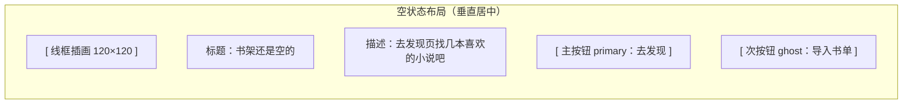
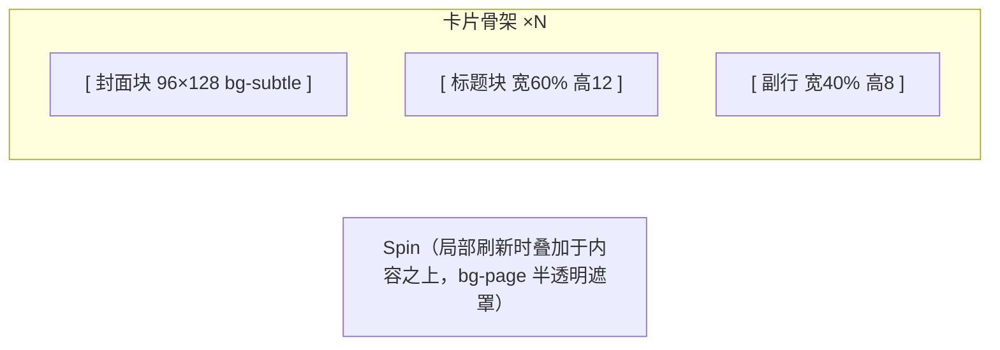
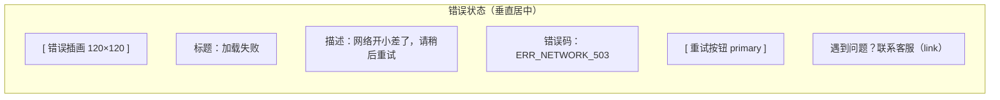
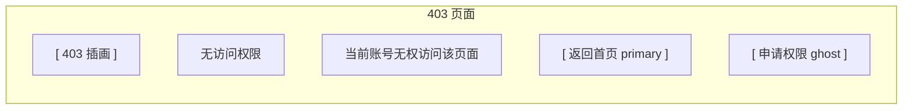
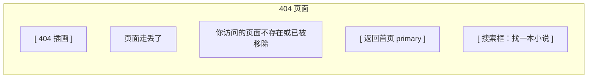
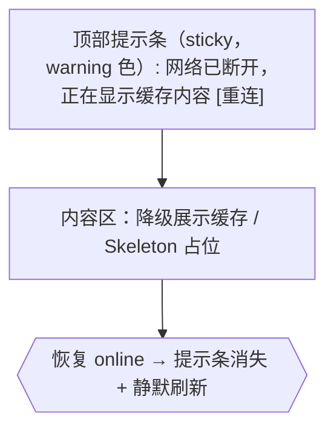

# 通用设计规范

> **版本**：V1.0.0 · 2026.07
> **适用范围**：小说网站 C 端（读者侧）与 B 端（作者/运营侧）共享的通用层
> **基础依赖**：统一令牌体系（品牌色 #1890FF、14 级中性色、三层 Token 架构）
> **维护方**：设计系统团队

---

## 0. 文档定位

本文是小说网站设计系统的**第二层规范**，定位为 C 端与 B 端共享的「通用层」。它向下消费《01-设计令牌》定义的语义令牌（`text-primary`、`bg-surface`、`space-6`、`radius-md` 等），向上为 C 端阅读体验规范与 B 端工作台规范提供可复用的组件、图标、图表、状态模式与协作约定。

**本文覆盖：**

- 15 个跨端通用组件的契约（Props / 状态 / 变体 / 示例 / Do-Don't）
- 6 种全局状态模式（空 / 加载 / 错误 / 403 / 404 / 离线）
- 60 个通用图标（B 端 50 + C 端扩展 10）
- 图表与可视化规范（色板、类型、无障碍）
- 响应式、国际化、协作交付通则

**本文不覆盖：** 品牌叙事、C 端阅读器专属交互、B 端富文本编辑器细节、营销活动视觉——这些由各自端规范承接。

**核心约束：** 所有组件**只消费语义令牌，禁止裸色值**（如 `#1890FF`、`rgba(0,0,0,.85)` 均不允许出现在组件实现中）。CI 将通过令牌扫描器拦截违规实现。[Expert judgment]

---

## 目录

1. [文档定位](#0-文档定位)
2. [通用组件规范](#1-通用组件规范)
   - 2.1 Button
   - 2.2 Input
   - 2.3 Select
   - 2.4 Modal
   - 2.5 Drawer
   - 2.6 Tabs
   - 2.7 Tag / Badge
   - 2.8 Tooltip / Popover
   - 2.9 Dropdown
   - 2.10 Avatar
   - 2.11 Switch
   - 2.12 Checkbox / Radio
   - 2.13 Alert / Message / Notification
   - 2.14 EmptyState / Skeleton
   - 2.15 Pagination
   - 2.16 BookMeta
   - 2.17 ContentStatus
3. [通用状态模式](#2-通用状态模式)
4. [图标系统](#3-图标系统)
5. [图表与可视化规范](#4-图表与可视化规范)
6. [响应式设计通则](#5-响应式设计通则)
7. [国际化基础](#6-国际化基础)
8. [协作与交付规范](#7-协作与交付规范)

---

## 1. 通用组件规范

### 通用约定

- **令牌消费**：组件实现仅引用语义层令牌（`brand`、`brand-hover`、`text-primary`、`border-default`、`space-*`、`radius-*`、`sh-*`、`dur-*` 等），不直接使用别名层或原始色值。
- **尺寸基准**：组件高度遵循 8px 栅格；sm=24px、md=32px、lg=40px（与 `icon-size-*` 对齐）。
- **焦点可见性**：所有可交互组件必须提供 `:focus-visible` 样式，使用 `border-focus` + `sh-1`，保证键盘可达性。[Research-backed]
- **禁用态**：`disabled` 时透明度 `0.5`、`cursor: not-allowed`、移除 hover/focus 反馈。
- **国际化**：所有文案外置为 `children` 或 `placeholder` prop，组件内部不写死中文。

---

### 1.1 Button

按钮用于触发即时操作，是页面中最高频的交互元素。

**Props**

| Prop | 类型 | 默认值 | 必填 | 说明 |
|------|------|--------|------|------|
| variant | `'primary' \| 'secondary' \| 'ghost' \| 'danger' \| 'link'` | `'primary'` | 否 | 视觉变体 |
| size | `'sm' \| 'md' \| 'lg'` | `'md'` | 否 | 尺寸，对应高度 24/32/40px |
| disabled | `boolean` | `false` | 否 | 禁用态 |
| loading | `boolean` | `false` | 否 | 加载态，显示 Spin 并禁用点击 |
| icon | `ReactNode` | — | 否 | 前置图标，尺寸跟随 `icon-size-*` |
| onClick | `(e: MouseEvent) => void` | — | 否 | 点击回调 |

**状态列表**

- `default`： resting 态
- `hover`：`brand-hover` 背景，过渡 `dur-fast`
- `active`：`brand-active` 背景，轻微下移
- `focus-visible`：`border-focus` 描边 + `sh-1`
- `disabled`：opacity 0.5，禁用交互
- `loading`：禁用交互 + Spin 替换 icon

**变体 / 规格**

| variant | 背景 | 文字 | 描边 | 用途 |
|---------|------|------|------|------|
| primary | `brand` | `text-inverse` | 无 | 主操作，每屏仅 1 个 |
| secondary | `bg-surface` | `brand` | `border-default` | 次操作 |
| ghost | transparent | `text-primary` | 无 | 弱化操作 |
| danger | `error` | `text-inverse` | 无 | 破坏性操作 |
| link | transparent | `brand` | 无 | 内联跳转 |

| size | 高度 | 内边距 | 字号 | icon |
|------|------|--------|------|------|
| sm | 24px | `space-2 space-3` | 12px | `icon-size-sm` |
| md | 32px | `space-3 space-4` | 14px | `icon-size-md` |
| lg | 40px | `space-4 space-6` | 16px | `icon-size-lg` |

**JSX 示例**

```jsx
import { Button } from '@/components/Button';
import { IconActionAdd } from '@/icons';

// 主操作
<Button variant="primary" size="md" icon={<IconActionAdd />} onClick={handleCreate}>
  新建小说
</Button>

// 危险操作 + 加载
<Button variant="danger" loading={deleting} onClick={handleDelete}>
  删除章节
</Button>

// 内联链接
<Button variant="link" onClick={() => navigate('/help')}>查看帮助</Button>
```

**Do / Don't**

- ✅ 每屏只保留一个 `primary` 按钮，其余用 `secondary` / `ghost`。
- ✅ 破坏性操作（删除、下架）必须用 `danger` 并二次确认。
- ✅ `loading` 时禁止再次触发 `onClick`。
- ❌ 不要用按钮做纯导航以外的「装饰元素」。
- ❌ 不要在 `link` 变体上叠加图标以外的背景色。

---

### 1.2 Input

单行文本输入框，用于收集短文本。

**Props**

| Prop | 类型 | 默认值 | 必填 | 说明 |
|------|------|--------|------|------|
| value | `string` | — | 是 | 受控值 |
| placeholder | `string` | — | 否 | 占位文案 |
| disabled | `boolean` | `false` | 否 | 禁用 |
| status | `'default' \| 'error' \| 'warning'` | `'default'` | 否 | 校验态 |
| size | `'sm' \| 'md' \| 'lg'` | `'md'` | 否 | 尺寸 |
| prefix | `ReactNode` | — | 否 | 前置图标/文字 |
| onChange | `(val: string, e) => void` | — | 是 | 值变化回调 |

**状态列表**

- `default` / `hover`（`border-default` 加深）/ `focus`（`border-focus` + `sh-1`）
- `error`（`error` 描边 + 红色提示文案）/ `warning`（`warning` 描边）
- `disabled` / `filled`（已有值时文字 `text-primary`，占位 `text-tertiary`）

**变体 / 规格**

| size | 高度 | 字号 | 圆角 |
|------|------|------|------|
| sm | 24px | 12px | `radius-sm` |
| md | 32px | 14px | `radius-md` |
| lg | 40px | 16px | `radius-md` |

**JSX 示例**

```jsx
import { Input } from '@/components/Input';
import { IconActionSearch } from '@/icons';

<Input
  size="md"
  status={error ? 'error' : 'default'}
  prefix={<IconActionSearch />}
  placeholder="搜索书名 / 作者"
  value={keyword}
  onChange={(v) => setKeyword(v)}
/>
```

**Do / Don't**

- ✅ 错误态必须同时给出文字说明，不能只靠颜色（无障碍）。
- ✅ `prefix` 图标尺寸锁定 `icon-size-sm`，不随 size 放大。
- ❌ 不要用 Input 收集多行内容，改用 B 端规范的 Textarea。
- ❌ 不要在禁用态显示校验错误。

---

### 1.3 Select

下拉选择器，支持单选、多选、搜索。

**Props**

| Prop | 类型 | 默认值 | 必填 | 说明 |
|------|------|--------|------|------|
| value | `string \| string[]` | — | 是 | 受控值 |
| options | `{ label: string; value: string; disabled?: boolean }[]` | — | 是 | 选项列表 |
| multiple | `boolean` | `false` | 否 | 多选 |
| searchable | `boolean` | `false` | 否 | 可搜索过滤 |
| loading | `boolean` | `false` | 否 | 远程加载态 |
| placeholder | `string` | `'请选择'` | 否 | 占位 |
| onChange | `(val) => void` | — | 是 | 回调 |

**状态列表**

- `default` / `hover` / `focus` / `disabled` / `loading`
- 展开态：下拉面板 `bg-surface` + `sh-3`，最大高度 256px 后滚动
- 选中态：选项文字 `brand`，左侧打勾图标

**变体 / 规格**

- 单选：显示 `label`，右侧 chevron-down
- 多选：选中项以 `Tag` 形式堆叠，支持单个移除
- 搜索：顶部固定 Input，远程加载时显示 Spin

**JSX 示例**

```jsx
import { Select } from '@/components/Select';

<Select
  multiple
  searchable
  loading={fetching}
  placeholder="选择分类标签"
  options={categoryOptions}
  value={selectedCats}
  onChange={setSelectedCats}
/>
```

**Do / Don't**

- ✅ 选项 > 8 项时开启 `searchable`。
- ✅ 远程搜索必须给出 `loading` 反馈，避免空窗。
- ❌ 不要在下拉面板里塞嵌套表单，改用 Drawer。

---

### 1.4 Modal

模态对话框，用于需要用户聚焦决策的中间层。

**Props**

| Prop | 类型 | 默认值 | 必填 | 说明 |
|------|------|--------|------|------|
| open | `boolean` | `false` | 是 | 是否展开 |
| title | `ReactNode` | — | 否 | 标题 |
| width | `number \| string` | `480` | 否 | 宽度 |
| closable | `boolean` | `true` | 否 | 显示右上关闭 |
| maskClosable | `boolean` | `true` | 否 | 点遮罩关闭 |
| onCancel | `() => void` | — | 是 | 关闭回调 |
| footer | `ReactNode \| null` | 默认按钮组 | 否 | 底部；传 null 隐藏 |
| children | `ReactNode` | — | 否 | 内容 |

**状态列表**

- 进入：遮罩 `dur-normal` 渐显，内容 `dur-normal` 缩放 + 渐显
- 退出：反向，`dur-fast`
- 嵌套：仅允许一层，第二层用 Drawer 替代 [Expert judgment]

**变体 / 规格**

- 默认：标题 16px / `text-primary`，内容 14px / `text-secondary`
- 无 footer：纯信息展示
- 危险确认：footer 主按钮使用 `danger` variant

**JSX 示例**

```jsx
import { Modal, Button } from '@/components';

<Modal
  open={open}
  title="下架小说"
  width={480}
  onCancel={() => setOpen(false)}
  footer={[
    <Button variant="secondary" onClick={() => setOpen(false)}>取消</Button>,
    <Button variant="danger" onClick={handleConfirm}>确认下架</Button>,
  ]}
>
  下架后读者将无法继续阅读，确定要下架《{book.title}》吗？
</Modal>
```

**Do / Don't**

- ✅ `Esc` 键必须可关闭（除非是不可中断的关键操作）。
- ✅ 危险操作 footer 主按钮放右侧并用 `danger`。
- ❌ 不要在 Modal 内承载长表单，超过一屏改用页面或 Drawer。
- ❌ 不要叠放多个 Modal。

---

### 1.5 Drawer

侧边抽屉，用于承载次级任务流或详情面板。

**Props**

| Prop | 类型 | 默认值 | 必填 | 说明 |
|------|------|--------|------|------|
| open | `boolean` | `false` | 是 | 是否展开 |
| title | `ReactNode` | — | 否 | 标题 |
| placement | `'left' \| 'right'` | `'right'` | 否 | 方向 |
| width | `number \| string` | `378` | 否 | 宽度 |
| closable | `boolean` | `true` | 否 | 关闭按钮 |
| maskClosable | `boolean` | `true` | 否 | 点遮罩关闭 |
| onClose | `() => void` | — | 是 | 关闭回调 |
| footer | `ReactNode \| null` | — | 否 | 底部操作区 |

**状态列表**

- 进入：面板 `dur-normal` 滑入，遮罩渐显
- 退出：`dur-fast` 滑出
- 内容过长：内部滚动，header/footer 固定

**变体 / 规格**

- 右侧默认 378px，移动端自动撑满
- 带 footer：操作区 `bg-subtle` 顶部分隔

**JSX 示例**

```jsx
import { Drawer, Button } from '@/components';

<Drawer
  open={open}
  title="章节设置"
  placement="right"
  width={420}
  onClose={() => setOpen(false)}
  footer={<Button variant="primary" onClick={handleSave}>保存</Button>}
>
  <ChapterSettingsForm />
</Drawer>
```

**Do / Don't**

- ✅ 移动端宽度自动 100%，避免与安全区冲突。
- ✅ 表单类内容用 Drawer，决策类用 Modal。
- ❌ 不要左右同时打开两个 Drawer。

---

### 1.6 Tabs

选项卡，用于在同一层级切换内容视图。

**Props**

| Prop | 类型 | 默认值 | 必填 | 说明 |
|------|------|--------|------|------|
| activeKey | `string` | — | 是 | 当前激活项 |
| items | `{ key: string; label: ReactNode; children: ReactNode; disabled?: boolean }[]` | — | 是 | 标签项 |
| type | `'line' \| 'card'` | `'line'` | 否 | 样式 |
| size | `'sm' \| 'md' \| 'lg'` | `'md'` | 否 | 尺寸 |
| onChange | `(key: string) => void` | — | 是 | 切换回调 |

**状态列表**

- `default` / `hover`（`text-primary`）/ `active`（`brand` + 底部 2px 指示条）/ `disabled`

**变体 / 规格**

- `line`：底部指示条，适合内容区切换
- `card`：卡片式，适合页面级区块
- 项过多：溢出区域左右滚动箭头

**JSX 示例**

```jsx
import { Tabs } from '@/components/Tabs';

<Tabs
  activeKey={tab}
  type="line"
  items={[
    { key: 'info', label: '基本信息', children: <BookInfo /> },
    { key: 'chapters', label: '章节管理', children: <ChapterList /> },
    { key: 'stats', label: '数据统计', children: <BookStats /> },
  ]}
  onChange={setTab}
/>
```

**Do / Don't**

- ✅ 标签数量 2–5 个为佳；超过用折叠或左栏导航。
- ✅ `line` 用于内容切换，`card` 用于独立面板。
- ❌ 不要用 Tabs 做页面级主导航。

---

### 1.7 Tag / Badge

标签用于标记属性，徽标用于显示计数。

**Tag Props**

| Prop | 类型 | 默认值 | 必填 | 说明 |
|------|------|--------|------|------|
| color | `'default' \| 'success' \| 'warning' \| 'error' \| 'primary'` | `'default'` | 否 | 语义色 |
| closable | `boolean` | `false` | 否 | 可关闭 |
| children | `ReactNode` | — | 是 | 内容 |

**Badge Props**

| Prop | 类型 | 默认值 | 必填 | 说明 |
|------|------|--------|------|------|
| count | `number` | — | 是 | 计数；>99 显示 99+ |
| overflow | `number` | `99` | 否 | 溢出阈值 |
| dot | `boolean` | `false` | 否 | 仅显示小红点 |

**状态列表**

- Tag：`default` / `closable hover`（关闭按钮加深）
- Badge：`count` / `dot`（无数字）/ `overflow`（99+）

**变体 / 规格**

| Tag color | 背景 | 文字 |
|-----------|------|------|
| default | `bg-subtle` | `text-secondary` |
| success | `feedback-success-bg` | `feedback-success` |
| warning | `feedback-warning-bg` | `feedback-warning` |
| error | `feedback-error-bg` | `feedback-error` |
| primary | `brand-bg` | `brand` |

**JSX 示例**

```jsx
import { Tag, Badge } from '@/components';

<Tag color="primary">连载中</Tag>
<Tag color="success" closable onClose={handleRemove}>玄幻</Tag>
<Badge count={5}><IconContentNotification /></Badge>
<Badge dot><IconContentMail /></Badge>
```

**Do / Don't**

- ✅ Tag 用于分类、状态；Badge 用于未读计数。
- ✅ 计数超过 99 显示 `99+`，避免破坏布局。
- ❌ 不要用 Badge 替代 Tag 显示分类。

---

### 1.8 Tooltip / Popover

`Tooltip` 承载纯文本提示；`Popover` 承载富内容操作。

**Tooltip Props**

| Prop | 类型 | 默认值 | 必填 | 说明 |
|------|------|--------|------|------|
| title | `ReactNode` | — | 是 | 提示文本 |
| placement | `'top' \| 'bottom' \| 'left' \| 'right'` | `'top'` | 否 | 方位 |
| children | `ReactNode` | — | 是 | 触发元素 |

**Popover Props**

| Prop | 类型 | 默认值 | 必填 | 说明 |
|------|------|--------|------|------|
| title | `ReactNode` | — | 否 | 标题 |
| content | `ReactNode` | — | 是 | 内容 |
| trigger | `'hover' \| 'click'` | `'hover'` | 否 | 触发方式 |
| placement | `'top' \| 'bottom' \| 'left' \| 'right'` | `'top'` | 否 | 方位 |

**状态列表**

- 进入：`dur-fast` 渐显 + 轻微位移
- 退出：`dur-instant`
- 智能定位：边缘自动翻转

**变体 / 规格**

- Tooltip：`bg-gray-13`（深底）/ `text-inverse`，最大宽度 240px
- Popover：`bg-surface` + `sh-2`，内边距 `space-3`

**JSX 示例**

```jsx
import { Tooltip, Popover } from '@/components';

<Tooltip title="收藏到书架">
  <IconContentBookmark />
</Tooltip>

<Popover
  title="批量操作"
  content={<BatchActions onAction={handleAction} />}
  trigger="click"
  placement="bottomRight"
>
  <Button variant="ghost">操作</Button>
</Popover>
```

**Do / Don't**

- ✅ Tooltip 只放短文本（≤ 20 字），复杂内容用 Popover。
- ✅ 移动端优先用 `click` 触发，避免 hover 死区。
- ❌ 不要把关键信息只放在 Tooltip 里。

---

### 1.9 Dropdown

下拉菜单，承载一组操作命令。

**Props**

| Prop | 类型 | 默认值 | 必填 | 说明 |
|------|------|--------|------|------|
| items | `{ key: string; label: ReactNode; disabled?: boolean; danger?: boolean; divider?: boolean }[]` | — | 是 | 菜单项 |
| trigger | `'hover' \| 'click'` | `'hover'` | 否 | 触发方式 |
| placement | `'bottom' \| 'bottomLeft' \| 'bottomRight' \| ...` | `'bottomLeft'` | 否 | 方位 |
| onClick | `(key: string) => void` | — | 是 | 选中回调 |
| children | `ReactNode` | — | 是 | 触发元素 |

**状态列表**

- 菜单项：`default` / `hover`（`bg-subtle`）/ `disabled` / `danger`（`error` 文字）
- 分隔线：`border-subtle`

**变体 / 规格**

- 默认 `click` 触发，B 端命令密集区可用 `hover`
- 菜单最大高度 280px 滚动

**JSX 示例**

```jsx
import { Dropdown, Button } from '@/components';
import { IconNavigationMore } from '@/icons';

<Dropdown
  trigger="click"
  placement="bottomRight"
  items={[
    { key: 'edit', label: '编辑' },
    { key: 'duplicate', label: '复制' },
    { key: 'divider', label: '', divider: true },
    { key: 'delete', label: '删除', danger: true },
  ]}
  onClick={(key) => handleAction(key)}
>
  <Button variant="ghost" icon={<IconNavigationMore />} />
</Dropdown>
```

**Do / Don't**

- ✅ 破坏性操作用 `danger: true` 与常规项视觉分离。
- ✅ 菜单项超过 8 个考虑分组或改用 Drawer。
- ❌ 不要用 Dropdown 做表单选择，那是 Select 的职责。

---

### 1.10 Avatar

头像，展示用户或作者形象。

**Props**

| Prop | 类型 | 默认值 | 必填 | 说明 |
|------|------|--------|------|------|
| src | `string` | — | 否 | 图片地址；无则取 `alt` 首字 |
| alt | `string` | — | 否 | 备用文字/首字 |
| size | `'sm' \| 'md' \| 'lg'` | `'md'` | 否 | 尺寸 |
| shape | `'circle' \| 'square'` | `'circle'` | 否 | 形状 |

**状态列表**

- 加载中：`bg-subtle` + Spin
- 加载失败：显示 `alt` 首字，背景 `brand-bg`
- 默认（无 src）：首字 `brand`

**变体 / 规格**

| size | 尺寸 | 字号 |
|------|------|------|
| sm | 24px | 12px |
| md | 32px | 14px |
| lg | 48px | 18px |

**JSX 示例**

```jsx
import { Avatar } from '@/components/Avatar';

<Avatar src={author.avatar} alt={author.name} size="md" shape="circle" />
<Avatar alt="匿名读者" size="sm" />
```

**Do / Don't**

- ✅ 无图片时用首字兜底，保证不塌陷。
- ✅ 头像组场景加 `-space-2` 负边距重叠。
- ❌ 不要用非正方形原图硬裁，会变形。

---

### 1.11 Switch

开关，用于二元状态切换。

**Props**

| Prop | 类型 | 默认值 | 必填 | 说明 |
|------|------|--------|------|------|
| checked | `boolean` | `false` | 是 | 开关状态 |
| disabled | `boolean` | `false` | 否 | 禁用 |
| size | `'sm' \| 'md'` | `'md'` | 否 | 尺寸 |
| onChange | `(checked: boolean) => void` | — | 是 | 回调 |

**状态列表**

- 关闭：`bg-subtle`，圆点左
- 开启：`brand` 背景，圆点右，过渡 `dur-fast`
- 禁用：opacity 0.5
- 加载：圆点处显示小 Spin

**变体 / 规格**

| size | 宽 | 高 | 圆点 |
|------|----|----|------|
| sm | 28px | 16px | 12px |
| md | 40px | 22px | 18px |

**JSX 示例**

```jsx
import { Switch } from '@/components/Switch';

<Switch checked={autoSave} onChange={setAutoSave} />
```

**Do / Don't**

- ✅ 状态变化需即时生效并持久化，避免额外「保存」。
- ✅ 旁边配说明文案，明确开启后的影响。
- ❌ 不要用 Switch 触发需要二次确认的操作。

---

### 1.12 Checkbox / Radio

`Checkbox` 用于多选；`Radio.Group` 用于单选。

**Checkbox Props**

| Prop | 类型 | 默认值 | 必填 | 说明 |
|------|------|--------|------|------|
| checked | `boolean` | `false` | 是 | 选中 |
| indeterminate | `boolean` | `false` | 否 | 半选（全选场景） |
| disabled | `boolean` | `false` | 否 | 禁用 |
| onChange | `(checked: boolean) => void` | — | 是 | 回调 |

**Radio.Group Props**

| Prop | 类型 | 默认值 | 必填 | 说明 |
|------|------|--------|------|------|
| value | `string` | — | 是 | 当前值 |
| options | `{ label: string; value: string; disabled?: boolean }[]` | — | 是 | 选项 |
| onChange | `(value: string) => void` | — | 是 | 回调 |

**状态列表**

- 未选 / 选中（`brand`）/ 半选 / 禁用 / `focus-visible`
- hover：`bg-subtle`

**变体 / 规格**

- 默认横排，B 端表单可纵向 `vertical`
- 选中图标尺寸 `icon-size-sm`

**JSX 示例**

```jsx
import { Checkbox, Radio } from '@/components';

<Checkbox
  checked={allChecked}
  indeterminate={someChecked && !allChecked}
  onChange={toggleAll}
>全选</Checkbox>

<Radio.Group
  value={sort}
  options={[
    { label: '按更新时间', value: 'updated' },
    { label: '按收藏数', value: 'collected' },
  ]}
  onChange={setSort}
/>
```

**Do / Don't**

- ✅ 选项 ≤ 4 用 Radio，> 4 用 Select。
- ✅ 全选场景必须支持 `indeterminate`。
- ❌ 不要用 Checkbox 模拟单选。

---

### 1.13 Alert / Message / Notification

三种反馈提示，按层级与时长区分。

**Alert Props**

| Prop | 类型 | 默认值 | 必填 | 说明 |
|------|------|--------|------|------|
| type | `'success' \| 'warning' \| 'error' \| 'info'` | `'info'` | 否 | 类型 |
| message | `ReactNode` | — | 是 | 标题 |
| description | `ReactNode` | — | 否 | 描述 |
| closable | `boolean` | `false` | 否 | 可关闭 |

**Message**（函数式调用）：`message.success(text)`，顶部居中，3s 自动消失。

**Notification**（函数式调用）：`notification.open({ title, description, duration })`，右上角，4.5s。

**状态列表**

| 组件 | 位置 | 时长 | 用途 |
|------|------|------|------|
| Alert | 内联页面 | 持久 | 表单校验、页面级提示 |
| Message | 顶部居中 | 3s | 操作轻反馈 |
| Notification | 右上角 | 4.5s | 系统通知、异步结果 |

**变体 / 规格**

- Alert 背景：`feedback-*-bg`，左侧 4px 色条
- Message：`bg-gray-13` + `text-inverse` + `sh-2`
- Notification：`bg-surface` + `sh-3` + 关闭按钮

**JSX 示例**

```jsx
import { Alert, message, notification } from '@/components';

// 页面级
<Alert type="warning" message="草稿未保存" closable />

// 轻反馈
message.success('章节已发布');

// 系统通知
notification.open({
  title: '审核通过',
  description: '《第一章》已通过审核，可对外发布',
  duration: 4.5,
});
```

**Do / Don't**

- ✅ 成功操作用 Message，需要留存的信息用 Alert 或 Notification。
- ✅ Notification 不要超过 3 条同时出现，旧的替换。
- ❌ 不要用 Message 承载错误详情（太短）。

---

### 1.14 EmptyState / Skeleton

`EmptyState` 用于无数据；`Skeleton` 用于内容加载占位。

**EmptyState Props**

| Prop | 类型 | 默认值 | 必填 | 说明 |
|------|------|--------|------|------|
| title | `string` | — | 是 | 标题 |
| description | `string` | — | 否 | 描述 |
| action | `ReactNode` | — | 否 | 主 CTA |

**Skeleton Props**

| Prop | 类型 | 默认值 | 必填 | 说明 |
|------|------|--------|------|------|
| rows | `number` | `3` | 否 | 占位行数 |
| avatar | `boolean` | `false` | 否 | 是否含头像占位 |
| active | `boolean` | `true` | 否 | 是否动画 |
| loading | `boolean` | `true` | 否 | 是否显示 |

**状态列表**

- EmptyState：`title` 16px / `text-primary`，`description` 14px / `text-tertiary`
- Skeleton：`bg-subtle` 块，`active` 时 `dur-slow` 流光动画

**变体 / 规格**

- EmptyState 居中，上方线框插画 120×120
- Skeleton 支持卡片型、列表型、表格型预设

**JSX 示例**

```jsx
import { EmptyState, Skeleton, Button } from '@/components';

{books.length === 0 ? (
  <EmptyState
    title="书架还是空的"
    description="去发现页找几本喜欢的小说吧"
    action={<Button variant="primary" onClick={goDiscover}>去发现</Button>}
  />
) : (
  <Skeleton rows={4} avatar loading={loading}>
    <BookList items={books} />
  </Skeleton>
)}
```

**Do / Don't**

- ✅ 空状态必须提供下一步行动（CTA），不要只摆一句话。
- ✅ Skeleton 形状应贴近真实内容，减少布局抖动。
- ❌ 加载超过 1s 才显示 Skeleton，避免闪烁。

---

### 1.15 Pagination

分页器，用于长列表分段。

**Props**

| Prop | 类型 | 默认值 | 必填 | 说明 |
|------|------|--------|------|------|
| current | `number` | `1` | 是 | 当前页 |
| total | `number` | `0` | 是 | 总条数 |
| pageSize | `number` | `20` | 否 | 每页条数 |
| showSizeChanger | `boolean` | `false` | 否 | 显示条数切换 |
| showTotal | `(total) => ReactNode` | — | 否 | 总数文案 |
| onChange | `(page, pageSize) => void` | — | 是 | 回调 |

**状态列表**

- 当前页：`brand` 背景 + `text-inverse`
- 普通页：`bg-surface`，hover `bg-subtle`
- 禁用（首/末页 prev/next）：`text-disabled`
- `focus-visible`

**变体 / 规格**

- 页码超过 7 个：首末固定，中间省略号
- 移动端：精简为「上一页 / 1/N / 下一页」

**JSX 示例**

```jsx
import { Pagination } from '@/components/Pagination';

<Pagination
  current={page}
  total={total}
  pageSize={20}
  showSizeChanger
  showTotal={(t) => `共 ${t} 本`}
  onChange={(p, s) => { setPage(p); setPageSize(s); }}
/>
```

**Do / Don't**

- ✅ 数据量 > 50 才显示分页，更少用「加载更多」。
- ✅ 切换页码后滚动回列表顶部。
- ❌ 不要把分页和筛选状态耦合到 URL 之外。

---

### 1.16 BookMeta

小说元信息组件，用于集中展示作品的核心元数据：书名、作者、字数、章节数、连载状态、更新时间与分类标签。是书单、搜索结果、详情页头图等场景的高频复用块，向下消费令牌，向上为 C 端阅读卡片与 B 端作品列表提供统一的信息结构。

**Props**

| Prop | 类型 | 默认值 | 必填 | 说明 |
|------|------|--------|------|------|
| title | `string` | — | 是 | 书名 |
| author | `string` | — | 是 | 作者名 |
| wordCount | `number` | — | 否 | 总字数，自动格式化为「万/亿」 |
| chapterCount | `number` | — | 否 | 章节数 |
| status | `'ongoing' \| 'completed' \| 'paused' \| 'reviewing' \| 'offline'` | — | 否 | 连载状态，透传给 ContentStatus |
| updatedAt | `string \| number \| Date` | — | 否 | 最近更新时间，自动相对化 |
| tags | `string[]` | — | 否 | 分类标签数组 |
| size | `'compact' \| 'detailed'` | `'detailed'` | 否 | 尺寸变体 |
| onClick | `(e: MouseEvent) => void` | — | 否 | 点击书名跳转详情 |

**组件结构**

`detailed` 变体自上而下四行：

1. **书名行**：`title` + 可选 `status` 状态标签（ContentStatus）
2. **作者行**：`author`，可前置作者头像（Avatar sm）
3. **统计行**：`字数 · 章节数 · 更新时间`，以中点分隔
4. **标签行**：`tags` 渲染为 Tag 列表

`compact` 变体压缩为两行：书名行 + 统计行（作者与标签省略，悬停 Tooltip 展开完整信息）。

**尺寸变体**

| 变体 | 适用场景 | 书名字号 | 统计字号 | 行间距 | 最大高度 |
|------|----------|----------|----------|--------|----------|
| compact | 列表项、卡片缩略 | 14px | 12px | `space-1` | 56px |
| detailed | 详情页、书单头图 | 18px | 13px | `space-2` | 自适应 |

**令牌引用**

| 元素 | 字号 | 字体 | 文字色 | 说明 |
|------|------|------|--------|------|
| 书名 | 变体决定 | `--font-serif` | `--color-text-primary` | 衬线体强化文学感 |
| 作者 | 13px | `--font-sans` | `--color-text-secondary` | 次级信息 |
| 统计数字 | 13px | `--font-mono` | `--color-text-tertiary` | 等宽体保证数字对齐 |
| 统计分隔符 | 13px | `--font-sans` | `--color-text-tertiary` | 中点「·」 |
| 标签 | 12px | `--font-sans` | 随 Tag 组件 | — |

**间距规格**

- 行间距：`--space-2`（compact 变体用 `--space-1`）
- 标签间距：`--space-1`
- 书名与状态标签间距：`--space-2`
- 作者头像与作者名间距：`--space-2`

**CSS 示例**

```css
.book-meta {
  display: flex;
  flex-direction: column;
  gap: var(--space-2);
  font-family: var(--font-sans);
}

.book-meta--compact {
  gap: var(--space-1);
}

.book-meta__title {
  font-family: var(--font-serif);
  font-size: 18px;
  line-height: 28px;
  color: var(--color-text-primary);
  font-weight: 600;
}

.book-meta--compact .book-meta__title {
  font-size: 14px;
  line-height: 22px;
}

.book-meta__author {
  font-size: 13px;
  line-height: 20px;
  color: var(--color-text-secondary);
}

.book-meta__stats {
  display: flex;
  align-items: center;
  gap: var(--space-2);
  font-family: var(--font-mono);
  font-size: 13px;
  color: var(--color-text-tertiary);
}

.book-meta__stats-separator {
  color: var(--color-text-tertiary);
  font-family: var(--font-sans);
}

.book-meta__tags {
  display: flex;
  flex-wrap: wrap;
  gap: var(--space-1);
}
```

**JSX 示例**

```jsx
import { BookMeta } from '@/components/BookMeta';

<BookMeta
  title="星辰与深渊"
  author="月下行者"
  wordCount={1284000}
  chapterCount={642}
  status="ongoing"
  updatedAt="2026-07-30T08:00:00Z"
  tags={['玄幻', '热血', '东方玄幻']}
  size="detailed"
  onClick={() => navigate('/book/123')}
/>
```

**Do / Don't**

- ✅ 书名始终使用 `--font-serif`，与正文 UI 区分文学属性。
- ✅ compact 变体省略的信息用 Tooltip 补全，不可静默丢弃。
- ✅ 统计数字用 `--font-mono` 等宽体，保证列表多行对齐。
- ❌ 不要在书名行叠加超过 2 个状态标签，溢出归入标签行。
- ❌ 不要在 BookMeta 内嵌交互按钮，操作区应独立于元信息块。

[Expert judgment]

---

### 1.17 ContentStatus

内容状态标签，专用于展示小说的连载与生命周期状态。与通用 Tag 的区别在于：状态集合固定、颜色映射强约束、不可由业务自定义色值，从而保证全站状态语义一致。通常与 BookMeta 的书名行配合使用，也可独立出现在章节列表、搜索结果等位置。

**Props**

| Prop | 类型 | 默认值 | 必填 | 说明 |
|------|------|--------|------|------|
| status | `'ongoing' \| 'completed' \| 'paused' \| 'reviewing' \| 'offline'` | — | 是 | 状态枚举 |
| size | `'sm' \| 'md'` | `'md'` | 否 | 尺寸 |
| withDot | `boolean` | `true` | 否 | 是否显示状态前导圆点 |
| children | `ReactNode` | — | 否 | 自定义文案；缺省取状态默认文案 |

**状态映射**

| status | 默认文案 | 圆点色 | 文字色 | 背景 | 语义 |
|--------|----------|--------|--------|------|------|
| `ongoing` | 连载中 | `feedback-success` | `feedback-success` | `feedback-success-bg` | 正在持续更新 |
| `completed` | 已完结 | `brand` | `brand` | `brand-bg` | 全本完结 |
| `paused` | 暂停更新 | `feedback-warning` | `feedback-warning` | `feedback-warning-bg` | 作者暂停更新 |
| `reviewing` | 审核中 | `text-tertiary` | `text-tertiary` | `bg-subtle` | 内容审核中 |
| `offline` | 已下架 | `feedback-error` | `feedback-error` | `feedback-error-bg` | 已下架不可读 |

**尺寸规格**

| size | 字号 | 行高 | 内边距 | 圆点直径 | 高度 |
|------|------|------|--------|----------|------|
| sm | 12px | 18px | `space-1 space-2` | 6px | 22px |
| md | 13px | 20px | `space-1 space-2` | 6px | 24px |

**样式规格**

- 形态：胶囊形（pill），圆角 `--radius-full`
- 内边距：`--space-1 --space-2`
- 圆点：实心圆，与文字间距 `--space-1`，垂直居中
- 描边：无；仅 `offline` 状态可选 `--color-border-default` 描边以强调严重性
- 文字：`--font-sans`，字重 500

**JSX 示例**

```jsx
import { ContentStatus } from '@/components/ContentStatus';

<ContentStatus status="ongoing" />
<ContentStatus status="completed" size="sm" />
<ContentStatus status="paused" withDot={false}>暂停</ContentStatus>
```

**Do / Don't**

- ✅ 状态枚举固定为 5 种，禁止业务层新增未定义状态。
- ✅ `completed` 与 `ongoing` 是读者最关注的两种，优先在书名行展示。
- ✅ `reviewing` 仅 B 端可见，C 端不展示未过审内容。
- ❌ 不要用通用 Tag 替代 ContentStatus，会丢失状态色映射约束。
- ❌ 不要修改状态对应的色值映射，全站必须一致。

[Expert judgment]

---

## 2. 通用状态模式

本节定义所有页面共享的 6 种状态变体。每种状态给出组件组合、交互行为与线框示意。**原则：任何状态都必须可恢复**——空状态可去创建，错误状态可重试，离线可重连。[Research-backed]

### 2.1 空状态（Empty）

触发条件：数据加载成功但结果为 0。

**组件组合**：`EmptyState`（120×120 线框插画 + 标题 + 描述）+ 主 CTA `Button`（primary）+ 可选次 CTA。

**交互行为**：

- C 端：书架空 →「去发现」；搜索无结果 →「换个关键词」+ 热门推荐。
- B 端：作品列表空 →「新建小说」；评论空 → 引导分享。

**线框示意**



**规范**：

- 插画统一使用 `text-tertiary` 线框 + `bg-subtle` 填充，禁止彩色插画。
- 上下间距：插画→标题 `space-4`，标题→描述 `space-2`，描述→按钮 `space-6`。
- CTA 不超过 2 个，主操作在左。

---

### 2.2 加载状态（Loading）

触发条件：数据请求中。

**组件组合**：`Skeleton` 占位 + `Spin` 局部刷新图标。区分三种加载模式：

| 模式 | 适用场景 | 占位策略 |
|------|----------|----------|
| 表格加载 | B 端数据表格 | 表头常驻，行用 Skeleton 占位 5 行 |
| 卡片加载 | C 端书架/书单 | 卡片骨架 + 封面块 + 标题块 |
| 列表加载 | 评论/章节列表 | 头像 + 双行文本块 |

**交互行为**：

- 首次加载用 Skeleton（结构化占位）；局部刷新/分页用 Spin。
- 超过 1s 才显示 Skeleton，避免闪烁；超过 8s 显示「加载时间较长」提示。
- 禁止在加载期间允许重复触发请求。

**线框示意（卡片加载）**



---

### 2.3 错误状态（Error）

触发条件：请求失败、服务异常。

**组件组合**：`ErrorState`（错误插画 + 错误信息 + 错误码）+ `Button`（重试，primary）+ 联系方式（次级链接）。

**交互行为**：

- 显示可读的错误说明，而非原始堆栈；包含错误码供排查。
- 「重试」按钮重新发起上次请求；重试失败 3 次后建议联系客服。
- 表单级错误用 `Alert type="error"` 内联，而非整页替换。

**线框示意**



---

### 2.4 无权限状态（403）

触发条件：用户已登录但无访问权限（如读者进入作者后台）。

**组件组合**：403 插画 + 标题「无访问权限」+ 描述 + `Button`（返回首页 / 申请权限）。

**交互行为**：

- 不暴露受保护资源是否存在，文案统一为「无访问权限」。
- 提供「返回首页」主操作；B 端可附加「申请权限」流程入口。

**线框示意**



---

### 2.5 404 状态

触发条件：路由未匹配、资源已删除。

**组件组合**：404 插画 + 标题「页面走丢了」+ 描述 + `Button`（返回首页）+ 搜索框（可选）。

**交互行为**：

- C 端 404 引导返回首页或搜索小说；B 端 404 引导返回工作台。
- 自动 3s 后不跳转，交由用户决策。

**线框示意**



---

### 2.6 网络断开（Offline）

触发条件：浏览器 `offline` 事件。

**组件组合**：页面顶部固定离线提示条（`Alert type="warning"` 紧凑版）+ 内容区降级展示缓存数据。

**交互行为**：

- 提示条 `sticky` 置顶，文案「网络已断开，正在显示缓存内容」。
- 恢复在线后自动消失，并静默刷新当前数据。
- 写操作（发布、保存）在离线时禁用按钮并 Tooltip 说明。

**线框示意**



---

### 状态切换决策表

| 数据阶段 | 结果 | 推荐状态 |
|----------|------|----------|
| loading | — | Skeleton / Spin |
| success | 0 条 | EmptyState |
| success | 有数据 | 正常渲染 |
| error | — | ErrorState |
| — | 路由未匹配 | 404 |
| — | 无权限 | 403 |
| — | 离线 | Offline 提示条 |

---

## 3. 图标系统

通用图标库覆盖小说网站 C 端与 B 端共需的 **60 个图标**（在 B 端 50 个基础上扩展 10 个 C 端专用）。图标库与 UI 语义色解耦，独立维护一套线性风格资源。

### 3.1 图标规范

| 维度 | 规范 | 说明 |
|------|------|------|
| 画布 | 24×24 viewbox | 统一基准，按需缩放 |
| 描边 | 1.8px | 线性风格，`stroke-linecap: round`、`stroke-linejoin: round` |
| 填充 | none | 默认线性，仅 status 类提供实心变体 |
| 颜色 | `currentColor` | 继承父级文字色，禁止在 SVG 内写死颜色 |
| 命名 | `icon-{category}-{name}` | 如 `icon-action-add`；不含尺寸与颜色 |
| 尺寸消费 | `icon-size-sm/md/lg/xl` | 16/20/24/32px，由容器决定 |

**实现约定**：所有图标以 React 组件形式提供，接受 `size` 与 `className`，内部映射到 `icon-size-*` 令牌；颜色通过 `color` 继承。

```jsx
// 图标组件契约
<IconActionAdd size="md" className="text-primary" />
// 渲染：<svg width={20} height={20} stroke="currentColor" ...>
```

**Do / Don't**

- ✅ 图标颜色一律通过父级 `text-*` 令牌控制。
- ✅ 同一操作在 C/B 端复用同一图标，避免认知分裂。
- ❌ 不要在 SVG 中使用 `fill="#1890FF"` 等硬编码色值。
- ❌ 不要用图标尺寸做视觉强调，改用 `icon-size-lg`。

---

### 3.2 图标目录（60 个）

#### Action 类（15 个）`icon-action-*`

通用操作动作，覆盖增删改查与文件流转。

| 图标名 | 用途说明 |
|--------|----------|
| `icon-action-add` | 新建/添加，用于「新建小说」「添加章节」按钮 |
| `icon-action-edit` | 编辑，用于作品、章节、资料编辑入口 |
| `icon-action-delete` | 删除，配合 danger 色用于移除操作 |
| `icon-action-save` | 保存，用于草稿、设置保存 |
| `icon-action-search` | 搜索，用于 C/B 端搜索框前缀 |
| `icon-action-filter` | 筛选，用于列表筛选触发 |
| `icon-action-refresh` | 刷新，用于数据重载 |
| `icon-action-download` | 下载，用于导出章节、报表 |
| `icon-action-upload` | 上传，用于封面、附件上传 |
| `icon-action-share` | 分享，用于作品分享到社交平台 |
| `icon-action-copy` | 复制，用于复制链接、章节内容 |
| `icon-action-sort` | 排序，用于列表字段排序 |
| `icon-action-expand` | 展开，用于折叠面板、章节树展开 |
| `icon-action-collapse` | 折叠，与 expand 成对使用 |
| `icon-action-more` | 更多，用于 Dropdown 触发器 |

#### Navigation 类（8 个）`icon-navigation-*`

方向与导航控制。

| 图标名 | 用途说明 |
|--------|----------|
| `icon-navigation-chevron-up` | 向上，用于折叠、回到顶部 |
| `icon-navigation-chevron-down` | 向下，用于展开、Select 触发 |
| `icon-navigation-chevron-left` | 向左，用于返回上一页、轮播 |
| `icon-navigation-chevron-right` | 向右，用于前进、分页 |
| `icon-navigation-menu` | 菜单，用于移动端汉堡菜单 |
| `icon-navigation-close` | 关闭，用于 Modal/Drawer/Tag 关闭 |
| `icon-navigation-home` | 首页，用于回到站点首页/工作台 |
| `icon-navigation-back` | 返回，用于返回上级页面 |

#### Status 类（8 个）`icon-status-*`

状态指示，提供线性与实心两套变体。

| 图标名 | 用途说明 |
|--------|----------|
| `icon-status-success` | 成功，用于操作成功反馈 |
| `icon-status-error` | 错误，用于校验失败、请求错误 |
| `icon-status-warning` | 警告，用于风险提示 |
| `icon-status-info` | 信息，用于中性提示 |
| `icon-status-loading` | 加载中，Spin 旋转图标 |
| `icon-status-complete` | 已完成，用于审核通过、任务完成 |
| `icon-status-pending` | 待处理，用于审核中、待发布 |
| `icon-status-blocked` | 已阻断，用于下架、封禁状态 |

#### Content 类（12 个）`icon-content-*`

小说内容域专用，C 端高频。

| 图标名 | 用途说明 |
|--------|----------|
| `icon-content-book` | 书籍，用于作品封面占位、列表项 |
| `icon-content-chapter` | 章节，用于章节列表、目录 |
| `icon-content-author` | 作者，用于作者信息、主页 |
| `icon-content-tag` | 标签，用于分类标签筛选 |
| `icon-content-category` | 分类，用于频道/分类导航 |
| `icon-content-bookmark` | 书签，用于章节内书签、收藏 |
| `icon-content-library` | 书架，用于我的书架入口 |
| `icon-content-reading` | 在读，用于阅读进度、最近阅读 |
| `icon-content-review` | 评论，用于书评、章节评论 |
| `icon-content-rank` | 榜单，用于排行榜入口 |
| `icon-content-subscribe` | 订阅，用于作品订阅、更新提醒 |
| `icon-content-history` | 历史，用于阅读历史记录 |

#### Media 类（4 个）`icon-media-*`

阅读器内的媒体控制（有声书场景）。

| 图标名 | 用途说明 |
|--------|----------|
| `icon-media-play` | 播放，用于有声书播放 |
| `icon-media-pause` | 暂停，用于有声书暂停 |
| `icon-media-volume` | 音量，用于朗读音量调节 |
| `icon-media-fullscreen` | 全屏，用于阅读器全屏切换 |

#### Communication 类（5 个）`icon-communication-*`

消息与互动。

| 图标名 | 用途说明 |
|--------|----------|
| `icon-communication-message` | 消息，用于私信、客服 |
| `icon-communication-notification` | 通知，用于系统通知中心 |
| `icon-communication-mail` | 邮件，用于邮件订阅、验证 |
| `icon-communication-comment` | 评论，用于互动评论入口 |
| `icon-communication-feedback` | 反馈，用于意见反馈入口 |

#### Editor 类（4 个）`icon-editor-*`

B 端章节编辑器工具栏。

| 图标名 | 用途说明 |
|--------|----------|
| `icon-editor-bold` | 加粗，富文本加粗 |
| `icon-editor-italic` | 斜体，富文本斜体 |
| `icon-editor-underline` | 下划线，富文本下划线 |
| `icon-editor-link` | 链接，插入超链接 |

#### System 类（4 个）`icon-system-*`

系统级设置。

| 图标名 | 用途说明 |
|--------|----------|
| `icon-system-settings` | 设置，用于账号、阅读设置 |
| `icon-system-user` | 用户，用于用户头像占位、个人中心 |
| `icon-system-logout` | 退出，用于退出登录 |
| `icon-system-theme-toggle` | 主题切换，用于深浅色模式切换 |

> **C 端扩展说明**：Content 类的 12 个图标中，`book / chapter / bookmark / library / reading / rank / subscribe / history` 等 10 个为 C 端读者场景专用扩展，B 端 50 图标库基础上新增，确保两端共享同一套资源与命名。[Expert judgment]

---

### 3.3 小说专用图标目录

通用图标库（§3.2）覆盖基础操作与内容域，但小说阅读场景中存在大量更细粒度的语义动作——章节翻页、阅读主题切换、互动打赏、热度趋势等——通用图标无法精确表达。本节补充 **25 个小说专用图标**，沿用 §3.1 的统一规范：**24×24 网格、1.8px 描边、`stroke-linecap: round`、`stroke-linejoin: round`、`currentColor` 着色**，命名统一为 `icon-novel-{name}`，与通用图标库共享同一套渲染契约与尺寸消费令牌（`icon-size-sm/md/lg/xl`）。

> **复用约定**：当通用图标与小说专用图标语义重叠时（如 `icon-action-share` 与 `icon-novel-share`），C 端阅读场景优先使用小说专用图标以获得更贴合的视觉表达；B 端工作台沿用通用图标。[Expert judgment]

#### 阅读类（5 个）

打开、关闭、收藏等阅读入口动作。线性与实心成对出现。

| 图标名 | 网格 | 描边 | 用途说明 |
|--------|------|------|----------|
| `icon-novel-book-open` | 24×24 | 1.8px | 打开阅读，用于「开始阅读」「继续阅读」入口 |
| `icon-novel-book-closed` | 24×24 | 1.8px | 关闭/合上，用于已完结作品标记、阅读器关闭 |
| `icon-novel-bookmark` | 24×24 | 1.8px | 书签（线性），用于章节书签添加、目录书签 |
| `icon-novel-bookmark-filled` | 24×24 | 1.8px | 书签（实心），用于已添加书签的回显状态 |
| `icon-novel-reading-glasses` | 24×24 | 1.8px | 阅读眼镜，用于阅读模式入口、沉浸阅读提示 |

#### 章节类（4 个）

章节导航与付费门槛标记。

| 图标名 | 网格 | 描边 | 用途说明 |
|--------|------|------|----------|
| `icon-novel-chapter-list` | 24×24 | 1.8px | 章节目录，用于打开章节列表、目录侧栏 |
| `icon-novel-chapter-next` | 24×24 | 1.8px | 下一章，用于阅读器翻页、章节导航 |
| `icon-novel-chapter-prev` | 24×24 | 1.8px | 上一章，用于阅读器翻页、章节导航 |
| `icon-novel-chapter-lock` | 24×24 | 1.8px | VIP 锁，用于付费章节、未解锁章节标记 |

#### 互动类（6 个）

读者与作品、作者之间的互动反馈。

| 图标名 | 网格 | 描边 | 用途说明 |
|--------|------|------|----------|
| `icon-novel-heart` | 24×24 | 1.8px | 点赞（线性），用于书评点赞、作品喜欢 |
| `icon-novel-heart-filled` | 24×24 | 1.8px | 点赞（实心），用于已点赞回显 |
| `icon-novel-thumbs-up` | 24×24 | 1.8px | 推荐，用于章节段评推荐 |
| `icon-novel-comment` | 24×24 | 1.8px | 评论，用于段评、章评入口 |
| `icon-novel-share` | 24×24 | 1.8px | 分享，用于章节/作品分享到社交平台 |
| `icon-novel-reward` | 24×24 | 1.8px | 打赏，用于章节末尾打赏作者入口 |

#### 状态类（5 个）

热门、付费、排行、趋势等运营状态标记。

| 图标名 | 网格 | 描边 | 用途说明 |
|--------|------|------|----------|
| `icon-novel-fire` | 24×24 | 1.8px | 热门，用于热门标记、本周热读 |
| `icon-novel-crown` | 24×24 | 1.8px | VIP，用于 VIP 作品、付费内容标记 |
| `icon-novel-medal` | 24×24 | 1.8px | 勋章，用于作者等级、成就徽章 |
| `icon-novel-trending-up` | 24×24 | 1.8px | 趋势上升，用于排行上升、热度增长 |
| `icon-novel-trending-down` | 24×24 | 1.8px | 趋势下降，用于排行下降、热度回落 |

#### 阅读设置类（5 个）

阅读器主题、字号、行距等阅读体验调节。

| 图标名 | 网格 | 描边 | 用途说明 |
|--------|------|------|----------|
| `icon-novel-moon` | 24×24 | 1.8px | 夜间模式，用于阅读器深色主题切换 |
| `icon-novel-sun` | 24×24 | 1.8px | 日间模式，用于阅读器浅色主题切换 |
| `icon-novel-eye` | 24×24 | 1.8px | 护眼模式，用于阅读器护眼色（米黄）切换 |
| `icon-novel-text-size` | 24×24 | 1.8px | 字号，用于阅读器正文字号调节 |
| `icon-novel-line-spacing` | 24×24 | 1.8px | 行距，用于阅读器行间距调节 |

**Do / Don't**

- ✅ 线性/实心成对图标（bookmark、heart）通过 `-filled` 后缀区分，切换时仅替换图标不改变布局尺寸。
- ✅ VIP 锁（`chapter-lock`）须配合 `feedback-warning` 色使用，提示付费门槛。
- ✅ 趋势成对图标（trending-up/down）须同时提供，避免只表达单向信息。
- ❌ 不要将小说专用图标用于 B 端工作台导航，B 端沿用通用图标。
- ❌ 不要在 SVG 内为状态类图标写死颜色，热度/VIP 等强调色由父级 `color` 控制。

[Expert judgment]

---

## 4. 图表与可视化规范

图表色板独立于 UI 语义色，专门用于数据可视化，避免与功能色（success/error）语义冲突。本节适用于 B 端数据看板与 C 端阅读数据展示。

### 4.1 图表色板

采用 6 色序列色板，独立于 UI 语义令牌体系，单独维护为 `chart-1` ~ `chart-6`。

| 令牌 | 色值 | 用途 |
|------|------|------|
| `chart-1` | `#5B8FF9` | 主序列，默认首条数据 |
| `chart-2` | `#5AD8A6` | 次序列 |
| `chart-3` | `#5D7092` | 第三序列 |
| `chart-4` | `#F6BD16` | 第四序列 |
| `chart-5` | `#E8684A` | 第五序列 |
| `chart-6` | `#6DC8EC` | 第六序列 |

**规则**：

- 序列数 ≤ 6 时按序取色；> 6 时循环复用并降低饱和度。
- 单序列对比（如同比）使用 `chart-1` + `chart-3`（同色系深浅），不用相邻色。
- 图表色板不进入 UI 组件，仅在图表容器内消费。[Expert judgment]

---

### 4.2 图表类型目录

| 类型 | 适用场景 | 数据映射 |
|------|----------|----------|
| 折线图 | 阅读量趋势、收入走势 | x=时间，y=数值 |
| 柱状图 | 分类对比（各分类作品数） | x=分类，y=数量 |
| 环图 | 占比分布（分类占比） | 角度=占比，中心显示总数 |
| 面积图 | 累积趋势（累计字数） | x=时间，y=累积值 |
| 热力图 | 阅读活跃度（按日按时段） | 横=日期，纵=时段，色深=频次 |
| 指标卡 | 关键指标（今日阅读、收入） | 单值 + 同比/环比 |

**数据映射规则**：

- 时间序列统一升序排列，缺失时段补零并标注。
- 环图占比之和应为 100%，不足时显示「其他」。
- 指标卡必须含同比/环比，单值无对比无意义。

---

### 4.3 无障碍要求

- **色盲友好**：不依赖单一颜色区分序列；折线图叠加线型（实线/虚线/点线），柱状图叠加纹理。[Research-backed]
- **文字标签补充**：关键数据点必须可直接读出数值，不依赖 Tooltip；环图各扇区标注百分比。
- **对比度**：图表文字（轴标签、图例）与背景对比度 ≥ 4.5:1，使用 `text-secondary` / `text-tertiary`。
- **键盘可达**：图例项可 Tab 聚焦并切换序列显隐；Tooltip 内容可被屏幕阅读器读取（`aria-label`）。
- **降级**：纯文本表格作为图表的兜底呈现，复杂图表提供「查看数据表」入口。

---

### 4.4 图表样式规范

| 元素 | 规范 | 令牌/值 |
|------|------|---------|
| 画布尺寸 | 宽度自适应容器，高度固定 240/320/400 三档 | — |
| 坐标轴线 | 1px，中性 | `border-subtle` |
| 网格线 | 横向虚线 1px，纵向不画 | `border-subtle`，`stroke-dasharray: 4 4` |
| 轴标签 | 12px | `text-tertiary` |
| 图例 | 底部居中，圆点 8px + 文字 12px | `text-secondary` |
| Tooltip | `bg-gray-13` + `text-inverse` + `sh-2`，`radius-md`，内边距 `space-2 space-3` | — |
| 数据点 | 折线悬停放大 r=4→6，过渡 `dur-fast` | — |

**JSX 示例**

```jsx
import { LineChart } from '@/charts';

<LineChart
  height={320}
  data={readTrend}
  xField="date"
  yField="count"
  color="chart-1"
  tooltip={{ format: (v) => `${v} 次` }}
  ariaLabel="近 30 天阅读量趋势"
/>
```

**Do / Don't**

- ✅ Y 轴从 0 起，除非明确标注截断原因。
- ✅ 单图序列不超过 5 条，过多拆分多图。
- ❌ 不要用 3D 透视、阴影、渐变填充图表，破坏读数。
- ❌ 不要用红绿区分关键序列（色盲不友好）。

---

### 4.5 小说数据图表模式

小说网站的数据可视化场景具有强领域特征：字数增长是创作者核心健康度指标、阅读热力图反映读者活跃节律、追更漏斗刻画读者留存。本节定义 5 种小说专用图表模式，复用 §4.1 图表色板（`chart-1` ~ `chart-6`）与 §4.4 样式规范，仅补充领域专属的色板映射、尺寸、交互与空数据占位约定。

#### 图表总览

| 图表类型 | 用途 | 数据维度 | 推荐库实现 |
|----------|------|----------|------------|
| 字数增长曲线 | 展示小说日更/累计字数趋势 | 时间 × 字数 | 折线图（可叠加面积） |
| 阅读时长热力图 | 展示用户阅读习惯分布 | 星期 × 时段 | 热力图（日历式） |
| 追更漏斗 | 从发现到追读的转化漏斗 | 漏斗各层 | 漏斗图 |
| 排行趋势 | 小说排名随时间变化 | 时间 × 排名 | 折线图（反转 Y 轴） |
| 分类占比 | 站内小说类型分布 | 分类 × 数量 | 环形图 |

#### 4.5.1 字数增长曲线

展示作者每日更新字数与累计字数趋势，B 端作者中心与 C 端作品数据页共用。

**色板映射**

| 序列 | 令牌 | 含义 |
|------|------|------|
| 日更字数 | `chart-1` | 主序列，面积填充透明度 0.15 |
| 累计字数 | `chart-3` | 次序列，实线，映射右 Y 轴 |

**尺寸规范**

- 最小宽度 320px；低于此值隐藏累计轴，仅显示日更
- 推荐宽高比 16:7（如 640×280）
- 高度档位复用 §4.4：240 / 320 / 400

**交互规范**

- hover：tooltip 显示「日期 · 日更字数 · 累计字数」；日更低于 2000 字的点高亮 `feedback-warning`
- 点击数据点：下钻到当日章节列表（B 端）
- 连续 3 天日更为 0 时，该区间以虚线连接并标注「断更」

**空数据占位**

- 新建作品无数据：EmptyState「还没有更新记录，发布第一章开始记录」+ CTA「去写作」
- 数据不足 7 天：仍渲染折线，但隐藏「近 30 天」对比切换

[Expert judgment]

#### 4.5.2 阅读时长热力图

展示用户（C 端个人中心）或全站读者（B 端运营看板）的阅读活跃时段分布。

**色板映射**

| 强度 | 令牌 | 含义 |
|------|------|------|
| 0（无阅读） | `bg-subtle` | 空白格 |
| 低 | `chart-6` | 1–15 分钟 |
| 中 | `chart-2` | 16–45 分钟 |
| 高 | `chart-4` | 46–90 分钟 |
| 极高 | `chart-5` | >90 分钟 |

> 采用离散色阶而非连续渐变，保证色盲可辨识，并叠加格内数字辅助读数。[Research-backed]

**尺寸规范**

- 网格：7 行（周一至周日）× 24 列（0–23 时）
- 单格最小 12×12px，间距 2px
- 推荐宽高比约 2.5:1（如 600×240）
- 移动端横向滚动，首列（星期）与表头（时段）sticky

**交互规范**

- hover：tooltip 显示「周X HH:00 · 平均 N 分钟」
- 点击格：下钻到该时段阅读过的章节列表
- 图例：右侧纵向 5 档色块 + 时长区间

**空数据占位**

- 新用户无阅读记录：EmptyState「开始阅读后这里会显示你的阅读习惯」
- 单日全格为 0：保留空白格不隐藏，维持网格完整性

[Expert judgment]

#### 4.5.3 追更漏斗

展示读者从「发现作品 → 查看详情 → 加入书架 → 开始阅读 → 持续追更」的转化漏斗。B 端运营看板专用。

**色板映射**

| 漏斗层 | 令牌 | 含义 |
|--------|------|------|
| 发现 | `chart-1` | 列表/搜索曝光 |
| 详情 | `chart-2` | 进入作品详情页 |
| 加书架 | `chart-4` | 收藏到书架 |
| 开读 | `chart-5` | 阅读至少 1 章 |
| 追更 | `chart-3` | 7 日内回访阅读 |

**尺寸规范**

- 最小宽度 280px
- 推荐宽高比 4:3（如 480×360）
- 漏斗各层高度等分，宽度按转化率缩放

**交互规范**

- hover：tooltip 显示「阶段名 · 人数 · 转化率 · 较上一步」
- 点击层：下钻到该阶段用户列表
- 转化率低于 10% 的环节用 `feedback-warning` 标注

**空数据占位**

- 作品上线不足 7 天：提示「数据积累中，7 天后展示完整漏斗」+ Skeleton
- 某层人数为 0：漏斗中断，后续层灰显并标注「无转化」

[Expert judgment]

#### 4.5.4 排行趋势

展示小说在分类榜单中的排名变化。注意 Y 轴须反转——排名 1 位于顶部。

**色板映射**

| 序列 | 令牌 | 含义 |
|------|------|------|
| 当前作品 | `chart-1` | 主序列，加粗 2px |
| 同类 Top10 均值 | `chart-3` | 对比序列，虚线 |

**尺寸规范**

- 最小宽度 360px
- 推荐宽高比 16:7
- Y 轴反转：排名 1 位于顶部，数值越大越靠下
- Y 轴范围：仅显示 1–100，超过 100 不展示曲线尾部

**交互规范**

- hover：tooltip 显示「日期 · 排名第 N」
- 排名上升区间用 `feedback-success` 底色带，下降区间用 `feedback-error` 底色带（透明度 0.1）
- 点击数据点：跳转当日榜单快照

**空数据占位**

- 未上榜：EmptyState「暂未进入榜单，继续加油」
- 上榜不足 3 天：渲染散点不连线，提示「数据较少」

[Expert judgment]

#### 4.5.5 分类占比

展示站内小说类型分布（玄幻/都市/科幻等），C 端发现页与 B 端运营看板共用。

**色板映射**

| 分类序 | 令牌 | 备注 |
|--------|------|------|
| Top 1 | `chart-1` | 占比最大 |
| Top 2 | `chart-2` | |
| Top 3 | `chart-4` | |
| Top 4 | `chart-5` | |
| Top 5 | `chart-3` | |
| Top 6+ | `chart-6` 循环降饱和 | 超过 6 类合并为「其他」 |

**尺寸规范**

- 环形图最小 160×160px，推荐 240×240px
- 中心显示总数 + 单位（「部」）
- 扇区间隔 2px，`--color-bg-surface` 填充

**交互规范**

- hover：扇区轻微外扩 4px，tooltip 显示「分类 · 数量 · 占比」
- 点击扇区：跳转该分类作品列表
- 图例：右侧纵向，点击可切换该分类显隐

**空数据占位**

- 无分类数据：EmptyState「暂无分类统计」
- 单一分类占比 > 90%：仍正常渲染，不合并

[Expert judgment]

#### 通用约定（5 种图表共享）

- 色板一律复用 `chart-1` ~ `chart-6`，禁止引入图表色板外的色值。
- Tooltip 样式复用 §4.4 规范（`bg-gray-13` + `text-inverse` + `sh-2` + `radius-md`）。
- 空数据一律使用 §2.1 EmptyState 模式，不可留白。
- 移动端宽度低于最小值时，热力图横向滚动、其余图表等比缩放或图例下沉堆叠。
- 所有图表必须提供「查看数据表」入口以满足无障碍降级（§4.3）。

[Expert judgment]

---

## 5. 响应式设计通则

### 5.1 策略选择

- **C 端（读者侧）**：移动优先（Mobile First）。阅读场景以手机为主，从最小断点向上增强。
- **B 端（作者/运营侧）**：PC 优先（PC First）。工作台以桌面为主，向下兼容平板。
- 通用组件需同时满足两端，按断点提供差异化尺寸与布局。[Expert judgment]

### 5.2 断点定义

| 断点 | 范围 | 语义 | 典型设备 |
|------|------|------|----------|
| `xs` | < 480px | 超小屏 | 手机竖屏 |
| `sm` | 480–768px | 小屏 | 手机横屏 / 小平板 |
| `md` | 768–1024px | 中屏 | 平板 / 小笔记本 |
| `lg` | 1024–1280px | 大屏 | 笔记本 / 桌面 |
| `xl` | ≥ 1280px | 超大屏 | 宽屏桌面 |

实现以 `min-width` 媒体查询递进（移动优先基准）。

### 5.3 栅格列组合策略

采用 12 列栅格，按断点切换列数与间距：

| 断点 | 列数 | 列间距 | 容器最大宽 |
|------|------|--------|------------|
| xs | 4 | `space-3`（12px） | 100% |
| sm | 8 | `space-4`（16px） | 100% |
| md | 12 | `space-5`（20px） | 960px |
| lg | 12 | `space-6`（24px） | 1200px |
| xl | 12 | `space-6`（24px） | 1440px |

常用组合：`md:col-span-6 / col-span-12`（中屏两栏、小屏单栏堆叠）。

### 5.4 响应式工具类

| 类别 | 工具类 | 说明 |
|------|--------|------|
| 显隐 | `hidden xs:flex` / `md:hidden` | 按断点显隐 |
| 布局切换 | `stack md:grid` | 小屏堆叠、中屏栅格 |
| 方向切换 | `flex-col md:flex-row` | 小屏纵向、中屏横向 |
| 文字 | `text-sm md:text-base` | 断点字号 |
| 间距 | `gap-3 md:gap-6` | 断点间距 |

### 5.5 图片响应式策略

- **srcset**：封面、Banner 提供 1x/2x/3x 多源，按 DPR 选择。
- **尺寸**：使用 `aspect-ratio` 锁定比例，避免布局偏移（CLS）。
- **lazy loading**：首屏外图片 `loading="lazy"`，封面图统一占位 `bg-subtle`。
- **格式**：优先 WebP/AVIF，降级 JPEG/PNG。

```jsx

```

**Do / Don't**

- ✅ 所有断点都要可读，不要在手机上残留 PC 的多栏布局。
- ✅ 触控目标 ≥ 44×44px（移动端）。
- ❌ 不要用 `display:none` 隐藏关键信息，改用折叠。

---

## 6. 国际化基础

### 6.1 文案长度弹性

中文转英文约膨胀 **1.3–1.8 倍**，转日韩约 1.1–1.3 倍。[Research-backed]

| 中文 | 英文预估 | 设计预留 |
|------|----------|----------|
| 4 字 | 6–7 字符 | 按钮宽度按 8 字符预留 |
| 8 字 | 12–14 字符 | 标题按 1.8 倍行宽 |

- 按钮文案按最长语言预留宽度，允许换行但不超过 2 行。
- 表格列宽采用弹性（`min-width` + `max-width`），禁止固定像素宽。
- 截断场景必须保留 Tooltip 显示完整文案。

### 6.2 RTL 布局支持

- 全局通过 `dir="rtl"` 切换，组件使用逻辑属性 `margin-inline` / `padding-inline` 替代 `left/right`。
- 图标方向敏感项（chevron-left/right、back）需在 RTL 下镜像翻转。
- 阅读器正文方向由内容语言决定，不受 UI 方向影响。

### 6.3 日期 / 时间 / 数字格式化

统一使用 ICU 格式，按 locale 渲染：

| 类型 | zh-CN | en-US |
|------|-------|-------|
| 日期 | 2026/7/31 | 7/31/2026 |
| 日期时间 | 2026/7/31 14:30 | 7/31/2026, 2:30 PM |
| 相对时间 | 3 小时前 | 3 hours ago |
| 数字 | 1,234.56 | 1,234.56 |
| 千分位 | 1.2 万 | 12K |

- 相对时间（「刚刚 / N 分钟前」）由 `Intl.RelativeTimeFormat` 生成。
- 大数字本地化：中文用「万/亿」，英文用 K/M/B。

### 6.4 货币格式化

- 使用 `Intl.NumberFormat` 带 `style: 'currency'`。
- 人民币默认 `CNY`，符号 `¥`；多币种按用户设置切换。
- 金额展示保留 2 位小数；整数价格（如打赏）可省略小数但需注明单位。

```js
new Intl.NumberFormat(locale, { style: 'currency', currency: 'CNY' }).format(9.9);
// zh-CN → ¥9.90 ; en-US → CN¥9.90
```

**Do / Don't**

- ✅ 所有文案走 i18n 资源文件，禁止硬编码。
- ✅ 日期一律存 UTC，展示时转本地时区。
- ❌ 不要用字符串拼接组装日期/货币，必用格式化 API。

---

## 7. 协作与交付规范

### 7.1 Figma 组织策略

**页面划分**：

- `00-Cover` 封面与版本信息
- `01-Tokens` 令牌（颜色/间距/圆角/阴影/动效）
- `02-Icons` 图标库
- `03-Components` 通用组件（按 15 个分画板）
- `04-Patterns` 状态模式与图表
- `05-C-End` / `06-B-End` 各端页面

**命名规范**：

- 组件：`{Category}/{Component}/{Variant}-{Size}`，如 `Inputs/Button/Primary-Md`。
- 图标：`Icon/{Category}/{Name}`，与代码 `icon-{category}-{name}` 一一对应。
- 画板：`{编号}-{名称}`，如 `03-Components`。

**Auto Layout 要求**：

- 所有组件必须使用 Auto Layout，间距引用令牌变量（`space-*`）。
- 文本框不固定宽度，依靠 Auto Layout 自适应。
- 变体（Variant）合并为单一组件集，属性命名与 Props 一致（`variant`、`size`、`status`）。

### 7.2 设计标注规范

| 标注类型 | 方式 | 示例 |
|----------|------|------|
| 间距 | 标注令牌名 + 像素值 | `space-4 (16px)` |
| 颜色 | 标注语义令牌名 | `text-primary`，不标 `#14161F` |
| 字号 | 标注字号 + 行高 + 令牌 | `14px / 22px text-primary` |
| 圆角 | 标注令牌名 | `radius-md` |
| 阴影 | 标注令牌名 | `sh-2` |

- 标注以语义令牌为主、像素为辅，确保改版时令牌联动。
- 禁止在标注中出现裸色值或裸像素间距（除非是栅格基准）。

### 7.3 开发交付清单

交付一个组件须包含：

- [ ] Token JSON 片段（新增令牌同步到 `tokens.json`）
- [ ] 组件 Props 表（本文档格式）
- [ ] Figma 组件链接（含变体与状态）
- [ ] 切图规范：图标导出 SVG（24×24、`currentColor`、无填充）；插画导出 SVG + PNG@2x
- [ ] 无障碍 checklist（焦点、对比度、aria）
- [ ] Do/Don't 示例截图

### 7.4 CI 校验

设计令牌 CLI 在构建流水线中扫描：

| 校验项 | 规则 | 失败处理 |
|--------|------|----------|
| 裸色值 | 组件/样式文件中不得出现 `#xxxxxx` / `rgb()` / `rgba()` | 阻断构建 |
| 非法间距 | 不得出现非 `space-*` 映射的像素间距（除 1px 描边） | 阻断构建 |
| 令牌存在性 | 引用的语义令牌必须在 `tokens.json` 中声明 | 阻断构建 |
| 图标色值 | SVG 中不得出现 `fill`/`stroke` 硬编码色值 | 阻断构建 |
| 图标尺寸 | SVG 须为 24×24 viewbox，描边 1.8px | 警告 |

```bash
# 令牌扫描 CLI 用法
design-tokens scan --src ./src --tokens ./tokens.json --strict
```

### 7.5 版本管理

- **语义化版本**：`MAJOR.MINOR.PATCH`
  - MAJOR：令牌破坏性变更（如 `brand` 色值替换、间距体系重构）
  - MINOR：新增组件/图标/图表类型（向下兼容）
  - PATCH：缺陷修复、文案调整
- **变更日志**：每个版本在 `CHANGELOG.md` 记录新增 / 变更 / 修复 / 破坏性，附迁移指南。
- **发布节奏**：MINOR 版本双周发布，PATCH 随时，MAJOR 版本需评审后发布。[Expert judgment]

---

## 附录：令牌速查

| 类别 | 令牌示例 | 说明 |
|------|----------|------|
| 品牌色 | `brand` `brand-hover` `brand-active` `brand-bg` | 主色及衍生 |
| 文字 | `text-primary` `text-secondary` `text-tertiary` `text-disabled` `text-inverse` | 文字层级 |
| 背景 | `bg-page` `bg-surface` `bg-subtle` | 页面/容器/弱化 |
| 描边 | `border-default` `border-subtle` `border-focus` | 描边层级 |
| 反馈 | `feedback-success` `feedback-warning` `feedback-error` `feedback-info` 及 `*-bg` | 功能色 |
| 间距 | `space-1` ~ `space-32`（4/8/12/16/20/24/32/40/48/64/80/96/128） | 13 档 |
| 圆角 | `radius-none/xs/sm/md/lg/xl/2xl/full` | 8 档 |
| 阴影 | `sh-1` ~ `sh-5` | 5 级 |
| 动效 | `dur-instant/fast/normal/slow/deliberate`（90/150/240/360/540ms） | 5 级 |
| 层级 | `z-index-base/dropdown/sticky/drawer/modal/toast` | 6 级 |
| 图标尺寸 | `icon-size-sm/md/lg/xl`（16/20/24/32） | 4 档 |
| 图表色 | `chart-1` ~ `chart-6` | 独立色板 |

---

> **文档版本**：V1.0.0 · 2026.07
> **证据标注说明**：`[Research-backed]` 表示基于业界通用研究或无障碍标准；`[Expert judgment]` 表示设计系统团队基于项目上下文的经验决策。
> **下一步**：本文为通用层基线，C 端与 B 端规范将在此基础上做端专属扩展，禁止覆盖本文字段定义的令牌与组件契约。
