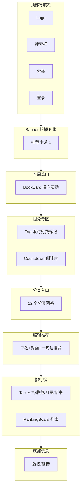
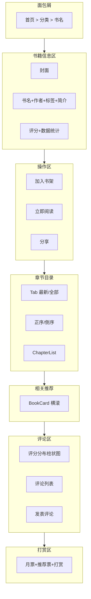
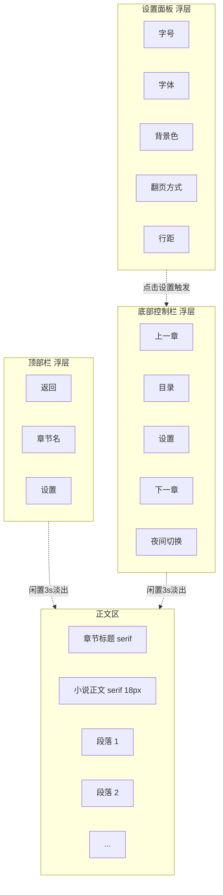
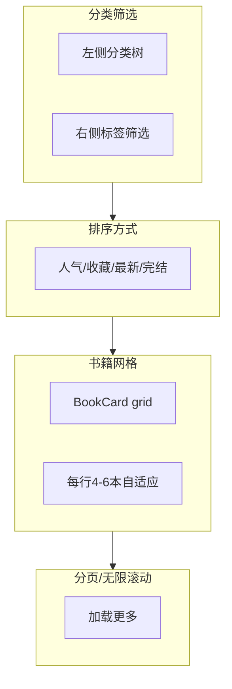
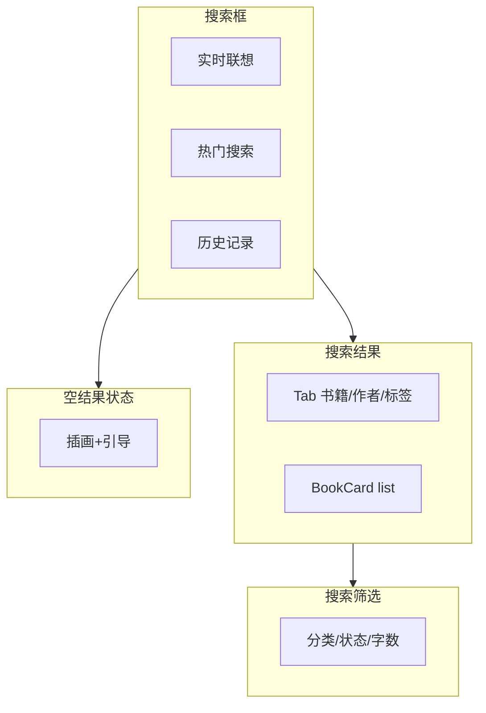
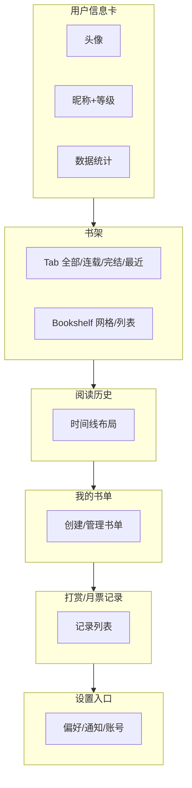

# C 端专项设计规范

> **文档版本**：V1.0.0 · 2026.07
> **适用范围**：面向读者用户（C 端）的消费级小说产品
> **覆盖端**：小说阅读 Web 站、H5 移动端、桌面端阅读器
> **令牌基线**：本文档所有设计令牌引用自《前端底层设计规范》，保持一致

---

## 目录

1. [文档定位](#1-文档定位)
2. [C 端设计原则](#2-c-端设计原则)
3. [C 端色彩策略](#3-c-端色彩策略)
4. [C 端字体排印](#4-c-端字体排印)
5. [C 端页面模板](#5-c-端页面模板)
6. [C 端专用组件](#6-c-端专用组件)
7. [C 端动效规范](#7-c-端动效规范)
8. [C 端 H5 移动端适配](#8-c-端-h5-移动端适配)
9. [C 端性能要求](#9-c-端性能要求)
10. [C 端无障碍专项](#10-c-端无障碍专项)

---

## 1. 文档定位

### 1.1 产品定位

C 端产品是面向**读者用户**的消费级内容产品，与 B 端/A 端（作者、运营后台）严格区分。C 端的核心不是「管理效率」，而是**阅读沉浸感**与**内容发现效率**。所有设计决策都应回答一个问题：*这是否让读者更愿意打开一本书、读得更久、更容易找到下一本想读的书？*

C 端产品矩阵覆盖三个端：

| 端 | 形态 | 主场景 | 设计侧重 |
| --- | --- | --- | --- |
| Web 站 | PC 浏览器 | 深度阅读、书架管理、社区浏览 | 信息密度、多列布局、键鼠交互 |
| H5 移动端 | 手机浏览器 / App WebView | 通勤阅读、睡前阅读、碎片追更 | 单手操作、手势、首屏性能 |
| 桌面端阅读器 | Electron 桌面应用 | 长时间沉浸阅读、离线阅读 | 大屏沉浸、离线能力、系统级集成 |

### 1.2 与底层规范的关系

本文档是《前端底层设计规范》的**垂直延伸**，不重复定义通用令牌，仅在其基础上：

- 扩展 C 端专属语义层（阅读模式色板、营销暖色系）[Expert judgment]
- 沉淀 C 端高频页面模板与专用组件 [Expert judgment]
- 约束 C 端特殊的性能、动效、无障碍要求 [Research-backed]

当本文档与底层规范冲突时，以底层规范为准；本文档未覆盖的部分，回退到底层规范。

### 1.3 阅读对象

- **前端工程师**：实现 C 端页面与组件，遵守令牌与组件契约
- **设计师**：基于模板与组件进行页面设计，不脱离体系造轮子
- **产品经理**：理解 C 端设计边界，需求规划时参考页面模板

---

## 2. C 端设计原则

C 端设计原则是所有页面与组件决策的顶层判断标准。当局部设计出现取舍冲突时，按下列顺序判断优先级（越靠前优先级越高）。

### 2.1 读者优先

一切设计服务于**阅读沉浸感**，UI 应当退居幕后。阅读器是 C 端的灵魂页面，进入阅读状态后，非必要 UI 一律隐藏；必要的控制项以浮层形式出现，闲置 3 秒后自动淡出 [Research-backed]。

- 阅读器正文区占满可视区域，不留广告位遮挡正文
- 章节切换时不打断阅读流，翻页动画优先于装饰动画
- 任何弹窗/通知在阅读器内必须可一键关闭，且不打断当前阅读位置

### 2.2 内容为王

视觉层级让位于内容本身，**封面和标题是第一触点**。在发现、分类、搜索、详情页中，书籍封面与书名承担 80% 的信息传达，UI 框架应当弱化。

- BookCard 的封面永远是最大视觉权重，元数据（作者、标签、评分）次之
- 列表页背景使用 bg-page（gray-1）保持安静，让封面色彩跳出来
- 不使用大面积装饰性渐变背景与内容争夺注意力 [Expert judgment]

### 2.3 温度感

C 端需要**情感连接**，相比 B 端的冷峻理性，C 端在圆角、色彩、动效上更柔、更暖、更生动。

- 圆角：C 端卡片默认 radius-lg（12px），比 B 端 radius-md（8px）更柔
- 色彩：增加暖橙 accent 与玫红 rose 辅助色系，承载营销与互动情绪
- 动效：BookCard hover 微缩放、打赏 spring 弹性反馈、排行榜数字滚动，传递「活」的感觉
- 文案：使用「追更」「书友」「月票」等社区化、有温度的词汇，而非「订阅/用户/积分」 [Expert judgment]

### 2.4 碎片化适配

支持**通勤、睡前、排队**等碎片场景，H5 体验与 Web 同等重要，不是降级版。

- 章节正文支持断点续读，跨端同步阅读进度
- 单章阅读时长 3-8 分钟，适配碎片时间窗口 [Research-backed]
- H5 首屏 1.5s 内可交互，避免用户在地铁信号弱场景流失
- 离线缓存已读章节，无网络也可继续阅读

### 2.5 性能即体验

**性能是 C 端体验的一部分**，不是技术指标。卡顿即体验劣化。

- 首屏 LCP < 1.5s，章节切换 < 300ms（含预加载）
- 翻页无白屏：当前章 ±2 章预加载，切换时直接渲染已缓存内容
- 长列表虚拟滚动：章节目录超过 500 章时启用虚拟列表
- 内存管理：阅读器最多保留 5 章在内存中，超出按 LRU 淘汰

---

## 3. C 端色彩策略

### 3.1 令牌基线（引用底层）

C 端色彩建立在底层 14 级中性色与品牌色之上，本节仅描述 C 端的策略性使用方式，令牌定义见底层规范。

| 语义令牌 | 值 | 用途 |
| --- | --- | --- |
| brand-7 | #1890FF | 主品牌色，主操作按钮、链接、选中态 |
| accent-7 | #245BFF | C 端钴蓝强调色，营销氛围、Banner、推荐位 |
| `--color-text-primary` | gray-14 (`#0A0B12`) | 正文主文字 |
| `--color-text-secondary` | gray-8 (`#5E5E6A`) | 次要文字（作者名、元数据） |
| `--color-text-tertiary` | gray-6 (`#9999A5`) | 辅助文字（时间、字数） |
| `--color-bg-page` | gray-1 (`#F7F7F8`) | 页面底色 |
| `--color-bg-surface` | `#FFFFFF` | 卡片/面板底色 |
| `--color-border-default` | gray-4 (`#D3D3DA`) | 分割线、卡片边框 |

> **命名对齐**：上表语义令牌均带 `--color-` 前缀，与底层规范（doc 01 §4.4）一致。本文档后续表格与正文中为简洁起见可省略前缀简写（如 `text-primary`），实际 CSS 引用须使用全名 `var(--color-text-primary)`。

### 3.2 C 端辅助暖色系

C 端在通用令牌基础上**新增暖色辅助色系**，用于营销与互动场景，这是 C 端区别于 B 端的色彩特征 [Expert judgment]。

#### 3.2.1 暖橙 accent（营销色）

```
/* L1 Primitive · 暖橙（C 端扩展色系，底层 doc 01 可扩展补充） */
--orange-1: #FFF4E6;
--orange-2: #FFD9B3;
--orange-3: #E37318;
--orange-4: #F08528;
--orange-5: #C9640F;

/* L2 Semantic · 暖橙强调 */
--color-accent-orange:      var(--orange-3);
--color-accent-orange-hover: var(--orange-4);
--color-accent-orange-active: var(--orange-5);
--color-accent-orange-bg:   var(--orange-1);
```

> **命名对齐**：暖橙令牌遵循底层 `{palette}-{shade}` 原始层 + `color-{role}-{state}` 语义层双轨命名。本文档正文中简写为 `accent-orange`，CSS 实际引用须使用 `var(--color-accent-orange)`。

**使用场景**：排行榜 TOP 标记、限时免费标签、推荐位徽章、活动倒计时、畅销榜金牌。

**使用约束**：
- 仅用于营销/推荐/限时类信息，**不可**用于普通操作按钮（普通操作用 brand-7）
- 单屏出现不超过 3 处，避免视觉过载
- 与 brand-7 同屏时，暖橙用于「特殊/限时」，蓝色用于「常规操作」，形成语义区分

#### 3.2.2 玫红 rose（互动色）

```
/* L2 Semantic · 玫红互动色（C 端扩展，复用 error 原始色阶） */
--color-rose:          var(--error-3);   /* #F5222D，打赏/月票/点赞 */
--color-rose-light:    #FF6B6B;           /* C 端扩展浅色，需补充至底层 primitive */
--color-rose-gradient: linear-gradient(135deg, var(--error-3) 0%, #FF6B6B 100%);
--color-rose-bg:       var(--error-1);    /* #FFF1F0，浅底用于打赏记录 */
```

**使用场景**：打赏按钮、月票、推荐票、点赞、红心、催更。

**使用约束**：
- rose-gradient 仅用于打赏/月票这类强互动按钮，不用于普通按钮
- 点赞/收藏的「已激活」态使用 rose，与「未激活」的 gray 形成对比

### 3.3 品牌色使用策略

| 场景 | 令牌 | 说明 |
| --- | --- | --- |
| 主操作按钮（加入书架、立即阅读、登录） | brand-7 #1890FF | 全站统一的主操作色 |
| 营销氛围（Banner、推荐位背景、活动专题） | accent-7 #245BFF | 钴蓝比 brand 更有质感，适合大面积 |
| 链接、选中态、焦点 | brand-7 | 保持一致 |
| 禁用态 | gray-4 文字 + gray-2 背景 | 不用品牌色 |

**原则**：同一屏内 brand-7 与 accent-7 不要混用作为操作色，避免用户产生「两个主操作」的困惑 [Expert judgment]。accent-7 主要用于非交互的氛围层（背景、插画、装饰），brand-7 用于可点击的操作元素。

### 3.4 阅读模式专用色板

阅读器是 C 端核心场景，提供 **4 种阅读主题**，每种主题独立定义背景与文字色，不使用通用语义令牌，以保证阅读舒适度 [Research-backed]。

| 模式 | 背景 bg | 文字 text | 次要文字 | 适用场景 |
| --- | --- | --- | --- | --- |
| 日间模式 | #FFFFFF | #2A2B33 | #5E5E6A | 白天、明亮环境 |
| 夜间模式 | #1A1A1A | #E0E0E0 | #888888 | 夜间、暗环境 |
| 护眼模式 | #F5EDDC | #5B4636 | #8C7355 | 长时间阅读、减轻疲劳 |
| 羊皮纸模式 | #F4ECD8 | #5B4636 | #8C7355 | 文学氛围、复古质感 |

**阅读主题切换规则**：
- 默认跟随系统 `prefers-color-scheme`，用户手动选择后持久化
- 夜间模式与系统暗黑模式独立：系统暗黑影响 UI 框架，阅读器夜间模式仅影响正文区
- 4 种主题切换无过渡动画或极短过渡（dur-instant 90ms），避免阅读时色彩流动干扰

### 3.5 C 端暗黑模式

C 端暗黑模式与通用暗黑模式保持一致（gray-14 #0A0B12 作为最深层背景），但**阅读器有独立的 4 种阅读主题**，暗黑模式下阅读器仍可独立选择护眼/羊皮纸模式。

- UI 框架（导航、卡片、列表）：跟随系统暗黑模式令牌
- 阅读器正文区：由阅读主题决定，不受系统暗黑模式影响
- 暖橙 accent 在暗黑模式下降低明度使用（accent-orange #E37318 → #F08528），保证对比度

---

## 4. C 端字体排印

### 4.1 字体家族

| 用途 | 字体族 | 令牌 | 说明 |
| --- | --- | --- | --- |
| UI 文字 | Noto Sans SC | `--font-sans` | 导航、按钮、列表、表单等界面文字 |
| 小说正文 | Noto Serif SC | `--font-serif` | 阅读器正文、书名、章节标题 |
| 代码/数字 | JetBrains Mono | `--font-mono` | 字数统计、时间戳、ID |

### 4.2 UI 文字阶

UI 文字使用 Noto Sans SC，正文基准 16px，行高 1.7 [Expert judgment]。

| 阶 | 字号 | 行高 | 字重 | 用途 |
| --- | --- | --- | --- | --- |
| Display | 64px | 1.2 | 600 | 营销专题大标题 |
| H1 | 40px | 1.3 | 600 | 页面主标题 |
| H2 | 32px | 1.4 | 600 | 区块标题 |
| H3 | 24px | 1.5 | 600 | 卡片标题 |
| Body-lg | 18px | 1.7 | 400 | 大正文（列表简介） |
| Body | 16px | 1.7 | 400 | 默认正文 |
| Body-sm | 14px | 1.6 | 400 | 辅助文字、元数据 |
| Caption | 12px | 1.5 | 400 | 标签、时间戳、角标 |

### 4.3 小说正文排印

小说正文是 C 端的灵魂，使用 Noto Serif SC，有独立的排印规则 [Research-backed]：

| 属性 | 值 | 说明 |
| --- | --- | --- |
| 字体 | Noto Serif SC | 衬线字体，长文阅读更舒适 |
| 字号 | 18px | 默认值，用户可调 |
| 行高 | 1.8 | 比 UI 行高更松，减少换行疲劳 |
| 段间距 | 1em | 段落间空一行，呼吸感 |
| 首行缩进 | 2em | 中文排版传统，段落起始缩进两字 |
| 文字颜色 | 由阅读主题决定 | 见 §3.4 |
| 最大行宽 | 42 字符（约 756px） | 超出则居中，避免单行过长 |

**对齐方式**：正文两端对齐（`text-align: justify`），末行左对齐，避免锯齿状右边缘 [Expert judgment]。

### 4.4 标题与书名

| 元素 | 字体 | 字号 | 字重 | 说明 |
| --- | --- | --- | --- | --- |
| 书名（详情页大标题） | Noto Serif SC | 32px | 600 | 衬线体现文学质感 |
| 章节标题（阅读器顶部） | Noto Serif SC | 20px | 600 | 居中显示 |
| 章节列表项 | Noto Sans SC | 16px | 400 | 列表可读性优先 |
| Display 展示标题 | Noto Serif SC | 64px | 600 | 营销专题、活动页 |

### 4.5 阅读器字号可调

阅读器支持 **6 档字号**调节，用户偏好持久化存储 [Expert judgment]：

| 档位 | 字号 | 适用 |
| --- | --- | --- |
| XS | 14px | 信息密度高、视力好 |
| S | 16px | 默认偏小 |
| M（默认） | 18px | 推荐阅读字号 |
| L | 20px | 稍大 |
| XL | 22px | 大字 |
| XXL | 24px | 最大，无障碍场景 |

字号调节实时生效，无需重新加载章节。调节后面板自动收起，正文区平滑过渡（dur-fast 150ms）。

### 4.6 阅读器字体可切换

除 Noto Serif SC 默认字体外，阅读器支持切换 4 种字体，适配不同读者偏好 [Expert judgment]：

| 选项 | 字体族 | 回退 | 说明 |
| --- | --- | --- | --- |
| 系统默认 | Noto Serif SC | serif | 官方推荐衬线 |
| 宋体 | SimSun, Noto Serif SC | serif | 传统书报体 |
| 黑体 | SimHei, Noto Sans SC | sans-serif | 无衬线，现代感 |
| 楷体 | KaiTi, Noto Serif SC | serif | 文学复古感 |

**实现**：通过 CSS 变量 `--reader-font-family` 动态切换，字体文件按需加载，首次切换显示加载状态。

---

## 5. C 端页面模板

本节定义 C 端 6 个核心页面模板。每个模板含 Mermaid 线框图、组件槽位表、响应式断点规则、状态变体。

### 5.1 首页 — 发现页

发现页是 C 端入口，目标是让读者**快速找到想读的书**，承担推荐、导流、氛围营造职责。

#### 5.1.1 线框图



#### 5.1.2 组件槽位表

| 槽位 | 组件 | 数量 | 说明 |
| --- | --- | --- | --- |
| 顶部导航栏 | NavBar | 1 | Logo + Search + 分类下拉 + 登录/头像 |
| Banner 轮播 | Carousel | 1 | 5 张推荐，自动轮播 5s，可手动切换 |
| 本周热门 | BookCard (horizontal) | 6-10 | 横向滚动，露出右侧暗示可滑 |
| 限免专区 | BookCard (grid) + Tag + Countdown | 4-6 | 限时免费标记 + 倒计时 |
| 分类入口 | CategoryGrid | 12 | 3×4 网格，图标 + 文字 |
| 编辑推荐 | EditorPick | 3-5 | 大封面 + 书名 + 一句话推荐 |
| 排行榜 | RankingBoard | 1 | Tab 切换 4 类榜单 |
| 底部信息 | Footer | 1 | 版权、友链、备案 |

#### 5.1.3 响应式断点规则

| 断点 | 布局 | 说明 |
| --- | --- | --- |
| xs <480 | 单列，Banner 全宽，分类 2 列，BookCard 横滚 | H5 主流 |
| sm 480-768 | 单列，Banner 全宽，分类 3 列 | 大屏手机 |
| md 768-1024 | 双栏，主内容 + 侧边排行榜，分类 4 列 | 平板 |
| lg 1024-1280 | 12 列栅格，内容区 8 列 + 侧栏 4 列 | 小屏 PC |
| xl ≥1280 | 12 列栅格，内容居中 max-width 1200px | 标准 PC |

#### 5.1.4 状态变体

- **默认态**：已登录，展示个性化推荐
- **未登录态**：Banner 区显示登录引导浮层，书架入口引导登录
- **加载态**：骨架屏（Skeleton）占位，Banner 用灰色占位块
- **空态**：个性化推荐数据不足时，降级为热门榜单

---

### 5.2 小说详情页

详情页是阅读决策页，目标是让读者**判断是否读这本书**并**进入阅读**。

#### 5.2.1 线框图



#### 5.2.2 组件槽位表

| 槽位 | 组件 | 说明 |
| --- | --- | --- |
| 面包屑 | Breadcrumb | 首页 > 分类 > 书名 |
| 封面 | BookCover | 大封面，点击可放大 |
| 书籍信息 | BookMeta | 书名(serif H1) + 作者 + 标签 + 简介(可展开) |
| 评分 | RatingStars + 数字 | 评分 + 评分人数 |
| 数据统计 | StatGroup | 字数、收藏、点击、状态(连载/完结) |
| 操作区 | ButtonGroup | 加入书架(主) + 立即阅读(accent) + 分享 |
| 章节目录 | ChapterList | Tab 最新/全部，支持倒序，分页 |
| 相关推荐 | BookCard (horizontal) | 同类书籍横滚 |
| 评论区 | CommentList + RatingDistribution | 评分柱状图 + 评论列表 + 发表入口 |
| 打赏区 | RewardButton ×3 | 月票/推荐票/打赏 |

#### 5.2.3 响应式断点规则

| 断点 | 布局 |
| --- | --- |
| xs/sm | 单列，封面与信息上下排列，操作区吸底固定 |
| md | 双栏，封面+信息左 5 列，操作+目录右 7 列 |
| lg/xl | 三栏，信息区 7 列 + 目录 5 列，评论区全宽下方 |

#### 5.2.4 状态变体

- **未加入书架**：「加入书架」按钮为 brand-7 主色
- **已加入书架**：按钮变为 gray 描边态，文案「已在书架」
- **连载中**：显示「连载中」标签，最新章节高亮
- **已完结**：显示「已完结」标签，章节目录无更新提示
- **VIP 章节**：章节列表项显示 VIP 锁标记，未订阅点击触发订阅引导

---

### 5.3 阅读器页

阅读器是 C 端核心，目标是**沉浸阅读**，UI 最大化退让。

#### 5.3.1 线框图



#### 5.3.2 组件槽位表

| 槽位 | 组件 | 说明 |
| --- | --- | --- |
| 顶部栏 | ReaderTopBar | 返回 + 章节名 + 设置入口，浮层闲置 3s 淡出 |
| 正文区 | Reader | content + fontSize + fontFamily + lineHeight + theme + pageMode |
| 底部控制栏 | ReaderBottomBar | 上一章/目录/设置/下一章/夜间切换 |
| 设置面板 | ReaderSettings | 字号/字体/背景色/翻页方式/行距 5 项 |
| 阅读进度 | ReadingProgress | 顶部细条，显示当前章节进度 |

#### 5.3.3 翻页交互

| 方式 | 触发 | 动效 | 说明 |
| --- | --- | --- | --- |
| 左右滑动 | 手势左右滑 | dur-normal 240ms 滑动 + 淡入淡出 | H5 默认 |
| 上下滚动 | 手势上下滑 | 原生滚动 | 桌面/Web 默认 |
| 点击翻页 | 点击左/右半屏 | dur-normal 240ms 淡入淡出 | 可选 |

**预加载策略**：当前章 ±2 章预加载，后台静默加载无动画。切换章节时优先使用缓存，缓存未命中显示极简加载条（不遮挡上一章末尾）[Research-backed]。

#### 5.3.4 响应式断点规则

| 断点 | 布局 |
| --- | --- |
| xs/sm | 全屏沉浸，顶部/底部栏浮层，正文最大宽度 100% |
| md | 正文居中，最大宽度 680px，左右留白 |
| lg/xl | 正文居中，最大宽度 756px（约 42 字符），大屏沉浸 |

#### 5.3.5 状态变体

- **阅读中**：顶部/底部栏隐藏，仅 ReadingProgress 细条可见
- **唤出控制**：点击屏幕中央区域唤出顶部/底部栏，闲置 3s 自动淡出
- **设置面板展开**：底部栏上滑出设置面板，遮罩半透明
- **章节切换加载**：缓存未命中时显示加载条，不中断当前显示
- **夜间模式**：正文区切换为夜间色板，顶部/底部栏同步暗化

---

### 5.4 分类页

分类页是发现路径，目标是让读者**按类别筛选**找到目标书籍。

#### 5.4.1 线框图



#### 5.4.2 组件槽位表

| 槽位 | 组件 | 说明 |
| --- | --- | --- |
| 分类筛选 | CategoryTree + TagFilter | 左侧分类树，右侧标签多选 |
| 排序方式 | SortTabs | 人气/收藏/最新/完结 4 项 |
| 书籍网格 | BookCard (grid) | 每行 4-6 本自适应 |
| 分页 | Pagination / InfiniteScroll | 桌面分页，H5 无限滚动 |

#### 5.4.3 响应式断点规则

| 断点 | 布局 | 每行书数 |
| --- | --- | --- |
| xs | 单列，筛选折叠为顶部抽屉 | 2 |
| sm | 单列，筛选折叠 | 3 |
| md | 双栏，分类左 3 列 + 网格右 9 列 | 4 |
| lg | 双栏，分类左 3 列 + 网格右 9 列 | 5 |
| xl | 双栏，网格最大宽度 1200px | 6 |

#### 5.4.4 状态变体

- **默认**：显示人气排序结果
- **筛选激活**：标签高亮，结果实时刷新
- **加载中**：网格位置显示骨架卡片
- **空结果**：空状态插画 + 「换个筛选条件试试」引导

---

### 5.5 搜索页

搜索页是精准定位入口，目标是**快速找到特定书/作者**。

#### 5.5.1 线框图



#### 5.5.2 组件槽位表

| 槽位 | 组件 | 说明 |
| --- | --- | --- |
| 搜索框 | SearchInput | 实时联想（防抖 300ms） |
| 热门搜索 | HotSearchTags | 标签云形式 |
| 历史记录 | SearchHistory | 可清空 |
| 搜索结果 | BookCard (list) | Tab 切换书籍/作者/标签 |
| 空结果 | EmptyState | 插画 + 引导文案 |
| 搜索筛选 | SearchFilter | 分类/状态/字数范围 |

#### 5.5.3 响应式断点规则

| 断点 | 布局 |
| --- | --- |
| xs/sm | 全屏搜索，联想下拉，结果单列 |
| md | 搜索框居中，结果双列 |
| lg/xl | 搜索框居中 max-width 720px，结果单列居中 |

#### 5.5.4 状态变体

- **初始态**：显示热门搜索 + 历史记录
- **输入联想**：下拉显示匹配书名/作者
- **有结果**：Tab 切换 + 结果列表
- **无结果**：空状态 + 「搜索建议」相似词
- **搜索中**：搜索框显示加载指示

---

### 5.6 个人中心页

个人中心是用户资产页，管理**书架、历史、书单、互动记录**。

#### 5.6.1 线框图



#### 5.6.2 组件槽位表

| 槽位 | 组件 | 说明 |
| --- | --- | --- |
| 用户信息卡 | UserCard | 头像 + 昵称 + 等级 + 阅读时长/书本数 |
| 书架 | Bookshelf | Tab 全部/连载/完结/最近阅读，网格/列表切换 |
| 阅读历史 | ReadingHistory | 时间线布局，按日期分组 |
| 我的书单 | BookList | 创建/管理书单 |
| 打赏记录 | RewardRecord | 月票/推荐票/打赏流水 |
| 设置入口 | SettingsEntry | 偏好/通知/账号安全 |

#### 5.6.3 响应式断点规则

| 断点 | 布局 |
| --- | --- |
| xs/sm | 单列，书架 Tab 横向滚动 |
| md | 双栏，左侧导航 3 列 + 右侧内容 9 列 |
| lg/xl | 三栏，用户卡左 4 列 + 内容 8 列 |

#### 5.6.4 状态变体

- **已登录**：完整展示所有模块
- **未登录**：仅展示登录引导，书架/历史灰显
- **书架空**：空状态 + 「去发现好书」引导
- **VIP 用户**：信息卡显示 VIP 徽章

---

### 5.7 阅读统计页 — 阅读数据可视化

阅读统计页是用户阅读数据的可视化页面，目标是让读者**直观感知阅读习惯与成就**，把抽象的「读了多少」转化为可视化的成长轨迹，增强阅读粘性与成就感。布局为单列流式，max-width 720px 居中。

#### 5.7.1 布局示意图

```
┌──────────────────────────────────────────┐
│ ←  阅读统计                          ⋯   │  顶部栏
├──────────────────────────────────────────┤
│ ┌────────┐ ┌────────┐ ┌────────┐         │
│ │本周时长 │ │累计字数 │ │连续天数 │         │  统计概览
│ │ 12.5h  │ │ 86.4万 │ │  28天  │         │  (mono 数字)
│ └────────┘ └────────┘ └────────┘         │
├──────────────────────────────────────────┤
│ 阅读热力图                    近一年 ▾   │
│ ┌──────────────────────────────────────┐ │
│ │ ░░▒▒▓▓░▒▓▓░░▒▒▓░▒▓▓▒░▒▓░░▒▒▓▓▒░▒▓▓ │ │ 53×7 格子
│ │ ░▒▓▓▒░▒▓▓▒▒▓░▒▓▓▒░░▒▓▓▒▒▓░▒▓▓▒░▒▓▓ │ │ hover 显示
│ │ ▒▓▓░░▒▓▓▒▒▓▓▒░▒▓░▒▒▓▓▒▒▓░▒▓▓▒▒▓▓▒▓ │ │ 当日时长
│ │ ░░▒▒▓▓░▒▓░▒▓▓▒░░▒▒▓▓▒▒▓░▒▓▓▒░░▒▒▓▓ │ │
│ └──────────────────────────────────────┘ │
│ 少 ░░ ▒▒ ▓▓ 多                           │
├──────────────────────────────────────────┤
│ 阅读偏好分布                              │
│      ╭───╮                               │
│     ╱     ╲     玄幻 32% ████████         │  环形图
│    │  ██   │    都市 24% ██████           │  + 分类图例
│     ╲     ╱     武侠 18% █████            │
│      ╰───╯      历史 14% ████             │
│                  其他 12% ███             │
├──────────────────────────────────────────┤
│ 成就徽章墙                        全部 ▸ │
│ ┌────┐ ┌────┐ ┌────┐ ┌────┐ ┌────┐       │
│ │百章│ │百万│ │连读│ │追更│ │ ?? │       │  已解锁/未解锁
│ │ 已 │ │ 已 │ │ 已 │ │ 已 │ │ 锁 │       │
│ └────┘ └────┘ └────┘ └────┘ └────┘       │
└──────────────────────────────────────────┘
```

#### 5.7.2 组件槽位表

| 槽位 | 组件 | 说明 |
| --- | --- | --- |
| 顶部栏 | NavBar | 返回 + 标题「阅读统计」+ 更多（导出/分享） |
| 统计概览 | StatOverview | 三宫格：本周阅读时长 / 累计阅读字数 / 连续阅读天数 |
| 阅读热力图 | ReadingHeatmap | GitHub 贡献图风格，53 周 × 7 日格子，4 级色深 |
| 偏好分布 | PreferenceRing | 环形图 + 分类图例，扇区色用 `--color-accent-orange` 渐变 |
| 成就徽章墙 | BadgeWall | 徽章网格，已解锁/未解锁态，点击查看达成条件 |

#### 5.7.3 交互与状态

- **统计数字**：`--font-mono` + `--color-text-primary`，进入页面时从 0 滚动到目标值，dur-deliberate 540ms ease-out；标签用 `--color-text-tertiary` 14px
- **热力图 hover**：格子 hover 弹出 tooltip「2026-07-15 · 阅读 48 分钟」，dur-instant 90ms 显隐，移出即消失
- **热力图色深**：4 级由浅到深映射阅读时长，最深档用 `--color-accent-orange`，空日为 `--color-bg-subtle`
- **偏好环形图**：点击分类高亮对应扇区并显示该类字数，再次点击取消
- **徽章墙**：已解锁徽章彩色 + `--color-accent-orange` 描边，未解锁 `--color-text-tertiary` 灰色 + 锁图标

| 状态 | 视觉 | 说明 |
| --- | --- | --- |
| 加载中 | 骨架屏（统计卡灰块 + 热力图灰格 + 环形图灰环） | 数据请求中 |
| 空状态 | EmptyState 插画 + 「还没有阅读数据，去读一本书吧」+ 主按钮 | 新用户无数据 |
| 部分数据 | 热力图仅显示有记录日期，无记录为浅灰格 | 数据稀疏 |
| 错误 | 错误插画 + 「加载失败，点击重试」 | 接口异常 |

#### 5.7.4 响应式断点规则

| 断点 | 布局 |
| --- | --- |
| xs | 单列，统计概览纵向堆叠，热力图横向滚动，徽章墙 3 列 |
| sm | 单列，统计概览三宫格，热力图横向滚动，徽章墙 4 列 |
| md | 单列居中 max-width 720px，热力图完整展示，徽章墙 5 列 |
| lg/xl | 单列居中 max-width 720px，左右留白，徽章墙 5 列 |

[Research-backed] 阅读数据可视化参考 GitHub 贡献图与主流阅读 App 范式，热力图与成就徽章墙经实证可提升阅读粘性与留存。

---

### 5.8 VIP 订阅页 — 会员订阅与充值

VIP 订阅页是会员权益与充值页面，目标是让读者**快速理解 VIP 价值并完成订阅**。为与普通页面的 brand 蓝形成语义区分，VIP 区域统一使用 `--color-accent-orange`（暖橙）作为主调，传递「尊享/限时」的营销情绪。

#### 5.8.1 布局示意图

```
┌──────────────────────────────────────────┐
│ ←  开通 VIP                          ✕   │  顶部栏
├──────────────────────────────────────────┤
│ ╔════════════════════════════════════╗   │
│ ║ ★ VIP 会员  尊享全站精品           ║   │  VIP 权益卡
│ ║ ▸ 全站 VIP 章节免费读              ║   │  (暖橙主调)
│ ║ ▸ 去广告 · 双倍月票                ║   │
│ ║ ▸ 专属徽章 · 优先催更              ║   │
│ ╚════════════════════════════════════╝   │
├──────────────────────────────────────────┤
│ 选择套餐                                  │
│ ┌────────┐ ┌────────┐ ┌────────┐         │
│ │  月卡   │ │  季卡   │ │  年卡   │         │  3 列等宽
│ │ ¥18/月 │ │ ¥15/月 │ │ ¥12/月 │         │  选中态：
│ │        │ │  省 9  │ │ 省 72  │         │  暖橙边框
│ │  ○     │ │  ● ✔   │ │  ○     │         │  + 底纹
│ └────────┘ └────────┘ └────────┘         │
│                              已过期 ▾    │  不可用套餐
├──────────────────────────────────────────┤
│ 支付方式                                  │
│ ◉ 微信支付   ○ 支付宝   ○ 苹果内购        │
├──────────────────────────────────────────┤
│                                          │
├──────────────────────────────────────────┤
│ 合计 ¥45（季卡）       [ 立即开通 ▸ ]     │  底部固定提交栏
└──────────────────────────────────────────┘
```

#### 5.8.2 组件槽位表

| 槽位 | 组件 | 说明 |
| --- | --- | --- |
| 顶部栏 | NavBar | 返回 + 标题「开通 VIP」+ 关闭 |
| VIP 权益卡 | VipBenefitCard | 暖橙渐变背景 + 权益清单，`--color-accent-orange` 主调 |
| 套餐选择 | PlanSelector | 月卡/季卡/年卡 3 列等宽栅格，含原价划线 + 折后价 |
| 支付方式 | PaymentMethod | 微信/支付宝/苹果内购单选 |
| 底部提交栏 | SubmitBar | 固定吸底，合计金额 + 「立即开通」主按钮 |

#### 5.8.3 套餐状态

| 状态 | 视觉 | 说明 |
| --- | --- | --- |
| 未选中 | `--color-bg-surface` + `--color-border-default` 边框 | 默认 |
| 选中 | `--color-accent-orange` 2px 边框 + `--color-accent-orange-bg` 底纹 + 右上角 ✔ | 当前选择 |
| 不可用（已过期套餐） | `--color-text-tertiary` 文字 + 虚线边框 + 「已过期」标签 | 不可选 |
| 推荐 | 角标「省最多」`--color-accent-orange` | 营销引导 |

#### 5.8.4 响应式断点规则

| 断点 | 布局 |
| --- | --- |
| xs/sm | 单列，套餐卡片纵向堆叠，底部提交栏吸底 + 安全区 |
| md | 套餐卡片 3 列等宽栅格，权益卡全宽 |
| lg/xl | 内容居中 max-width 720px，套餐 3 列，提交栏吸底 |

#### 5.8.5 色彩策略

- VIP 区域主调用 `--color-accent-orange`（#E37318），区别于普通页面的 `--color-brand` 蓝
- 权益卡背景用 `--color-accent-orange-bg`（#FFF4E6）底 + 暖橙渐变描边
- 「立即开通」按钮用 `--color-accent-orange` 实色，hover 切换 `--color-accent-orange-hover`
- 同屏暖橙不超过权益卡 + 选中套餐 + 主按钮 3 处，避免视觉过载

[Expert judgment] VIP 区域用暖橙区别于 brand 蓝，是基于 C 端营销色彩语义分层经验：暖橙传递「尊享/限时」，蓝色用于常规操作。

---

### 5.9 追更管理页 — 追更书单聚合管理

追更管理页是用户追更书单的聚合管理页面，目标是让读者**一眼掌握所有追更小说的更新状态**，快速进入新章节阅读。

#### 5.9.1 布局示意图

```
┌──────────────────────────────────────────┐
│ ←  追更管理            [ 全部已读 ]       │
├──────────────────────────────────────────┤
│ [全部] 已更新 3 │ 未读 12 │ 已完结        │  顶部 Tab
├──────────────────────────────────────────┤
│ ┌────┐  雪中悍刀行              ● 更新2章 │
│ │封面│  最新：第八十二章 江湖路            │  列表项
│ │60× │  2 小时前                  追更 ●  │  --radius-lg
│ │ 80 │                              ←左滑 │  --sh-1
│ └────┘          [ 取消追更 ]              │
│ ──────────────────────────────────────── │
│ ┌────┐  诡秘之主                  未更新  │
│ │封面│  最新：第一千零五章 蠕动的饥饿      │
│ │    │  昨天 18:30                          │
│ └────┘                                    │
│ ──────────────────────────────────────── │
│ ┌────┐  斗破苍穹                已完结    │
│ │封面│  最新：第一千六百四十八章 大结局    │  灰色标签
│ │    │  2025-12-01                          │
│ └────┘                                    │
├──────────────────────────────────────────┤
│ 共 12 本 · 3 本有更新                     │
└──────────────────────────────────────────┘
```

#### 5.9.2 组件槽位表

| 槽位 | 组件 | 说明 |
| --- | --- | --- |
| 顶部栏 | NavBar | 返回 + 标题 + 「全部已读」批量操作按钮 |
| Tab 切换 | Tabs | 全部 / 已更新 / 未读 / 已完结，带数量 |
| 书籍列表 | FollowListItem | 左封面 60×80 + 右信息区，`--radius-lg` + `--sh-1` |
| 未读红点 | NotificationBadge | 封面右上角 `--color-rose` 红点 + 未读章节数 |
| 底部统计 | ListFooter | 共 N 本 · M 本有更新 |

#### 5.9.3 交互与状态

- **左滑操作**：列表项左滑露出 `--color-rose`「取消追更」按钮，滑动距离 ≥80px 触发，dur-fast 150ms 回弹
- **点击项**：点击列表项进入阅读器最新未读章节
- **批量已读**：顶部「全部已读」一键清除所有红点，二次确认弹窗
- **下拉刷新**：拉取最新更新状态

| 状态 | 视觉 | 说明 |
| --- | --- | --- |
| 有更新 | 封面右上角 `--color-rose` 红点 + 「更新 N 章」`--color-accent-orange` | 未读 |
| 无更新 | 无红点，最新章节 `--color-text-tertiary` | 已读尽 |
| 已完结 | 右侧「已完结」灰色标签 `--color-text-tertiary` + `--color-border-default` 描边 | 不再更新 |
| 加载中 | 骨架列表项（封面灰块 + 文字灰条） | 请求中 |
| 空追更 | EmptyState + 「去发现好书追更」 | 无追更书籍 |

#### 5.9.4 响应式断点规则

| 断点 | 布局 |
| --- | --- |
| xs/sm | 单列，列表项全宽，左滑手势操作 |
| md | 单列居中 max-width 720px，列表项左封面 + 右信息 |
| lg/xl | 单列居中 max-width 720px，信息区可展示更多元数据 |

[Expert judgment] 追更管理采用左滑取消而非长按菜单，符合移动端书友高效追更的操作习惯，红点提示是追更用户的核心诉求。

---

## 6. C 端专用组件

本节定义 C 端 12 个专用组件。每个组件含 Props 表、状态、规格、JSX 示例、Do/Don't。组件基于底层令牌实现，遵循通用交互规范。

### 6.1 BookCard — 书籍卡片

书籍卡片是 C 端出现频率最高的组件，承载书籍的核心信息，用于发现页、分类页、搜索页、详情页相关推荐等场景。

#### Props

| Prop | 类型 | 默认值 | 说明 |
| --- | --- | --- | --- |
| book | `Book` | - | 书籍对象，含 id/title/author/cover/tags/intro/rating |
| variant | `'grid' \| 'list' \| 'horizontal'` | `'grid'` | 网格 / 列表 / 横向滚动 |
| size | `'sm' \| 'md' \| 'lg'` | `'md'` | 封面尺寸档位 |
| showRating | `boolean` | `true` | 是否显示评分 |
| showIntro | `boolean` | `false` | 是否显示简介（list 变体默认 true） |
| onClick | `(book) => void` | - | 点击跳转详情页 |
| tags | `string[]` | - | 额外标签覆盖 |

#### 状态

| 状态 | 视觉 | 说明 |
| --- | --- | --- |
| 默认 | bg-surface + border-subtle + radius-lg | 静态展示 |
| hover | 封面 scale(1.02) + sh-2 提升 + dur-fast 150ms | 桌面端悬停 |
| active | 封面 scale(0.98) | 按下反馈 |
| loading | 骨架屏（封面灰块 + 文字灰条） | 数据加载中 |
| 已加入书架 | 右上角角标「已加入」brand-bg | 书架内标记 |

#### 规格

- 封面比例固定 3:4（宽:高），size 对应宽度：sm 80px / md 120px / lg 160px
- grid 变体：封面在上，书名/作者/评分在下，垂直排列
- list 变体：封面在左，信息在右，简介默认展示 2 行
- horizontal 变体：封面在左，信息紧凑，用于横滚列表
- 书名 font-serif 字重 600，作者 font-sans text-secondary，评分用 RatingStars
- 封面圆角 radius-md，卡片整体 radius-lg

#### JSX 示例

```jsx
<BookCard
  book={{
    id: '101',
    title: '雪中悍刀行',
    author: '烽火戏诸侯',
    cover: 'https://cdn.example.com/covers/101.webp',
    tags: ['武侠', '连载中'],
    intro: '北凉世子徐凤年，三年辱名洗雪，踏入江湖……',
    rating: 4.8,
  }}
  variant="grid"
  size="md"
  showRating
  onClick={(book) => navigate(`/book/${book.id}`)}
/>
```

#### Do / Don't

- Do：封面永远是最大视觉权重，信息层级让位于封面
- Do：grid 变体书名最多 2 行，超出省略号
- Don't：不要在卡片内塞入超过 3 个标签，导致信息过载
- Don't：不要用正方形封面，破坏书籍封面 3:4 的行业认知

---

### 6.2 ChapterList — 章节列表

章节列表用于详情页目录与阅读器目录抽屉，支持长列表虚拟滚动。

#### Props

| Prop | 类型 | 默认值 | 说明 |
| --- | --- | --- | --- |
| chapters | `Chapter[]` | - | 章节数组，含 id/title/wordCount/updateTime/isVip |
| order | `'asc' \| 'desc'` | `'asc'` | 正序 / 倒序 |
| activeId | `string` | - | 当前阅读章节高亮 |
| onSelect | `(chapter) => void` | - | 点击章节 |
| virtual | `boolean` | `false` | 章节数 >500 时启用虚拟滚动 |
| pageSize | `number` | `50` | 分页大小 |
| showVip | `boolean` | `true` | 是否显示 VIP 标记 |

#### 状态

| 状态 | 视觉 | 说明 |
| --- | --- | --- |
| 默认 | 列表项 bg-surface hover bg-subtle | 常规 |
| 当前阅读 | 文字 brand-7 + 左侧 3px brand 竖条 | activeId 匹配 |
| VIP 章节 | 章节名后跟随锁图标 + accent-orange「VIP」标签 | 未订阅 |
| 已读 | 章节名 text-tertiary | 弱化 |
| 加载更多 | 底部「加载更多」按钮 + spinner | 分页加载 |

#### 规格

- 列表项高度 48px，padding space-3 space-4
- 章节名 font-sans 16px，字数/时间 font-mono text-tertiary 12px 右对齐
- VIP 标签使用 accent-orange-bg + accent-orange 文字，radius-sm
- 虚拟滚动：仅渲染可视区域 + 上下各 5 条缓冲，高度动态计算
- 倒序切换：点击「倒序」按钮，列表整体翻转，dur-normal 240ms

#### JSX 示例

```jsx
<ChapterList
  chapters={chapters}
  order="asc"
  activeId={currentChapterId}
  virtual={chapters.length > 500}
  pageSize={50}
  showVip
  onSelect={(ch) => navigate(`/read/${ch.id}`)}
/>
```

#### Do / Don't

- Do：超 500 章必须启用 virtual，避免 DOM 节点过多卡顿
- Do：当前阅读章节必须高亮，方便用户定位
- Don't：不要在列表项内嵌套封面缩略图，章节列表保持纯文字的高密度
- Don't：不要默认倒序，新用户期望从第一章开始浏览

---

### 6.3 Reader — 阅读器容器

阅读器容器是 C 端核心组件，封装正文渲染、字号/字体/行距/主题/翻页方式控制。

#### Props

| Prop | 类型 | 默认值 | 说明 |
| --- | --- | --- | --- |
| content | `string` | - | 章节正文 HTML/Markdown |
| chapterTitle | `string` | - | 章节标题 |
| fontSize | `14 \| 16 \| 18 \| 20 \| 22 \| 24` | `18` | 字号 6 档 |
| fontFamily | `'serif' \| 'song' \| 'hei' \| 'kai'` | `'serif'` | 字体 4 种 |
| lineHeight | `number` | `1.8` | 行高 |
| theme | `'day' \| 'night' \| 'eye' \| 'parchment'` | `'day'` | 阅读主题 |
| pageMode | `'slide' \| 'scroll' \| 'click'` | `'scroll'` | 翻页方式 |
| onPrev | `() => void` | - | 上一章 |
| onNext | `() => void` | - | 下一章 |
| onProgress | `(percent) => void` | - | 阅读进度回调 |

#### 状态

| 状态 | 视觉 | 说明 |
| --- | --- | --- |
| 阅读中 | 仅正文 + 顶部进度条 | 控制栏隐藏 |
| 控制唤出 | 顶部栏 + 底部栏浮层，bg 半透明遮罩 | 点击中央唤出 |
| 章节加载 | 顶部细条加载指示，不遮挡正文 | 缓存未命中 |
| 翻页中 | slide：横向位移 + 淡入；click：淡入淡出 | dur-normal 240ms |
| 选词 | 长按选区 + 弹出操作菜单（复制/查词/笔记） | H5 手势 |

#### 规格

- 正文区：font-serif，首行缩进 2em，段间距 1em，两端对齐
- 最大行宽 756px（lg/xl），居中，左右 padding space-8
- 主题色板见 §3.4，通过 CSS 变量 `--reader-bg` / `--reader-text` 切换
- 翻页动画：slide 使用 transform translateX，scroll 使用原生滚动
- 控制栏闲置 3s 自动淡出（opacity 1→0，dur-normal 240ms）
- 预加载：组件挂载时请求当前章 ±2 章，存入内存缓存（最多 5 章 LRU）

#### JSX 示例

```jsx
<Reader
  content={chapterContent}
  chapterTitle="第八十一章 入江湖"
  fontSize={settings.fontSize}
  fontFamily={settings.fontFamily}
  lineHeight={settings.lineHeight}
  theme={settings.theme}
  pageMode={settings.pageMode}
  onPrev={handlePrev}
  onNext={handleNext}
  onProgress={(p) => saveProgress(p)}
/>
```

#### Do / Don't

- Do：正文区不要有任何与阅读无关的 UI 元素（广告、浮窗）
- Do：翻页动画时长严格控制在 dur-normal 240ms，过长会感觉迟钝
- Don't：不要用默认滚动条样式，需自定义细滚动条或隐藏
- Don't：不要在阅读时弹出全屏广告/弹窗打断阅读流

---

### 6.4 RatingStars — 星级评分

星级评分用于详情页评分展示、评论区评分输入、BookCard 评分缩略。

#### Props

| Prop | 类型 | 默认值 | 说明 |
| --- | --- | --- | --- |
| value | `number` | `0` | 当前评分 0-5 |
| max | `number` | `5` | 最大星数 |
| allowHalf | `boolean` | `true` | 允许半星 |
| readonly | `boolean` | `false` | 只读模式 |
| size | `'sm' \| 'md' \| 'lg'` | `'md'` | 星星尺寸 |
| showValue | `boolean` | `false` | 是否显示数字 |
| onChange | `(value) => void` | - | 评分回调 |

#### 状态

| 状态 | 视觉 | 说明 |
| --- | --- | --- |
| 只读 | 实心星 brand-7 + 空星 gray-4 | 展示用 |
| 可交互 | hover 星高亮 brand-7，预览将选值 | 输入用 |
| 选中 | 实心星 brand-7 | 确定值 |
| 禁用 | 全部 gray-4 | 不可评 |

#### 规格

- 星星图标 24×24 网格，1.8px 描边，currentColor 继承
- size：sm 12px / md 16px / lg 24px
- 半星通过图标裁剪实现，不允许出现 1/4 星
- 评分分布柱状图：5 档（5/4/3/2/1 星）横向条形，长度按比例，颜色 brand-bg → brand-7 渐变
- 数字显示 font-mono，与星星基线对齐

#### JSX 示例

```jsx
<RatingStars
  value={4.5}
  max={5}
  allowHalf
  readonly
  size="md"
  showValue
/>
```

#### Do / Don't

- Do：无障碍场景下必须配合数字双重表达（showValue），色觉障碍用户依赖数字
- Do：评分分布柱状图需标注各档人数
- Don't：不要用 1-10 分制，5 星制是 C 端通用心智模型
- Don't：不要用其他颜色（红/绿）表示评分高低，统一用 brand-7

---

### 6.5 Bookshelf — 书架组件

书架组件用于个人中心，管理用户收藏的书籍，支持分组与视图切换。

#### Props

| Prop | 类型 | 默认值 | 说明 |
| --- | --- | --- | --- |
| books | `Book[]` | - | 书架书籍 |
| groupBy | `'none' \| 'status' \| 'tag'` | `'none'` | 分组方式 |
| sortBy | `'recent' \| 'title' \| 'update'` | `'recent'` | 排序方式 |
| viewMode | `'grid' \| 'list'` | `'grid'` | 视图模式 |
| tabs | `Tab[]` | - | 全部/连载/完结/最近阅读 |
| onUpdate | `(books) => void` | - | 书架变更回调 |

#### 状态

| 状态 | 视觉 | 说明 |
| --- | --- | --- |
| 网格视图 | BookCard grid 排列，封面 + 书名 | 默认 |
| 列表视图 | BookCard list，含阅读进度 | 详细信息 |
| 分组展开 | 分组标题 + 折叠箭头 | groupBy 启用 |
| 空书架 | 空状态插画 + 「去发现好书」按钮 | 无数据 |
| 有更新 | 书籍封面右上角红点 + NotificationBadge | 追更提示 |

#### 规格

- 网格视图：响应式列数，xs 2 列 / sm 3 列 / md 4 列 / lg 5 列 / xl 6 列
- 列表视图：单列，含封面 + 书名 + 阅读进度 + 上次阅读时间
- 分组标题 font-sans 14px text-secondary，uppercase
- 排序/视图切换控件置于右上角，icon-only 按钮
- 书籍有更新时封面右上角 8px rose 红点

#### JSX 示例

```jsx
<Bookshelf
  books={shelfBooks}
  groupBy="status"
  sortBy="update"
  viewMode="grid"
  tabs={[
    { key: 'all', label: '全部' },
    { key: 'ongoing', label: '连载' },
    { key: 'finished', label: '完结' },
    { key: 'recent', label: '最近阅读' },
  ]}
  onUpdate={(books) => syncShelf(books)}
/>
```

#### Do / Don't

- Do：默认按最近阅读排序，符合用户「接着读」的预期
- Do：有更新的书籍必须有醒目提示（红点 + Badge）
- Don't：不要默认列表视图，网格视图浏览效率更高
- Don't：不要在书架内放广告位，书架是用户私有资产页

---

### 6.6 RankingBoard — 排行榜

排行榜用于首页与排行榜页，展示热门书籍排名，含排名变化指示。

#### Props

| Prop | 类型 | 默认值 | 说明 |
| --- | --- | --- | --- |
| items | `RankItem[]` | - | 排行项，含 book/rank/prevRank |
| type | `'hot' \| 'collect' \| 'ticket' \| 'new'` | `'hot'` | 榜单类型 |
| rankIcon | `boolean` | `true` | 前三名是否用奖牌图标 |
| maxCount | `number` | `10` | 展示数量 |
| onTabChange | `(type) => void` | - | 切换榜单类型 |

#### 状态

| 状态 | 视觉 | 说明 |
| --- | --- | --- |
| TOP 1-3 | 金/银/铜奖牌图标 + 书名加粗 | 特殊样式 |
| TOP 4-10 | 数字序号 font-mono | 常规 |
| 排名上升 | 序号旁绿色上箭头 + 上升位数 | 上升趋势 |
| 排名下降 | 序号旁红色下箭头 + 下降位数 | 下降趋势 |
| 新上榜 | 「NEW」accent-orange 标签 | 首次上榜 |
| 持平 | 灰色横线 | 无变化 |

#### 规格

- 榜单类型 Tab：人气/收藏/月票/新书，4 个 Tab 横向排列
- 前三名奖牌：金 #FFD700 / 银 #C0C0C0 / 铜 #CD7F32，圆形 24px
- 排名变化指示：上箭头 #52C41A / 下箭头 rose #F5222D / 横线 gray-5
- 列表项：序号左 + 书名中 + 右侧评分/数据，高度 56px
- 切换 Tab 时列表整体数字滚动动画 dur-normal 240ms

#### JSX 示例

```jsx
<RankingBoard
  items={rankItems}
  type="hot"
  rankIcon
  maxCount={10}
  onTabChange={(type) => loadRank(type)}
/>
```

#### Do / Don't

- Do：前三名必须有视觉区分（奖牌图标），强化头部效应
- Do：排名变化用颜色 + 箭头双重表达，快速识别趋势
- Don't：不要展示超过 10 名，长尾排名无营销价值
- Don't：不要用品牌色做奖牌，金银铜是通用认知

---

### 6.7 TagCloud — 标签云

标签云用于搜索页热门搜索与分类页标签筛选，可视化热门标签。

#### Props

| Prop | 类型 | 默认值 | 说明 |
| --- | --- | --- | --- |
| tags | `Tag[]` | - | 标签数组，含 name/count |
| sortBy | `'count' \| 'name'` | `'count'` | 排序方式 |
| maxCount | `number` | `30` | 最大展示数 |
| onSelect | `(tag) => void` | - | 点击标签 |
| variant | `'cloud' \| 'list'` | `'cloud'` | 云形式 / 列表形式 |

#### 状态

| 状态 | 视觉 | 说明 |
| --- | --- | --- |
| 默认 | 标签 pill 样式，bg-subtle + text-primary | 常规 |
| 热门 | 字号更大 + brand-7 文字 + 加粗 | count 高 |
| 选中 | brand-bg + brand-7 文字 + brand 边框 | 已选筛选 |
| hover | bg-surface + sh-1 | 悬停 |

#### 规格

- 标签字号根据 count 映射：count 越高字号越大，范围 12px-20px
- pill 样式：padding space-1 space-3，radius-full（胶囊形）
- 云布局：flex-wrap，标签间 gap space-2
- 列表布局：每行一个，左侧标签名 + 右侧 count font-mono
- 热门 TOP3 标签前加「热」accent-orange 小标记

#### JSX 示例

```jsx
<TagCloud
  tags={hotTags}
  sortBy="count"
  maxCount={30}
  variant="cloud"
  onSelect={(tag) => searchByTag(tag.name)}
/>
```

#### Do / Don't

- Do：字号差异要明显（12-20px 跨度），才能体现热度层级
- Do：热门标签数量控制在 30 个以内，避免过载
- Don't：不要用纯色块背景，pill 透明底 + 文字色更轻量
- Don't：不要随机排列，按热度排序更符合扫读习惯

---

### 6.8 Countdown — 倒计时

倒计时用于限免专区、活动营销，营造紧迫感。

#### Props

| Prop | 类型 | 默认值 | 说明 |
| --- | --- | --- | --- |
| targetTime | `number \| Date` | - | 目标结束时间 |
| format | `'HMS' \| 'DHMS' \| 'compact'` | `'HMS'` | 时:分:秒 / 天时分秒 / 紧凑 |
| onFinish | `() => void` | - | 倒计时结束回调 |
| showLabel | `boolean` | `true` | 是否显示「时/分/秒」标签 |
| variant | `'inline' \| 'block'` | `'inline'` | 行内 / 块状 |

#### 状态

| 状态 | 视觉 | 说明 |
| --- | --- | --- |
| 进行中 | 数字 font-mono + accent-orange 文字 | 常规 |
| 紧急（<1h） | 数字 rose + 闪烁脉冲 | 临结束 |
| 结束 | 「已结束」gray 文字 | onFinish 触发 |
| 加载 | 「--:--:--」占位 | targetTime 未就绪 |

#### 规格

- 数字块：bg accent-orange-bg + radius-sm + padding space-1 space-2
- 数字 font-mono，字重 600
- 分隔符「:」每秒闪烁一次（opacity 1→0.3）
- 紧急态（剩余 <1 小时）：数字变 rose，每秒 pulse 缩放 1.05
- block 变体：数字块更大，适合限免专区顶部

#### JSX 示例

```jsx
<Countdown
  targetTime={freeEndTime}
  format="HMS"
  showLabel
  variant="block"
  onFinish={() => refreshFreeList()}
/>
```

#### Do / Don't

- Do：剩余不足 1 小时切换为紧急态，强化紧迫感
- Do：结束触发 onFinish 刷新数据，移除已过期项
- Don't：不要每秒重新渲染整个组件，仅更新数字节点
- Don't：不要用负数显示，结束立即切换为「已结束」

---

### 6.9 Comment — 评论组件

评论组件用于详情页与社区，支持楼中楼回复。

#### Props

| Prop | 类型 | 默认值 | 说明 |
| --- | --- | --- | --- |
| comment | `Comment` | - | 评论对象，含 user/content/likes/replies/time |
| showReplies | `boolean` | `true` | 是否展开回复 |
| onLike | `(id) => void` | - | 点赞 |
| onReply | `(id) => void` | - | 回复 |
| onDelete | `(id) => void` | - | 删除（作者本人） |
| depth | `number` | `0` | 嵌套层级，限制 2 层 |

#### 状态

| 状态 | 视觉 | 说明 |
| --- | --- | --- |
| 默认 | 头像 + 昵称 + 内容 + 操作栏 | 常规 |
| 已点赞 | 红心 rose + 数字加粗 | 激活 |
| 展开回复 | 楼中楼缩进 space-4，左侧 2px border-subtle | 嵌套 |
| 折叠回复 | 「展开 N 条回复」链接 | 收起 |
| 删除 | 「该评论已删除」gray 斜体 | 软删除 |

#### 规格

- 头像 32px 圆形，昵称 font-sans 14px text-secondary
- 内容 font-sans 16px text-primary，行高 1.7
- 操作栏：点赞 / 回复 / 时间，font-sans 12px text-tertiary
- 楼中楼最多 2 层嵌套，更深层扁平展示
- 点赞红心图标 16px，激活态 rose #F5222D

#### JSX 示例

```jsx
<Comment
  comment={commentData}
  showReplies
  onLike={(id) => likeComment(id)}
  onReply={(id) => openReplyBox(id)}
  depth={0}
/>
```

#### Do / Don't

- Do：楼中楼限制 2 层，避免无限嵌套导致排版崩溃
- Do：点赞用红心 + 数字双重表达
- Don't：不要默认展开所有回复，超过 3 条折叠
- Don't：不要在评论内嵌广告，社区氛围优先

---

### 6.10 RewardButton — 打赏按钮

打赏按钮用于详情页打赏区，支持月票/推荐票/打赏三种类型。

#### Props

| Prop | 类型 | 默认值 | 说明 |
| --- | --- | --- | --- |
| novelId | `string` | - | 小说 ID |
| rewardType | `'ticket' \| 'recommend' \| 'tip'` | `'ticket'` | 月票/推荐票/打赏 |
| count | `number` | `0` | 已打赏次数 |
| remaining | `number` | - | 今日剩余次数 |
| onReward | `(type, amount) => void` | - | 打赏回调 |
| disabled | `boolean` | `false` | 禁用（次数用尽） |

#### 状态

| 状态 | 视觉 | 说明 |
| --- | --- | --- |
| 默认 | rose-gradient 背景 + 白字 | 强互动 |
| hover | 渐变提亮 + sh-2 | 悬停 |
| 点击反馈 | spring 弹性缩放 0.92→1 + 飞出动画 | 打赏成功 |
| 次数用尽 | gray 背景 + 「今日已用完」 | disabled |
| 加载中 | spinner 替换图标 | 请求中 |

#### 规格

- 月票按钮：rose-gradient，图标月票 + 文案「投月票」
- 推荐票按钮：rose 实色，图标推荐 + 文案「推荐」
- 打赏按钮：rose-gradient，图标金币 + 文案「打赏」
- 按钮高度 40px，padding space-3 space-6，radius-lg
- 打赏成功反馈：dur-fast 150ms + spring 弹性，飞出月票/金币粒子动画
- 剩余次数显示在按钮下方，font-mono text-tertiary 12px

#### JSX 示例

```jsx
<RewardButton
  novelId="101"
  rewardType="ticket"
  count={12}
  remaining={3}
  onReward={(type, amount) => submitReward(type, amount)}
/>
```

#### Do / Don't

- Do：打赏成功必须有强反馈动画（spring + 粒子），强化爽感
- Do：显示今日剩余次数，制造稀缺感
- Don't：不要用 brand-7 蓝色，打赏是情感互动，用 rose 传递温度
- Don't：不要把三个按钮做成同色，需有主次（月票最重）

---

### 6.11 ReadingProgress — 阅读进度条

阅读进度条用于阅读器顶部，显示当前章节阅读进度并支持章节定位。

#### Props

| Prop | 类型 | 默认值 | 说明 |
| --- | --- | --- | --- |
| current | `number` | - | 当前章节序号 |
| total | `number` | - | 总章节数 |
| percent | `number` | `0` | 当前章节内进度 0-100 |
| showChapter | `boolean` | `true` | 是否显示「第 N 章/共 M 章」 |
| onSeek | `(chapter) => void` | - | 点击跳转章节 |

#### 状态

| 状态 | 视觉 | 说明 |
| --- | --- | --- |
| 阅读 | 顶部 2px 细条，brand-7 填充至 percent | 常规 |
| 拖动 | 拖拽手柄出现 + 章节预览气泡 | 桌面拖动 |
| 章节切换 | 进度归零 + dur-normal 240ms 重置 | 换章 |
| 完成 | 满 100% + 「本章已读完」提示 | 章末 |

#### 规格

- 进度条高度 2px（阅读器顶部），不占用阅读空间
- 填充色 brand-7，底色 bg-subtle
- 章节信息：「第 N 章 / 共 M 章」font-sans 12px text-tertiary，进度条下方
- 桌面端可拖动手柄（8px 圆点）跳转章节，H5 仅展示不可拖
- 切换章节时进度条重置动画 dur-normal 240ms

#### JSX 示例

```jsx
<ReadingProgress
  current={81}
  total={320}
  percent={45}
  showChapter
  onSeek={(ch) => navigateToChapter(ch)}
/>
```

#### Do / Don't

- Do：进度条高度控制在 2px，不挤压正文空间
- Do：章节切换时进度归零要有过渡，避免突兀
- Don't：不要用粗进度条（>4px），阅读器顶部要极简
- Don't：不要默认显示百分比数字，文字会干扰阅读

---

### 6.12 NotificationBadge — 追更通知

追更通知用于书架与个人中心，提示书籍有新章节更新。

#### Props

| Prop | 类型 | 默认值 | 说明 |
| --- | --- | --- | --- |
| novelTitle | `string` | - | 小说标题 |
| chapterCount | `number` | - | 新增章节数 |
| updateTime | `number \| Date` | - | 更新时间 |
| onClick | `() => void` | - | 点击跳转阅读 |
| onDismiss | `() => void` | - | 忽略 |

#### 状态

| 状态 | 视觉 | 说明 |
| --- | --- | --- |
| 新通知 | 左侧 rose 红点 + 书名加粗 + 新增章节数 | 未读 |
| 已读 | 灰色底 + text-secondary | 已查看 |
| hover | bg-subtle + 右侧出现「忽略」按钮 | 悬停 |
| 多条合并 | 「N 本书有更新」聚合卡片 | 超过 3 条 |

#### 规格

- 通知卡片：bg-surface + border-subtle + radius-lg，padding space-3 space-4
- 左侧 8px rose 红点表示未读
- 书名 font-serif 14px 字重 600，新增章节「更新 N 章」accent-orange
- 更新时间 font-mono text-tertiary 12px 右对齐
- 点击整卡跳转最新章节阅读
- 超过 3 条通知合并为聚合卡片「N 本书有更新」

#### JSX 示例

```jsx
<NotificationBadge
  novelTitle="雪中悍刀行"
  chapterCount={2}
  updateTime={Date.now()}
  onClick={() => navigate(`/read/${latestChapterId}`)}
  onDismiss={() => markRead(novelId)}
/>
```

#### Do / Don't

- Do：未读必须有红点提示，这是追更用户的核心诉求
- Do：点击直接跳转最新章节，减少操作步数
- Don't：不要用全屏弹窗打断用户，通知用轻量卡片
- Don't：不要频繁推送同一本书，合并多条更新

---

### 6.13 ReaderSettings — 阅读设置面板

阅读设置面板是阅读器内的设置浮层，控制字号、行距、字体、阅读主题、翻页方式等阅读体验参数。设置实时生效并持久化，让每位读者拥有个性化的阅读环境。

#### Props

| Prop | 类型 | 默认值 | 说明 |
| --- | --- | --- | --- |
| settings | `ReaderSettings` | - | 当前设置对象，含 fontSize/lineHeight/fontFamily/theme/pageMode |
| onChange | `(settings) => void` | - | 设置变更回调，实时触发 |
| visible | `boolean` | `false` | 面板显隐 |
| onClose | `() => void` | - | 关闭面板 |
| storageKey | `string` | `'reader-settings'` | localStorage 持久化键名前缀 |

#### 触发与交互

- **触发**：阅读器中间区域点击呼出底部控制栏后，点击「设置」按钮从底部弹出半屏面板
- **面板**：背景 `--color-bg-surface` + `--sh-3`，顶部圆角 `--radius-2xl`，半屏高度
- **实时生效**：任意设置项变更立即应用到正文区，无需确认
- **关闭**：面板外点击 / 下滑 / Esc 关闭，设置自动写入 localStorage
- **持久化**：所有设置项写入 `localStorage`，键名格式 `reader-settings:{key}`，下次进入阅读器自动恢复

#### 设置项状态表

| 设置项 | 默认值 | 可选值 | 持久化键名 |
| --- | --- | --- | --- |
| 字号 fontSize | 18 | 14 / 16 / 18 / 20 / 22 / 24 | `reader-settings:fontSize` |
| 行距 lineHeight | `standard` | `compact`(1.5) / `standard`(1.8) / `loose`(2.1) | `reader-settings:lineHeight` |
| 字体 fontFamily | `serif` | `serif`(宋体) / `hei`(黑体) / `kai`(楷体) | `reader-settings:fontFamily` |
| 阅读主题 theme | `day` | `day`(日间) / `night`(夜间) / `eye`(护眼) / `parchment`(羊皮纸) | `reader-settings:theme` |
| 翻页方式 pageMode | `slide` | `slide`(滑动) / `click`(点击) / `flip`(仿真) | `reader-settings:pageMode` |

#### 规格

- 面板从底部滑入，dur-normal 240ms ease-out，遮罩半透明（`--color-text-primary` 45% 透明）
- 字号调节：`A-` 滑块 `A+` 三件式，滑块步进 2px，范围 14-24px，当前值 `--font-mono` 显示
- 行距/字体/翻页：分段控件（segmented），选中态 `--color-brand` 2px 边框 + `--color-bg-subtle` 底
- 阅读主题四选一：每个选项为色块预览（对应 §3.4 色板），选中态 `--color-brand` 边框
- 选中态过渡 dur-fast 150ms，主题切换为 dur-instant 90ms 避免色彩流动
- 焦点锁定在面板内（focus trap），Tab 循环，Esc 关闭

#### CSS 示例

```css
.reader-settings {
  position: fixed;
  left: 0;
  right: 0;
  bottom: 0;
  max-height: 50vh;
  padding: var(--space-6) var(--space-4) calc(var(--space-6) + env(safe-area-inset-bottom));
  background: var(--color-bg-surface);
  border-radius: var(--radius-2xl) var(--radius-2xl) var(--radius-none) var(--radius-none);
  box-shadow: var(--sh-3);
  transform: translateY(100%);
  transition: transform var(--dur-normal) ease-out;
  z-index: 1000;
}
.reader-settings[data-visible="true"] {
  transform: translateY(0);
}
.reader-settings__overlay {
  position: fixed;
  inset: 0;
  background: var(--color-text-primary);
  opacity: 0.45;
}
/* 字号滑块当前值 */
.reader-settings__font-size .value {
  font-family: var(--font-mono);
  color: var(--color-text-primary);
  min-width: 3em;
  text-align: center;
}
/* 分段控件选中态 */
.reader-settings__segment[data-active="true"] {
  border: 2px solid var(--color-brand);
  background: var(--color-bg-subtle);
  color: var(--color-text-primary);
  transition: border-color var(--dur-fast), background var(--dur-fast);
}
/* 主题色块预览 */
.reader-settings__theme-swatch {
  width: 56px;
  height: 56px;
  border-radius: var(--radius-md);
  border: 2px solid var(--color-border-default);
}
.reader-settings__theme-swatch[data-active="true"] {
  border-color: var(--color-brand);
  box-shadow: 0 0 0 3px var(--color-bg-subtle);
}
```

#### JSX 示例

```jsx
<ReaderSettings
  settings={readerSettings}
  visible={settingsVisible}
  onChange={(next) => {
    setReaderSettings(next);
    Object.entries(next).forEach(([k, v]) =>
      localStorage.setItem(`reader-settings:${k}`, v)
    );
  }}
  onClose={() => setSettingsVisible(false)}
/>
```

#### Do / Don't

- Do：设置实时生效，不要让用户点「确认」才应用
- Do：主题切换用 dur-instant 90ms，避免阅读时色彩流动干扰
- Don't：不要把面板做成全屏，半屏保留正文可见，保持阅读连续性
- Don't：不要在面板内堆砌非阅读相关设置（账号、通知），面板只管阅读体验

[Expert judgment] 阅读设置实时生效 + localStorage 持久化是阅读类产品标配，半屏面板保留正文可见以维持阅读连续性。

---

### 6.14 BookRecommend — 智能推荐卡片

基于用户阅读偏好的个性化推荐组件，用于发现页、详情页相关推荐、阅读器章末推荐，帮助读者发现下一本想读的书。

#### Props

| Prop | 类型 | 默认值 | 说明 |
| --- | --- | --- | --- |
| title | `string` | `'为你推荐'` | 区块标题 |
| books | `RecommendBook[]` | - | 推荐书籍，含 book/matchScore |
| loading | `boolean` | `false` | 加载中骨架屏 |
| onRefresh | `() => void` | - | 「换一批」回调 |
| onSelect | `(book) => void` | - | 点击书卡跳详情 |

#### 布局示意图

```
┌──────────────────────────────────────────┐
│ 为你推荐                        换一批 ↻  │
├──────────────────────────────────────────┤
│ ┌────┐ ┌────┐ ┌────┐ ┌────┐ ┌────┐ ┌── → │
│ │封面│ │封面│ │封面│ │封面│ │封面│ │封面│  │  横滑书卡
│ │100 │ │    │ │    │ │    │ │    │ │    │  │  100×160
│ │ ×  │ │    │ │    │ │    │ │    │ │    │  │  --radius-md
│ │160 │ │    │ │    │ │    │ │    │ │    │  │
│ └────┘ └────┘ └────┘ └────┘ └────┘ └────┘  │
│ 书名A   书名B   书名C   书名D   书名E       │
│ 96%匹配  92%   88%    85%    82%           │  匹配度(暖橙)
│ ★4.8   ★4.6  ★4.5  ★4.3  ★4.7            │  评分(mono)
└──────────────────────────────────────────┘
```

#### 状态

| 状态 | 视觉 | 说明 |
| --- | --- | --- |
| 默认 | 横滑书卡列表，露出右侧暗示可滑 | 常规 |
| 加载中 | 骨架屏（封面灰块 + 书名灰条 + 评分灰条） | 数据请求中 |
| 空状态 | 无推荐时降级展示热门榜（RankingBoard） | 数据不足 |
| 刷新中 | 「换一批」图标旋转，书卡淡出淡入 | onRefresh 触发 |

#### 规格

- 单张书卡：宽 100px × 高 160px，封面 `--radius-md`，比例 3:4
- 书名 `--font-sans` 14px `--color-text-primary`，单行省略
- 匹配度标签：`--color-accent-orange` 文字 + `--color-accent-orange-bg` 底，`--radius-sm`，文案「96% 匹配」
- 评分：`--color-text-tertiary` + `--font-mono` 12px，前置 ★ 图标
- 横滑容器：`overflow-x: auto`，滚动条隐藏，左右 padding `--space-4`
- 末尾「换一批」按钮：`--color-text-secondary` 文字 + ↻ 图标，点击 dur-fast 150ms 旋转

#### CSS 示例

```css
.book-recommend__list {
  display: flex;
  gap: var(--space-3);
  overflow-x: auto;
  scroll-snap-type: x mandatory;
  padding: var(--space-2) var(--space-4);
  -webkit-overflow-scrolling: touch;
}
.book-recommend__list::-webkit-scrollbar {
  display: none;
}
.book-recommend__card {
  flex: 0 0 100px;
  scroll-snap-align: start;
}
.book-recommend__cover {
  width: 100px;
  height: 160px;
  border-radius: var(--radius-md);
  object-fit: cover;
}
.book-recommend__title {
  font-family: var(--font-sans);
  color: var(--color-text-primary);
  font-size: 14px;
  white-space: nowrap;
  overflow: hidden;
  text-overflow: ellipsis;
}
.book-recommend__match {
  font-size: 12px;
  color: var(--color-accent-orange);
  background: var(--color-accent-orange-bg);
  border-radius: var(--radius-sm);
  padding: 0 var(--space-1);
}
.book-recommend__rating {
  font-family: var(--font-mono);
  color: var(--color-text-tertiary);
  font-size: 12px;
}
.book-recommend__refresh {
  color: var(--color-text-secondary);
  transition: transform var(--dur-fast) ease-in-out;
}
.book-recommend__refresh[data-loading="true"] {
  transform: rotate(360deg);
}
```

#### JSX 示例

```jsx
<BookRecommend
  title="为你推荐"
  books={recommendBooks}
  loading={loading}
  onRefresh={() => refreshRecommend()}
  onSelect={(book) => navigate(`/book/${book.id}`)}
/>
```

#### Do / Don't

- Do：匹配度用 `--color-accent-orange` 突出，这是推荐组件的核心卖点
- Do：无推荐数据时降级为热门榜，不留空白
- Don't：不要把书卡做得过大（>120px），横滑推荐要紧凑
- Don't：不要自动轮播，让用户主动横滑控制节奏

[Expert judgment] 推荐书卡用匹配度（暖橙）作为核心卖点，空状态降级为热门榜避免留白，是 C 端推荐位的通用策略。

---

### 6.15 ReadingCircle — 读书圈/书友互动

基于书籍的社交互动组件，类似书评广场，聚合书友的书评、话题与互动，用于社区页与详情页书评流。

#### Props

| Prop | 类型 | 默认值 | 说明 |
| --- | --- | --- | --- |
| topics | `Topic[]` | - | 热门话题标签，含 name/count |
| reviews | `Review[]` | - | 书评流，含 user/book/rating/content/likes/replies |
| loading | `boolean` | `false` | 加载更多 |
| hasMore | `boolean` | `true` | 是否还有更多 |
| onLoadMore | `() => void` | - | 滚动到底自动加载 |
| onLike | `(id) => void` | - | 点赞 |
| onReply | `(id) => void` | - | 回复 |
| onShare | `(review) => void` | - | 分享 |

#### 组件结构

```
ReadingCircle
├── TopicEntry（话题入口）
│   └── 热门话题标签横滑（#话题名 N 讨论）
├── ReviewStream（书评流）
│   └── ReviewItem × N
│       ├── 头像 + 昵称 + 时间
│       ├── 书名（serif + link 色，点击跳详情）
│       ├── 评分 RatingStars
│       ├── 书评内容（图文混排，sans 16px）
│       └── 互动栏（点赞 / 回复 / 分享）
└── LoadMoreFooter（加载更多 / 无更多提示）
```

#### 状态

| 状态 | 视觉 | 说明 |
| --- | --- | --- |
| 默认 | 话题横滑 + 书评流纵向滚动 | 常规 |
| 加载更多 | 底部 spinner + 「加载中…」 | 滚动到底自动触发 |
| 无更多 | 底部「没有更多了」`--color-text-tertiary` 居中 | hasMore=false |
| 已点赞 | 红心 `--color-rose` + 数字加粗 | 激活 |
| 空状态 | EmptyState + 「还没有书友书评，来抢沙发」 | 无数据 |

#### 规格

- 话题标签：pill 样式，`--color-bg-subtle` + `--color-text-primary`，`--radius-full`，横滑
- 书评项：`--color-bg-surface` + `--radius-lg` + `--sh-1`，padding `--space-4`
- 头像 32px 圆形，昵称 `--font-sans` 14px `--color-text-secondary`
- 书名 `--font-serif` 14px `--color-text-link`，点击跳详情页
- 书评内容 `--font-sans` 16px `--color-text-primary`，行高 1.7，支持图文混排（图片 `--radius-md`，最大宽 100%）
- 互动栏：点赞 / 回复 / 分享，`--font-sans` 12px `--color-text-tertiary`，点赞激活 `--color-rose`
- 滚动到底自动加载：距底部 200px 触发 onLoadMore，防抖 300ms

#### CSS 示例

```css
.reading-circle__topic-list {
  display: flex;
  gap: var(--space-2);
  overflow-x: auto;
  padding: var(--space-2) var(--space-4);
}
.reading-circle__topic {
  flex: 0 0 auto;
  padding: var(--space-1) var(--space-3);
  background: var(--color-bg-subtle);
  color: var(--color-text-primary);
  border-radius: var(--radius-full);
  font-size: 13px;
  white-space: nowrap;
}
.reading-circle__review {
  background: var(--color-bg-surface);
  border-radius: var(--radius-lg);
  box-shadow: var(--sh-1);
  padding: var(--space-4);
  margin: var(--space-2) var(--space-4);
}
.reading-circle__book-title {
  font-family: var(--font-serif);
  color: var(--color-text-link);
  font-size: 14px;
}
.reading-circle__content {
  font-family: var(--font-sans);
  color: var(--color-text-primary);
  font-size: 16px;
  line-height: 1.7;
}
.reading-circle__content img {
  max-width: 100%;
  border-radius: var(--radius-md);
  margin: var(--space-2) 0;
}
.reading-circle__action[data-active="like"] {
  color: var(--color-rose);
}
.reading-circle__footer {
  text-align: center;
  color: var(--color-text-tertiary);
  font-size: 13px;
  padding: var(--space-4);
}
```

#### JSX 示例

```jsx
<ReadingCircle
  topics={hotTopics}
  reviews={reviews}
  loading={loadingMore}
  hasMore={hasMore}
  onLoadMore={() => loadMoreReviews()}
  onLike={(id) => likeReview(id)}
  onReply={(id) => openReply(id)}
  onShare={(review) => shareReview(review)}
/>
```

#### Do / Don't

- Do：书评内容支持图文混排，图片圆角统一 `--radius-md`
- Do：滚动到底自动加载，距底部 200px 预触发，体验流畅
- Don't：不要在书评流中插入广告，社区氛围优先
- Don't：不要无限嵌套回复，书评流保持扁平 + 二级回复折叠

[Research-backed] 书友互动社区参考主流书评广场范式，滚动到底自动加载与图文混排是社交信息流的标准交互。

---

## 7. C 端动效规范

C 端动效在底层 5 档时长（dur-instant 90ms / dur-fast 150ms / dur-normal 240ms / dur-slow 360ms / dur-deliberate 540ms）基础上，针对 C 端场景定义具体用法。C 端动效偏生动，但阅读器内必须克制 [Expert judgment]。

### 7.1 动效用法清单

| 场景 | 时长 | 缓动 | 说明 |
| --- | --- | --- | --- |
| 页面转场 | dur-deliberate 540ms | ease-emphasized | 路由切换，页面滑入 + 淡入 |
| BookCard hover | dur-fast 150ms | ease-out | 封面微缩放 scale(1.02) + sh-2 提升 |
| 阅读器翻页 | dur-normal 240ms | ease-in-out | 左右滑动位移 + 淡入淡出 |
| 章节预加载 | 无动画 | - | 后台静默加载，用户无感知 |
| 打赏反馈 | dur-fast 150ms | spring 弹性 | 按钮缩放 0.92→1 + 粒子飞出 |
| 排行榜变化 | dur-normal 240ms | ease-out | 数字滚动动画 |
| 下拉刷新 | dur-normal 240ms | linear | 自定义旋转图标 |
| 控制栏淡出 | dur-normal 240ms | ease-in | 闲置 3s 后 opacity 1→0 |
| Countdown 紧急脉冲 | dur-fast 150ms | ease-in-out | 每秒 scale 1→1.05 循环 |
| 主题切换 | dur-instant 90ms | linear | 极短过渡，避免色彩流动 |

### 7.2 缓动函数

| 令牌 | 值 | 用途 |
| --- | --- | --- |
| ease-out | cubic-bezier(0.0, 0.0, 0.2, 1) | 进入动画（元素出现） |
| ease-in | cubic-bezier(0.4, 0.0, 1, 1) | 退出动画（元素消失） |
| ease-in-out | cubic-bezier(0.4, 0.0, 0.2, 1) | 翻页、过渡 |
| ease-emphasized | cubic-bezier(0.2, 0.0, 0, 1) | 页面转场，强调感 |
| spring | cubic-bezier(0.34, 1.56, 0.64, 1) | 弹性反馈（打赏、点赞） |

### 7.3 阅读器动效克制原则

阅读器是沉浸场景，动效必须**克制**，避免干扰阅读 [Research-backed]：

- 翻页动画严格控制在 dur-normal 240ms，过长会让用户感觉迟钝
- 控制栏淡出用 ease-in（加速消失），不用 ease-out（拖沓）
- 章节预加载完全无动画，静默完成
- 主题切换用 dur-instant 90ms，避免色彩流动分散注意力
- 选词、笔记等操作反馈用 dur-fast 150ms，快速响应

### 7.4 减弱动效偏好

所有动效必须响应 `prefers-reduced-motion` 媒体查询 [Research-backed]：

```css
@media (prefers-reduced-motion: reduce) {
  * {
    animation-duration: 0.01ms !important;
    transition-duration: 0.01ms !important;
    animation-iteration-count: 1 !important;
  }
}
```

- 用户系统开启「减弱动效」时，所有过渡降为近瞬时（0.01ms）
- 翻页改为纯淡入淡出，去除位移
- Countdown 紧急脉冲、打赏粒子动画完全关闭
- 控制栏改为即时显示/隐藏，无淡出

---

## 8. C 端 H5 移动端适配

C 端 H5 与 Web 是**同等产品**，不是降级版。H5 针对移动场景做专项优化，但功能与体验不对齐缩水 [Expert judgment]。

### 8.1 移动优先策略

- H5 与 Web 共用同一套设计令牌与组件，通过响应式断点适配
- H5 不裁剪核心功能（阅读、书架、打赏、评论全部支持）
- H5 针对触控、手势、弱网、碎片场景做增强，而非功能删减

### 8.2 触控区域

| 元素 | 最小尺寸 | 说明 |
| --- | --- | --- |
| 可点击按钮 | 44×44px | 遵循 WCAG 触控目标标准 [Research-backed] |
| 列表项 | 48px 高 | 含 padding |
| 底部 Tab | 48px 高 + 安全区 | 含底部安全区 |
| 章节列表项 | 48px 高 | 保证点击精度 |
| 评分星星 | 24px（lg 变体） | 可点击区域外扩至 44px |

视觉尺寸可小于 44px，但点击命中区域必须满足 44×44px（通过 padding 或 hit-area 扩展）。

### 8.3 底部 Tab 导航

H5 底部固定 4 个 Tab，覆盖核心场景：

| Tab | 图标 | 页面 | 说明 |
| --- | --- | --- | --- |
| 首页 | home | 发现页 | 推荐、榜单 |
| 书架 | book | 个人书架 | 我的书籍 |
| 发现 | compass | 分类页 | 浏览分类 |
| 我的 | user | 个人中心 | 账号资产 |

- 底部 Tab 高 48px + 底部安全区 padding（iPhone 底部 34px）
- 当前 Tab 图标 + 文字 brand-7，未选中 gray-6
- 阅读器全屏时底部 Tab 隐藏，退出阅读器恢复

### 8.4 阅读器手势

| 手势 | 动作 | 说明 |
| --- | --- | --- |
| 左右滑 | 翻页 | slide 模式默认 |
| 上下滑 | 滚动阅读 | scroll 模式 |
| 双击 | 放大 | 局部放大查看 |
| 长按 | 选词 | 弹出查词/复制/笔记菜单 |
| 点击中央 | 唤出控制栏 | 显示顶部/底部栏 |
| 点击左/右半屏 | 翻页 | click 模式 |

手势冲突处理：长按优先于滑动，双击优先于单击（300ms 延迟判定）。

### 8.5 图片懒加载

- 封面图统一使用 `loading="lazy"` 原生懒加载 [Research-backed]
- 首屏封面不懒加载，直接加载保证 LCP
- 懒加载占位：骨架屏（封面灰块 + pulse 动画），尺寸与真实封面一致，避免布局抖动（CLS）
- 图片格式 WebP，CDN 按断点返回合适尺寸（xs 返回 160px 宽，xl 返回 320px 宽）

### 8.6 首屏优化

- 关键 CSS 内联到 `<head>`，首屏样式不阻塞渲染
- 非关键 JS 延迟加载（`defer` 或动态 import）
- 路由级代码分割，首屏仅加载发现页所需 chunk
- 字体子集化：Noto Sans SC / Noto Serif SC 仅打包首屏所需字符
- 预连接 CDN 域名：`<link rel="preconnect">`

### 8.7 离线阅读

- Service Worker 缓存已读章节正文，无网络可继续阅读 [Research-backed]
- 缓存策略：已读章节 Cache-first，未读章节 Network-first
- 离线状态指示：阅读器顶部显示「离线阅读中」banner
- 书架数据本地缓存（IndexedDB），离线可查看书架
- 缓存清理：LRU 策略，总量上限 50MB，超出清理最早章节

### 8.8 安全区域适配

适配 iPhone 刘海屏与底部 Home Indicator [Research-backed]：

```css
/* 顶部刘海 */
.safe-top { padding-top: env(safe-area-inset-top); }
/* 底部 Home Indicator */
.safe-bottom { padding-bottom: env(safe-area-inset-bottom); }
/* 横屏左右 */
.safe-left { padding-left: env(safe-area-inset-left); }
.safe-right { padding-right: env(safe-area-inset-right); }
```

- 顶部导航栏：`padding-top: env(safe-area-inset-top)`
- 底部 Tab：`padding-bottom: env(safe-area-inset-bottom)`
- 阅读器正文：左右 `env(safe-area-inset-left/right)`，横屏不被刘海遮挡
- viewport meta：`viewport-fit=cover` 启用安全区域

---

## 9. C 端性能要求

性能是 C 端体验的一部分，本节定义可量化的性能指标，作为 C 端验收标准 [Research-backed]。

### 9.1 核心性能指标

| 指标 | 目标 | 场景 | 说明 |
| --- | --- | --- | --- |
| LCP | < 1.5s | 首屏加载 | 最大内容绘制（Banner/首图） |
| FID/INP | < 200ms | 交互响应 | 首次输入延迟 / 交互延迟 |
| CLS | < 0.1 | 视觉稳定 | 累积布局偏移 |
| 章节切换 | < 300ms | 阅读器翻页 | 含预加载命中场景 |
| TTI | < 3s | 首屏可交互 | 可交互时间 |

### 9.2 资源优化

- **图片**：WebP 格式，CDN 加速，按断点返回适配尺寸，首屏图 preload
- **字体**：子集化，font-display: swap，避免 FOIT（字体闪烁）
- **JS**：路由级代码分割，tree-shaking，第三方库按需引入
- **CSS**：关键 CSS 内联，非关键 CSS 异步加载
- **接口**：合并请求，GraphQL/BFF 聚合，减少 HTTP 往返

### 9.3 长列表虚拟滚动

章节目录超过 500 章时启用虚拟滚动 [Research-backed]：

- 仅渲染可视区域 DOM + 上下各 5 条缓冲
- 列表高度动态计算，保持滚动条位置准确
- 滚动至底部触发分页加载（pageSize 50）
- 搜索章节时跳转定位，不破坏虚拟列表结构

### 9.4 搜索防抖

- 搜索输入防抖 300ms，避免每次按键触发请求 [Expert judgment]
- 联想词请求取消：新请求发出时取消上一个未完成请求（AbortController）
- 联想词结果本地缓存 5 分钟，相同查询命中缓存

### 9.5 内存管理

阅读器内存管理策略 [Research-backed]：

- 最多保留 5 章在内存中（当前章 + 前 2 + 后 2）
- 超出按 LRU 淘汰最早章节，释放 DOM 与数据
- 切换章节时优先使用缓存，缓存未命中才请求
- 离开阅读器时清空内存缓存，避免占用

### 9.6 预加载策略

| 场景 | 预加载内容 | 时机 |
| --- | --- | --- |
| 阅读器 | 当前章 ±2 章 | 进入阅读器 |
| 详情页 | 前 3 章正文 | 进入详情页 |
| BookCard hover | 详情页数据 | 桌面端 hover（300ms 后） |
| 章节末尾 | 下一章 | 阅读至本章 80% |

预加载请求优先级低于当前页请求，避免抢占带宽。弱网环境（navigator.connection.effectiveType 为 2g/3g）降级预加载范围。

---

## 10. C 端无障碍专项

C 端无障碍聚焦**阅读体验的可达性**，确保视障、色觉障碍、运动障碍用户均可阅读 [Research-backed]。

### 10.1 屏幕阅读器支持

阅读器正文必须支持屏幕阅读器（VoiceOver / TalkBack / NVDA）：

- 正文使用语义化 HTML：`<article>` 包裹章节，`<h1>` 章节标题，`<p>` 段落
- 章节标题加 `aria-label="第 N 章 章节名"`
- 翻页后通过 `aria-live="polite"` 播报新章节名
- 控制栏按钮加 `aria-label`，如「上一章」「下一章」「夜间模式」
- 阅读进度通过 `role="progressbar"` + `aria-valuenow` 暴露

### 10.2 键盘导航

| 按键 | 动作 | 场景 |
| --- | --- | --- |
| ← 左方向键 | 上一章 / 上一页 | 阅读器 |
| → 右方向键 | 下一章 / 下一页 | 阅读器 |
| ↑/↓ | 滚动阅读 | scroll 模式 |
| Space | 下一页 | 阅读器 |
| Esc | 退出阅读器 / 关闭面板 | 全局 |
| Tab | 焦点流转 | 全局 |
| Enter | 确认/打开 | 全局 |

- 焦点可见：所有可交互元素 focus 态有 brand-7 2px outline
- 焦点陷阱：阅读器设置面板打开时焦点锁定在面板内

### 10.3 字号无上限

- 阅读器字号最大可调至 24px（XXL 档）[Expert judgment]
- 字号放大时布局自适应，不溢出、不截断
- UI 文字支持系统级缩放（`text-size-adjust: 100%`），不强制覆盖用户系统字号

### 10.4 高对比度模式

响应 `prefers-contrast: more` 媒体查询 [Research-backed]：

```css
@media (prefers-contrast: more) {
  :root {
    --color-text-primary: #000000;
    --color-border-default: #000000;
    --border-width: 2px;
  }
}
```

- 文字与背景对比度提升至 7:1 以上（WCAG AAA）
- 边框加粗至 2px，弱化阴影依赖
- 禁用半透明、模糊背景效果

### 10.5 色觉障碍友好

- **评分**：用星星 + 数字双重表达，不依赖颜色区分高低（见 §6.4）[Research-backed]
- **排名变化**：上升/下降用箭头 + 文字「↑2」「↓1」，不只用红绿
- **状态标签**：「连载中」「已完结」用文字 + 图标，不只用颜色
- **VIP 标记**：锁图标 + 「VIP」文字，不只用橙色
- 避免红绿作为唯一信息载体，关键状态补充文字/图标

### 10.6 运动障碍友好

- 所有可点击区域 ≥ 44×44px（见 §8.2）
- 无 hover 依赖的关键操作：H5 不依赖 hover 触发功能
- 取消误触保护：长按、双击有 300ms 判定窗口，避免误触
- 滑动手势有容差：轻微滑动不触发翻页，阈值 50px

---

## 附录：令牌引用对照

本节列出文档内引用的所有令牌，确保与底层设计一致。

| 令牌 | 值 | 引用章节 |
| --- | --- | --- |
| `--brand-7` | #1890FF | §3.1, §3.3, §6.1, §6.4, §6.11 |
| `--accent-7` | #245BFF | §3.1, §3.3 |
| `--color-accent-orange` | `var(--orange-3)` = #E37318 | §3.2.1, §6.2, §6.6, §6.8, §6.12 |
| `--color-rose` | `var(--error-3)` = #F5222D | §3.2.2, §6.6, §6.9, §6.10, §6.12 |
| `--gray-1` | #F7F7F8 | §3.1 (bg-page) |
| `--gray-14` | #0A0B12 | §3.1, §3.4 (text-primary) |
| `--font-sans` | Noto Sans SC | §4.1, 全组件 |
| `--font-serif` | Noto Serif SC | §4.1, §4.3, §6.3 |
| `--font-mono` | JetBrains Mono | §4.1, §6.2, §6.8 |
| `--radius-lg` | 12px | §2.3, §6.1, §6.10 |
| `--dur-fast` | 150ms | §7.1, §6.1, §6.10 |
| `--dur-normal` | 240ms | §7.1, §6.3, §6.11 |
| `--dur-deliberate` | 540ms | §7.1 |
| `--space-1` ~ `--space-32` | 4px 基准 | 全组件间距 |
| 断点 xs/sm/md/lg/xl | 480/768/1024/1280 | §5 全页面 |

---

> **文档版本**：V1.0.0 · 2026.07
> **维护说明**：本规范随底层设计令牌同步更新，C 端新增组件或页面需在此文档登记。证据标注 `[Research-backed]` 表示有用户研究/行业标准支撑，`[Expert judgment]` 表示基于 C 端设计经验判断。
