# B 端专项设计规范

> **文档版本** V1.0.0 · 2026.07
> **适用产品** 小说网站运营管理系统（B 端后台）
> **底层依赖** 前端底层设计令牌体系（品牌色 / 中性色 / 语义层 / 字体 / 间距 / 圆角 / 阴影 / 动效 / z-index / 栅格）
> **组件基座** Ant Design 5.x

---

## 目录

1. [文档定位](#1-文档定位)
2. [B 端设计原则](#2-b-端设计原则)
3. [B 端色彩策略](#3-b-端色彩策略)
4. [B 端字体排印](#4-b-端字体排印)
5. [B 端页面模板](#5-b-端页面模板)
6. [B 端专用组件](#6-b-端专用组件)
7. [B 端数据可视化](#7-b-端数据可视化)
8. [B 端布局规范](#8-b-端布局规范)
9. [B 端交互规范](#9-b-端交互规范)
10. [B 端权限设计](#10-b-端权限设计)
11. [B 端暗黑模式](#11-b-端暗黑模式)
12. [附录](#12-附录)

---

## 1. 文档定位

### 1.1 文档目标

本规范是小说网站运营管理系统（B 端后台）的专项设计规范，覆盖内容管理、数据分析、用户管理、审核流程、运营配置五大核心场景。规范所有 B 端页面的视觉呈现、组件使用、交互模式与状态管理，确保运营团队在不同功能模块中获得一致、高效的操作体验。

### 1.2 目标用户

| 角色 | 核心场景 | 高频页面 |
|------|---------|---------|
| 运营人员 | 数据监控、活动配置、内容推荐 | 工作台、列表页 |
| 编辑 | 作品管理、章节编辑、内容审核 | 列表页、卡片页、表单页 |
| 审核员 | 评论审核、举报处理、违规内容 | 列表页、工作台 |
| 管理员 | 用户管理、权限配置、系统设置 | 列表页、表单页 |

### 1.3 设备策略

- **PC 优先**：设计基准 1440 × 900，开发基准 1440px 宽度
- **向下兼容平板**：最小支持宽度 1280px，低于此宽度触发横向滚动
- **不适配移动端**：B 端为桌面端专用产品，不提供移动端适配

### 1.4 与底层设计的关系

B 端专项设计是底层令牌体系的上层应用层：

```
底层令牌体系（品牌色 / 中性色 / 语义层 / 字体 / 间距 / 圆角 / 阴影 / 动效 / z-index / 栅格）
        │
        ├── C 端专项设计（面向读者）
        └── B 端专项设计（本文档，面向运营团队）
```

B 端消费底层语义令牌，不直接使用原始色值。所有 B 端组件仅引用语义层令牌（如 `var(--color-brand)`、`var(--color-text-primary)`），确保主题切换与令牌升级时自动生效。[Expert judgment]

---

## 2. B 端设计原则

### 2.1 效率优先

高频操作路径最短化，批量操作全程支持。运营人员每天处理数百条内容，每个多余的点击都会被放大成可感知的时间损耗。

| 原则 | 实践 |
|------|------|
| 路径最短 | 核心操作不超过 3 次点击完成 |
| 批量操作 | 列表页必须支持勾选 + 批量操作条 |
| 键盘友好 | 高频操作提供快捷键（Ctrl+S / Ctrl+Enter / Esc） |
| 记忆替代 | 筛选状态持久化到 URL，刷新不丢失 |

[Research-backed] 后台管理系统可用性研究表明，批量操作与快捷键可提升操作效率 40% 以上。

### 2.2 信息密度

在不牺牲可读性的前提下提高单屏信息量。B 端用户是专业用户，有能力处理更密集的信息，但信息密度不能以牺牲可读性为代价。

| 维度 | 规范 |
|------|------|
| 表格行高 | 默认 48px，紧凑模式 40px |
| 表单间距 | 表单项垂直间距 24px |
| 卡片间距 | 栅格 gap 16px |
| 字号下限 | 正文最小 13px，数据值最小 14px |
| 图标尺寸 | 操作图标 16px，导航图标 20px |

### 2.3 一致性

对齐 Ant Design 交互模式，降低学习成本。B 端基于 Ant Design 组件体系，不发明与 Ant Design 冲突的交互模式。

- 表格排序、分页、筛选遵循 Ant Design Table 默认行为
- 表单校验时机、错误提示位置遵循 Ant Design Form 规范
- 弹窗层级、遮罩交互遵循 Ant Design Modal/Drawer 规范
- 仅在 Ant Design 未覆盖的场景定义补充规范

### 2.4 容错性

破坏性操作必须二次确认，支持撤销。

| 操作风险等级 | 确认方式 | 是否可撤销 |
|------------|---------|-----------|
| 低（编辑、上架） | 无需确认 | 支持 |
| 中（下架、批量删除） | Modal 二次确认 | 支持 |
| 高（永久删除作品） | Modal + 输入名称匹配 | 不支持 |

### 2.5 可扫描性

表格、列表、数据看板支持快速浏览。运营人员需要快速定位目标数据，而非逐行阅读。

- 状态字段使用 Tag（彩色标签）而非纯文本
- 数值字段右对齐，带千分位分隔
- 关键操作固定在表格右侧列
- 斑马纹可选，提升长表格可读性

---

## 3. B 端色彩策略

### 3.1 B 端令牌消费规则

B 端使用通用语义令牌，**不使用 C 端暖色辅助色**（如橙金、珊瑚等面向读者的情感色）。B 端色彩服务于信息识别与操作引导，而非情感渲染。[Expert judgment]

### 3.2 品牌色

| 令牌 | 色值 | 用途 |
|------|------|------|
| `--color-brand` | #1890FF | 主操作按钮、激活导航项、文本链接 |
| `--color-brand-hover` | #096DD9 | 主操作按钮 hover |
| `--color-brand-active` | #0050B3 | 主操作按钮 active / 选中行 |
| `--color-brand-bg` | #E6F7FF | 选中行背景、Tag 背景、信息提示背景 |

品牌色对应底层 `brand-7`（Ant Design blue-6），B 端不调整品牌色色值。

> **命名对齐**：B 端语义令牌均带 `--color-` 前缀，与底层规范（doc 01 §4.4）一致。本文档后续表格与正文中为简洁起见可省略前缀简写（如 `brand`、`text-primary`），实际 CSS 引用须使用全名 `var(--color-brand)`。

### 3.3 功能色语义化

功能色在 B 端有严格的语义映射，不得跨语义使用：

| 功能色 | 色值 | B 端语义 | 使用场景 |
|--------|------|---------|---------|
| `--feedback-success` | #52C41A | 通过 / 已上架 / 正常 | 审核通过、上架成功、状态正常 |
| `--feedback-warning` | #FAAD14 | 待审核 / 注意 / 待处理 | 待审核内容、库存预警、待处理任务 |
| `--feedback-error` | #F5222D | 失败 / 已下架 / 违规 | 审核驳回、下架、违规内容、校验错误 |

### 3.4 中性色与语义层映射

| 语义令牌 | 映射中性色 | 色值 | 用途 |
|---------|-----------|------|------|
| `--color-text-primary` | gray-14 | #0A0B12 | 标题、正文主文本 |
| `--color-text-secondary` | gray-8 | #5E5E6A | 次要文本、表单说明 |
| `--color-text-tertiary` | gray-6 | #9999A5 | 辅助文本、占位符 |
| `--color-text-disabled` | gray-5 | #B8B8C1 | 禁用文本 |
| `--color-text-inverse` | gray-1 | #F7F7F8 | 深色背景上的文本 |
| `--color-bg-page` | gray-1 | #F7F7F8 | 页面背景 |
| `--color-bg-surface` | #FFFFFF | #FFFFFF | 卡片 / 表格背景 |
| `--color-bg-subtle` | gray-2 | #EDEDF0 | 分区背景、表头背景 |
| `--color-border-default` | gray-4 | #D3D3DA | 默认边框、分割线 |
| `--color-border-subtle` | gray-3 | #E2E2E7 | 次级边框、卡片内分割 |
| `--color-border-focus` | brand-7 | #1890FF | 聚焦边框 |

### 3.5 功能色背景令牌

| 令牌 | 色值 | 用途 |
|------|------|------|
| `--color-feedback-success-bg` | #F6FFED | 成功 Tag 背景、成功提示背景 |
| `--color-feedback-warning-bg` | #FFFBE6 | 警告 Tag 背景、警告提示背景 |
| `--color-feedback-error-bg` | #FFF1F0 | 错误 Tag 背景、错误提示背景 |

[Research-backed] Ant Design 官方色彩规范对功能色背景的浅色映射有明确定义，B 端沿用其语义映射。

---

## 4. B 端字体排印

### 4.1 字体族

B 端统一使用 **Noto Sans SC**，不使用 serif 字体。小说网站 C 端可能在阅读场景使用 serif，但 B 端是管理系统，保持无衬线字体的一致性。

```css
font-family: 'Noto Sans SC', -apple-system, BlinkMacSystemFont, 'Segoe UI', Roboto, sans-serif;
```

| 用途 | 字体 | 说明 |
|------|------|------|
| UI 文本 | Noto Sans SC | 全站统一 |
| 数字 / 数据 | Noto Sans SC（tabular-nums） | 等宽数字特性 |
| 代码 / 等宽 | 'JetBrains Mono', 'Fira Code', monospace | 仅代码片段场景 |

### 4.2 字号阶梯

B 端基于 14px 基准字号，定义 4 级阶梯：

| 阶梯 | 令牌 | 字号 | 行高 | 字重 | 用途 |
|------|------|------|------|------|------|
| Page Title | H2 | 28px | 36px | 600 | 页面标题 |
| Card Title | H3 | 20px | 28px | 600 | 卡片标题、区块标题 |
| Body | Body | 14px | 22px | 400 | 正文、表格、表单、按钮 |
| Caption | Caption | 13px | 20px | 400 | 辅助说明、表单提示、时间戳 |

### 4.3 字重规范

| 字重 | 令牌值 | 用途 |
|------|--------|------|
| regular | 400 | 正文、表格内容、表单值 |
| medium | 500 | 按钮、标签、表头、Tab |
| semibold | 600 | 页面标题、卡片标题、小标题 |

> B 端不使用 bold（700）字重。需要强调时使用 semibold（600）或颜色区分。

### 4.4 行高与间距

| 场景 | 行高 |
|------|------|
| 标题（H2/H3） | 1.3 × 字号 |
| 正文（Body） | 1.57 × 字号（22px） |
| 辅助文本（Caption） | 1.54 × 字号（20px） |

### 4.5 数据数字排版

| 规则 | 示例 |
|------|------|
| 千分位分隔 | 1,234,567 |
| 趋势数据带正负号 | +12.3% / -5.2% |
| 大数缩写 | 12.3K / 4.5M |
| 货币符号前置 | ¥1,200.00 |
| 数值右对齐 | 表格数值列右对齐 |

[Expert judgment] B 端数据密集型表格对数字可读性要求高，等宽数字（tabular-nums）可防止列宽抖动。

---

## 5. B 端页面模板

B 端定义 4 个核心页面模板，覆盖 90% 以上 B 端场景。每个模板含 Mermaid 线框图、组件槽位表、响应式断点规则与状态变体。

### 5.1 列表页 — 小说内容管理

用于作品管理、章节管理、评论审核等数据密集列表场景。

#### 5.1.1 线框图

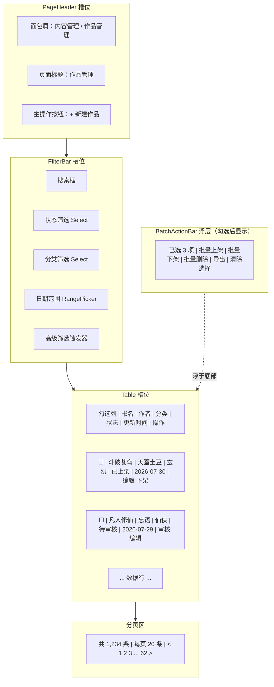

#### 5.1.2 组件槽位表

| 槽位 | 组件 | 必填 | 说明 |
|------|------|------|------|
| PageHeader | PageHeader | 是 | 标题 + 面包屑 + 主操作按钮（新建） |
| FilterBar | FilterBar | 是 | 搜索 + 状态筛选 + 分类筛选 + 日期范围 + 高级筛选抽屉 |
| Table | Table | 是 | 数据表格，含排序 / 筛选 / 行勾选 / 自定义渲染 |
| Pagination | Table.pagination | 是 | 分页，默认每页 20 条，可选 10 / 20 / 50 / 100 |
| BatchActionBar | BatchActionBar | 否 | 勾选行后底部浮出，提供批量操作 |

#### 5.1.3 响应式断点规则

| 断点 | 宽度 | 布局调整 |
|------|------|---------|
| xl | ≥ 1440px | 完整布局，筛选项全部展开 |
| lg | 1280-1439px | 筛选项折行显示，表格列可横向滚动 |
| md | 1024-1279px | 触发横向滚动（B 端不优化此区间） |

- 列宽策略：关键列（书名、状态、操作）固定，次要列可隐藏或横向滚动
- 操作列固定在右侧，`fixed: 'right'`，宽度 120px

#### 5.1.4 状态变体

| 状态 | 触发条件 | 展示内容 |
|------|---------|---------|
| 空列表 | dataSource 为空且无筛选 | Empty 插图 + "暂无作品" + "新建作品"按钮 |
| 加载中 | loading=true | Table Skeleton 占位（5 行）+ 分页禁用 |
| 加载失败 | 请求异常 | Result(status='error') + "加载失败" + "重试"按钮 |
| 无权限 | 权限校验失败 | Result(status='403') + "无访问权限" |
| 无搜索结果 | 有筛选但无数据 | Empty + "未找到匹配作品" + "清除筛选"按钮 |

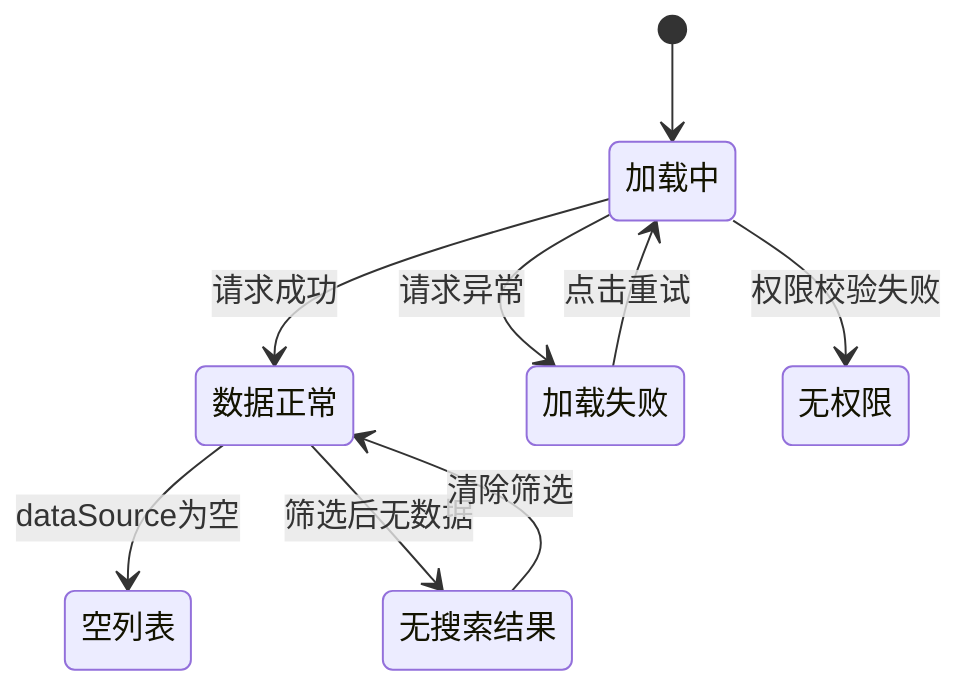

---

### 5.2 工作台 — 运营总览

登录后首页，呈现核心 KPI 与趋势图表，帮助运营人员快速掌握平台运营状况。

#### 5.2.1 线框图

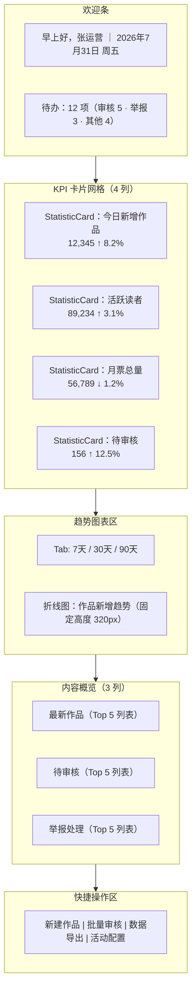

#### 5.2.2 组件槽位表

| 槽位 | 组件 | 必填 | 说明 |
|------|------|------|------|
| 欢迎条 | 自定义 Alert / div | 是 | 用户名 + 日期 + 待办计数，背景 `--brand-bg` |
| KPI 网格 | StatisticCard ×4-6 | 是 | 栅格 4 列，gap 16px，含趋势箭头 |
| 趋势图表 | Chart + Tabs | 是 | 折线图 / 柱状图，Tab 切换时间维度 |
| 内容概览 | Card ×3 | 否 | 最新作品 / 待审核 / 举报处理，各 Top 5 |
| 快捷操作 | Button Group | 否 | 常用操作入口 |

#### 5.2.3 响应式断点规则

| 断点 | 宽度 | 布局调整 |
|------|------|---------|
| xl | ≥ 1440px | KPI 4 列，概览 3 列 |
| lg | 1280-1439px | KPI 4 列，概览 2 列 |

#### 5.2.4 状态变体

| 状态 | 触发条件 | 展示内容 |
|------|---------|---------|
| 数据加载 | 首次加载 | Skeleton 占位（卡片骨架 + 图表骨架） |
| 无数据 | 平台无数据 | Empty 插图 + "暂无运营数据" |
| 图表错误 | 图表数据异常 | 图表区显示 Result(status='error') + "重试" |

---

### 5.3 卡片页 — 小说详情

单条作品的详情视图，以卡片栅格组织多维度信息。

#### 5.3.1 线框图

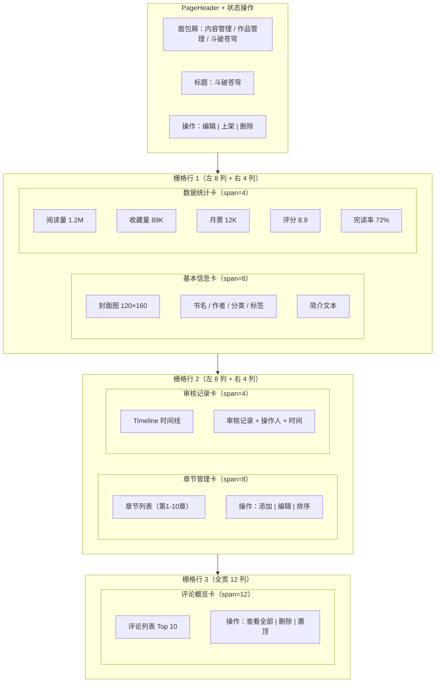

#### 5.3.2 组件槽位表

| 槽位 | 组件 | 必填 | 说明 |
|------|------|------|------|
| PageHeader | PageHeader | 是 | 标题 + 面包屑 + 状态操作按钮 |
| 基本信息卡 | Card + Descriptions | 是 | 封面 + 书名 + 作者 + 分类 + 标签 + 简介 |
| 数据统计卡 | Card + StatisticCard | 是 | 阅读量 / 收藏量 / 月票 / 评分 / 完读率 |
| 章节管理卡 | Card + Table/List | 是 | 章节列表 + 添加 / 编辑 / 排序操作 |
| 审核记录卡 | Card + Timeline | 否 | 审核记录时间线 |
| 评论概览卡 | Card + List | 否 | 评论列表 Top 10 |

#### 5.3.3 响应式断点规则

| 断点 | 宽度 | 布局调整 |
|------|------|---------|
| xl | ≥ 1440px | 左 8 列 + 右 4 列双栏布局 |
| lg | 1280-1439px | 维持双栏，卡片内部缩小内边距 |

#### 5.3.4 状态变体

| 状态 | 触发条件 | 展示内容 |
|------|---------|---------|
| 加载中 | 数据请求中 | Skeleton 卡片骨架占位 |
| 未找到 | 作品不存在 | Result(status='404') + "作品不存在" |
| 已下架 | 作品状态为下架 | 顶部 Alert 提示 + 数据统计置灰 |

---

### 5.4 表单页 — 新建/编辑小说

作品创建与编辑的表单，含校验与提交。

#### 5.4.1 线框图

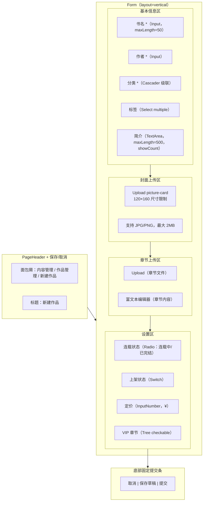

#### 5.4.2 组件槽位表

| 槽位 | 组件 | 必填 | 说明 |
|------|------|------|------|
| PageHeader | PageHeader | 是 | 标题 + 保存 / 取消按钮 |
| 基本信息 | Form + FormItem ×5 | 是 | 书名 / 作者 / 分类 / 标签 / 简介 |
| 封面上传 | Upload (picture-card) | 是 | 单图上传，120×160 |
| 章节上传 | Upload + RichTextEditor | 否 | 章节文件上传 + 富文本编辑 |
| 设置区 | Form + Radio/Switch/InputNumber/Tree | 是 | 连载状态 / 上架 / 定价 / VIP 章节 |
| 底部提交条 | 固定底部 div + Button | 是 | 取消 / 保存草稿 / 提交 |

#### 5.4.3 响应式断点规则

| 断点 | 宽度 | 布局调整 |
|------|------|---------|
| xl | ≥ 1440px | 表单宽度 720px 居中，底部固定 |
| lg | 1280-1439px | 表单宽度 720px 居中，底部固定 |

> 表单页在所有 B 端断点下保持一致宽度（720px），不随屏幕宽度拉伸。

#### 5.4.4 状态变体

| 状态 | 触发条件 | 展示内容 |
|------|---------|---------|
| 编辑 | 加载已有数据 | 表单回填，按钮为"保存修改" |
| 提交中 | 提交请求中 | 提交按钮 loading，禁用所有输入 |
| 校验失败 | 校验未通过 | 错误字段红框 + 错误提示，滚动到第一个错误字段 |
| 提交成功 | 提交成功 | Message 成功提示 + 跳转列表页 |

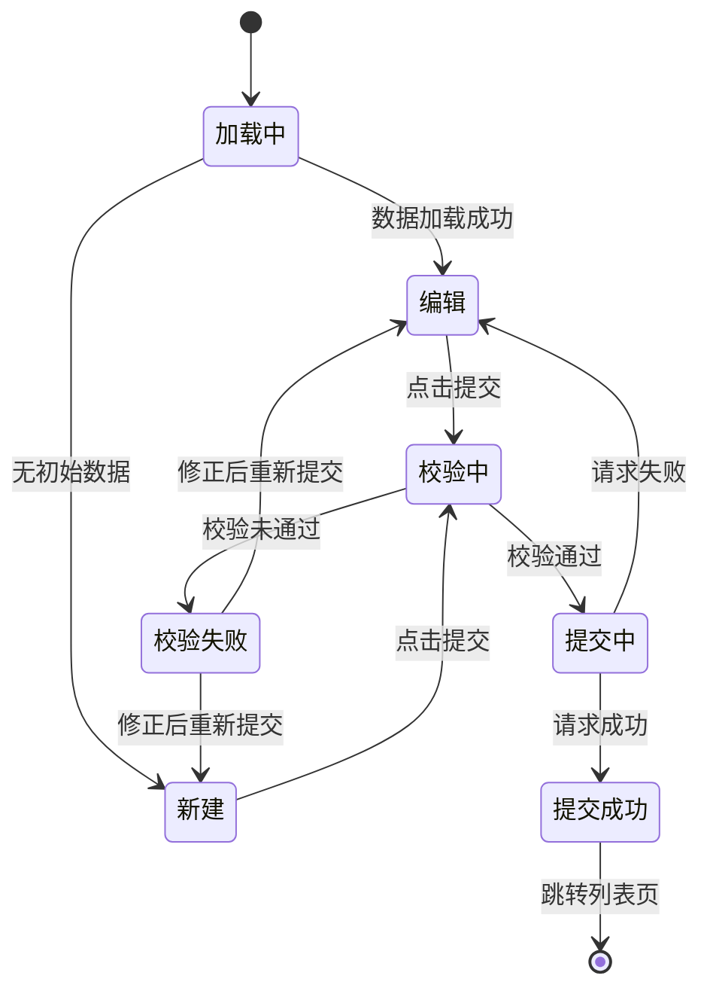

---

### 5.5 章节管理页

作者管理小说章节列表的页面，是 B 端最核心的内容管理场景。一部小说可能包含上千章节，页面需在高位密集信息下仍支持快速定位、排序与批量流转。

#### 5.5.1 布局示意图

```
┌─ PageHeader ─────────────────────────────────────────────────────────────────┐
│  内容管理 / 作品管理 / 《斗破苍穹》/ 章节管理                                 │
│  《斗破苍穹》章节管理     总字数 1,234,567   章节数 1,200   连载中            │
└──────────────────────────────────────────────────────────────────────────────┘
┌─ 工具栏 ───────────────────────────────────────────────┬─ 章节编辑预览 Drawer ┐
│  [+ 新建章节]   批量操作▾   排序：[序号▼] [更新时间]    │  第 120 章 陨落的心炎│
├───────────────────────────────────────────────────────┤  ─────────────────── │
│ 章节列表 Table                                         │  　　天地间，火焰翻涌│
│ ☰ 序号 │ 章节标题         │ 字数 │ 状态   │ VIP │ 操作│  ，一道岩浆冲出……    │
│ ───────┼─────────────────┼──────┼────────┼─────┼─────│                      │
│ ☰  1   │ 第一章 陨落的心炎 │ 3021 │ 已发布 │  —  │  ⋮  │  字数 3,021          │
│ ☰  2   │ 第二章 退婚       │ 2850 │ 待审核 │ VIP │  ⋮  │  已保存 14:30        │
│ ☰  3   │ 第三章 离开       │ 2912 │ 草稿   │  —  │  ⋮  │                      │
│   …                                                     │  [编辑]  [关闭]      │
├───────────────────────────────────────────────────────┤                      │
│  共 1,200 条   每页 50 条   < 1 2 3 … 24 >             │                      │
└───────────────────────────────────────────────────────┴──────────────────────┘
  ☰ = 拖拽手柄（按住拖动调整章节顺序）   ⋮ = 操作菜单（编辑 / 上移 / 下移 / 删除）
```

#### 5.5.2 组件槽位表

| 槽位 | 组件 | 必填 | 说明 |
|------|------|------|------|
| PageHeader | PageHeader | 是 | 面包屑 + 小说标题 + 总字数 / 章节数 / 连载状态统计 |
| 工具栏 | Button + Dropdown + Select | 是 | 新建章节、批量操作菜单、排序方式切换 |
| 章节列表 | Table | 是 | 行勾选 + 拖拽排序 + 行内编辑 + 操作列 |
| 章节编辑预览 | Drawer | 否 | 右侧抽屉，展开当前行章节正文预览 |
| 分页 | Table.pagination | 是 | 默认每页 50 条（章节量大），可选 20 / 50 / 100 |
| BatchActionBar | BatchActionBar | 否 | 勾选后底部浮出，批量发布 / 下架 |

#### 5.5.3 表格列定义

| 列 | 字段 | 宽度 | 渲染说明 |
|------|------|------|---------|
| 拖拽手柄 | — | 40px | 固定列 `fixed: 'left'`，hover 显示 ☰ |
| 勾选 | — | 40px | Checkbox，支持全选 / 跨页选 |
| 序号 | sort | 64px | 右对齐，拖拽后实时重排 |
| 章节标题 | title | 自适应 | 双击进入行内编辑，Enter 保存 / Esc 取消 |
| 字数 | wordCount | 96px | 右对齐，千分位，`--font-mono` |
| 状态 | status | 96px | Tag：草稿 / 待审核 / 已发布 / 已下架 |
| VIP 标记 | isVip | 72px | VIP 章节显示金色「VIP」Tag |
| 更新时间 | updatedAt | 144px | `YYYY-MM-DD HH:mm` |
| 操作 | — | 96px | `fixed: 'right'`，编辑 / 上移 / 下移 / 删除 |

#### 5.5.4 章节状态流转图

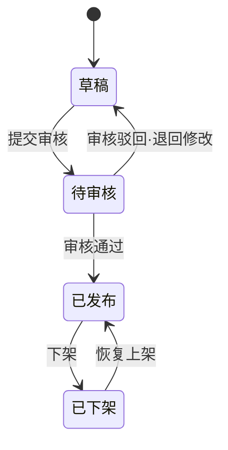

| 状态 | Tag 颜色 | 令牌 | 可执行操作 |
|------|---------|------|-----------|
| 草稿 | 灰 | `--color-text-tertiary` | 编辑、提交审核、删除 |
| 待审核 | 橙 | `--color-feedback-warning` | 撤回审核、查看 |
| 已发布 | 绿 | `--color-feedback-success` | 编辑（发布修改）、下架 |
| 已下架 | 红 | `--color-feedback-error` | 恢复上架、删除 |

> VIP 标记令牌：`--color-feedback-warning`（Tag 文字）+ `--color-feedback-warning-bg`（Tag 背景）。发布流程不可逆：草稿 → 待审核 → 已发布 后不可回退为草稿 / 待审核；已发布 → 已下架为可恢复路径。

#### 5.5.5 交互规范

| 交互 | 触发 | 行为 |
|------|------|------|
| 拖拽排序 | 按住 ☰ 拖动行 | 实时重排序号，松手批量提交 sort 变更，失败回滚 |
| 行内编辑标题 | 双击章节标题单元格 | 输入框聚焦，Enter 保存 / Esc 取消，校验 1-50 字 |
| 批量发布 | 勾选后 BatchActionBar | 仅对「草稿」生效，二次确认后批量转「待审核」 |
| 批量下架 | 勾选后 BatchActionBar | 仅对「已发布」生效，二次确认后批量转「已下架」 |
| 删除章节 | 操作菜单 | Modal 二次确认，已发布章节删除需输入标题匹配 |

#### 5.5.6 响应式断点规则

| 断点 | 宽度 | 布局调整 |
|------|------|---------|
| xl | ≥ 1440px | 表格 + 右侧 Drawer 并存，Drawer 宽 480px |
| lg | 1280-1439px | 表格占满，Drawer 改为覆盖式全宽抽屉 |

> 章节列表默认紧凑行高 40px（见 §2.2），单屏可见行数最大化，降低上千章节的滚动成本。[Expert judgment]

---

### 5.6 内容审核工作流页

运营人员审核小说内容的页面，支持多级审核流程。左侧待审队列、右侧内容预览的分屏布局让审核员不离开页面即可连续处理。

#### 5.6.1 布局示意图

```
┌─ PageHeader：内容审核 ───────────────────────────────────────────────────────┐
│  审核 / 章节审核      待审 128 条      今日已处理 56 条                        │
├─ 待审列表（左 40%） ──────────────────┬─ 内容预览（右 60%）──────────────────┤
│  筛选：[全部▾] [初审▾] [复审▾]         │  《斗破苍穹》· 第 120 章 陨落的心炎   │
│ ┌───────────────────────────────────┐ │  提交人：李编辑   提交时间 07-30 10:00│
│ │◉ 初审 · 第120章 陨落的心炎 3021字  │ │  ──────────────────────────────────│
│ │  《斗破苍穹》   待初审             │ │  　　天地间，火焰翻涌，一道▓敏感词▓│
│ │  提交 07-30 10:00  李编辑          │ │  从岩浆中冲出，▓另一敏感词▓震动……  │
│ ├───────────────────────────────────┤ │  （红色背景高亮命中敏感词）         │
│ │○ 复审 · 第119章 退婚       2850字  │ │  ──────────────────────────────────│
│ │  《斗破苍穹》   待复审             │ │  命中敏感词 2 处   [查看清单]      │
│ ├───────────────────────────────────┤ │                                    │
│ │○ 终审 · 第118章 离开       2912字  │ ├─ 审核操作栏（底部固定）───────────┤
│ └───────────────────────────────────┘ │  审核意见：[_____________________] │
│  共 128 条   < 1 2 3 >                 │  驳回原因：[涉政▾]（驳回时必选）   │
│                                        │  [通过]  [待修改]  [驳回]          │
└────────────────────────────────────────┴────────────────────────────────────┘
  ◉ = 当前选中   ▓ = 敏感词高亮（--color-feedback-error-bg + --color-feedback-error）
```

#### 5.6.2 组件槽位表

| 槽位 | 组件 | 必填 | 说明 |
|------|------|------|------|
| PageHeader | PageHeader | 是 | 标题 + 待审 / 今日已处理统计 |
| 待审列表 | List + FilterBar | 是 | 左 40%，按审核级别分组，单选定位当前项 |
| 内容预览 | Card + 正文渲染 | 是 | 右 60%，章节正文 + 敏感词高亮 |
| 敏感词清单 | Tag 列表 | 否 | 命中词列表，点击定位正文对应位置 |
| 审核操作栏 | 固定底部 div | 是 | 审核意见 TextArea + 驳回原因 Select + 通过 / 待修改 / 驳回按钮 |

#### 5.6.3 审核流程图

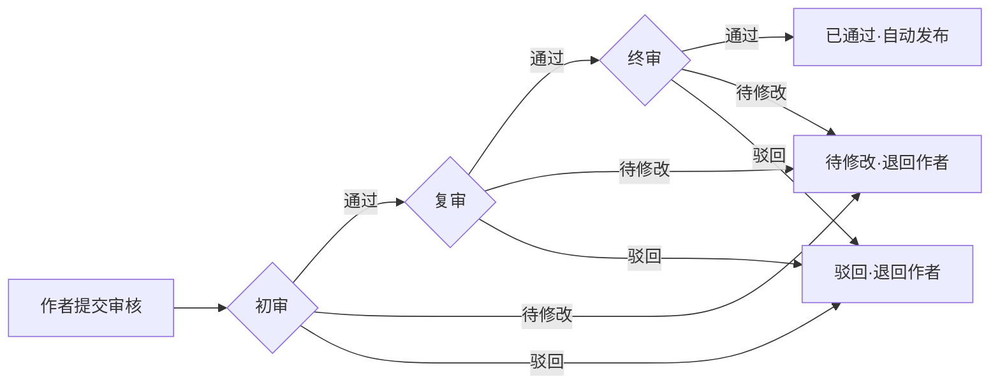

| 审核级别 | 操作权限 | 通过后流向 | 驳回后流向 |
|---------|---------|-----------|-----------|
| 初审 | 初审员 | 进入复审 | 退回作者（章节回退为草稿） |
| 复审 | 复审员 | 进入终审 | 退回作者 |
| 终审 | 主编 | 自动发布 | 退回作者 |

#### 5.6.4 驳回原因分类

| 原因 | 说明 | 令牌 |
|------|------|------|
| 涉政 | 政治敏感内容 | `--color-feedback-error` |
| 涉黄 | 色情低俗内容 | `--color-feedback-error` |
| 暴力 | 暴力血腥内容 | `--color-feedback-warning` |
| 抄袭 | 查重命中 | `--color-feedback-warning` |
| 广告 | 违规推广 | `--color-feedback-warning` |
| 其他 | 其他违规 | `--color-feedback-warning` |

> 驳回必须选择原因分类并填写说明（≥ 10 字），说明随通知下发作者。

#### 5.6.5 敏感词高亮规则

| 元素 | 令牌 | 说明 |
|------|------|------|
| 命中词背景 | `--color-feedback-error-bg` | 浅红底 |
| 命中词文字 | `--color-feedback-error` | 红字 + 下划线 |
| hover 提示 | `--color-feedback-error` | 显示等级与处理建议（见 §13.1） |

#### 5.6.6 状态变体

| 状态 | 触发条件 | 展示内容 |
|------|---------|---------|
| 空队列 | 待审列表为空 | Empty「暂无待审内容」 |
| 加载中 | 正文拉取中 | Skeleton 占位 |
| 审核提交中 | 点击通过 / 驳回 | 按钮 loading，操作栏禁用 |
| 审核完成 | 提交成功 | Toast 成功 + 自动跳转下一条 |

[Research-backed] 分屏审核布局相比「列表 → 详情页」跳转模式，可减少约 60% 的页面跳转，显著提升单任务吞吐量。

---

## 6. B 端专用组件

以下 18 个 B 端专用组件均基于 Ant Design 封装，仅消费语义令牌。每个组件含 Props 表、状态列表、变体 / 规格、JSX 示例与 Do/Don't。

### 6.1 Table

数据表格，B 端最高频组件。支持排序、筛选、行勾选、自定义渲染。

#### Props 表

| 属性 | 类型 | 默认值 | 必填 | 说明 |
|------|------|--------|------|------|
| columns | `ColumnsType[]` | — | 是 | 列定义数组 |
| dataSource | `Record<string, any>[]` | — | 是 | 数据源数组 |
| rowKey | `string \| ((record) => string)` | `'key'` | 是 | 行唯一标识 |
| rowSelection | `RowSelection` | — | 否 | 行选择配置 |
| pagination | `PaginationConfig \| false` | `{ pageSize: 20 }` | 否 | 分页配置 |
| loading | `boolean` | `false` | 否 | 加载状态 |
| onChange | `(pagination, filters, sorter) => void` | — | 否 | 分页/筛选/排序变化回调 |
| scroll | `{ x?: number, y?: number }` | — | 否 | 横向/纵向滚动 |
| size | `'default' \| 'middle' \| 'small'` | `'default'` | 否 | 表格尺寸 |
| bordered | `boolean` | `false` | 否 | 是否显示边框 |

#### 状态列表

| 状态 | 说明 |
|------|------|
| 默认 | 正常数据展示 |
| 加载中 | loading=true，显示 Skeleton |
| 空数据 | dataSource 为空，显示 Empty |
| 排序中 | 点击列头排序，显示排序图标 |
| 行选中 | rowSelection 勾选行，背景 `--brand-bg` |
| 行 hover | 鼠标悬停行，背景 `--bg-subtle` |

#### 变体 / 规格

| 变体 | 行高 | 用途 |
|------|------|------|
| default | 54px | 默认，常规数据 |
| middle | 48px | 紧凑，B 端推荐 |
| small | 40px | 高密度，数据量极大时 |

#### JSX 示例

```jsx
import { Table } from 'antd';

const columns = [
  {
    title: '书名',
    dataIndex: 'title',
    key: 'title',
    fixed: 'left',
    width: 200,
    render: (text, record) => (
      <a onClick={() => handleDetail(record.id)}>{text}</a>
    ),
  },
  {
    title: '状态',
    dataIndex: 'status',
    key: 'status',
    width: 100,
    render: (status) => {
      const map = {
        published: { color: 'success', text: '已上架' },
        pending: { color: 'warning', text: '待审核' },
        offline: { color: 'error', text: '已下架' },
      };
      const { color, text } = map[status] || {};
      return <Tag color={color}>{text}</Tag>;
    },
  },
  {
    title: '更新时间',
    dataIndex: 'updatedAt',
    key: 'updatedAt',
    width: 160,
    sorter: true,
    render: (val) => dayjs(val).format('YYYY-MM-DD HH:mm'),
  },
  {
    title: '操作',
    key: 'action',
    fixed: 'right',
    width: 120,
    render: (_, record) => (
      <Space size="small">
        <Button type="link" size="small" onClick={() => handleEdit(record.id)}>编辑</Button>
        <Button type="link" size="small" danger onClick={() => handleDelete(record)}>删除</Button>
      </Space>
    ),
  },
];

<Table
  columns={columns}
  dataSource={dataSource}
  rowKey="id"
  rowSelection={{
    selectedRowKeys,
    onChange: setSelectedRowKeys,
  }}
  pagination={{
    current: page,
    pageSize: 20,
    total,
    showSizeChanger: true,
    showTotal: (t) => `共 ${t} 条`,
  }}
  loading={loading}
  onChange={handleTableChange}
  scroll={{ x: 1200 }}
  size="middle"
/>
```

#### Do / Don't

| Do | Don't |
|----|-------|
| 操作列固定在右侧 `fixed: 'right'` | 操作列放在中间，滚动后看不到 |
| 数据量列右对齐 | 数值列左对齐 |
| 状态字段用 Tag 彩色渲染 | 状态字段用纯文本 |
| 分页显示总数 `showTotal` | 隐藏分页，一次性加载所有数据 |

---

### 6.2 FilterBar

筛选栏，集成搜索、下拉筛选、日期范围与高级筛选抽屉。

#### Props 表

| 属性 | 类型 | 默认值 | 必填 | 说明 |
|------|------|--------|------|------|
| searchKey | `string` | — | 否 | 搜索关键词（受控） |
| onSearch | `(value: string) => void` | — | 是 | 搜索回调 |
| filters | `FilterItem[]` | — | 否 | 筛选项配置数组 |
| onFilterChange | `(values: Record<string, any>) => void` | — | 是 | 筛选变化回调 |
| advancedFilters | `FilterItem[]` | — | 否 | 高级筛选项（抽屉展示） |
| onReset | `() => void` | — | 否 | 重置回调 |
| loading | `boolean` | `false` | 否 | 加载状态 |
| collapsible | `boolean` | `true` | 否 | 是否可折叠展开 |

#### FilterItem 类型

```ts
interface FilterItem {
  name: string;          // 字段名
  label: string;         // 标签
  type: 'select' | 'date' | 'rangePicker' | 'cascader' | 'input';
  options?: { label: string; value: any }[];
  placeholder?: string;
  allowClear?: boolean;
}
```

#### 状态列表

| 状态 | 说明 |
|------|------|
| 默认 | 筛选项平铺展示 |
| 折叠 | 筛选项超过 3 个时折叠，点击展开 |
| 高级筛选 | 点击触发器打开 Drawer 抽屉 |
| 已筛选 | 激活筛选项高亮 `--brand` |

#### 变体 / 规格

| 变体 | 说明 |
|------|------|
| 单行 | 筛选项 ≤ 3 个，单行展示 |
| 多行 | 筛选项 > 3 个，折叠 + 展开切换 |
| 抽屉 | 高级筛选项在 Drawer 中展示 |

#### JSX 示例

```jsx
import { FilterBar } from '@/components/b-end';

<FilterBar
  searchKey={searchKey}
  onSearch={handleSearch}
  filters={[
    {
      name: 'status',
      label: '状态',
      type: 'select',
      options: [
        { label: '已上架', value: 'published' },
        { label: '待审核', value: 'pending' },
        { label: '已下架', value: 'offline' },
      ],
    },
    {
      name: 'category',
      label: '分类',
      type: 'cascader',
      options: categoryOptions,
    },
    {
      name: 'dateRange',
      label: '更新时间',
      type: 'rangePicker',
    },
  ]}
  advancedFilters={[
    { name: 'author', label: '作者', type: 'input' },
    { name: 'wordCount', label: '字数范围', type: 'rangePicker' },
  ]}
  onFilterChange={handleFilterChange}
  onReset={handleReset}
  loading={loading}
/>
```

#### Do / Don't

| Do | Don't |
|----|-------|
| 筛选项 ≤ 3 个时平铺 | 所有筛选项都放抽屉里 |
| 筛选状态同步到 URL | 筛选状态仅存内存，刷新丢失 |
| 高级筛选用 Drawer 而非 Modal | 高级筛选用 Modal 遮挡表格 |

---

### 6.3 StatisticCard

KPI 统计卡片，用于工作台数据概览，含趋势指示。

#### Props 表

| 属性 | 类型 | 默认值 | 必填 | 说明 |
|------|------|--------|------|------|
| title | `string` | — | 是 | 指标标题 |
| value | `number \| string` | — | 是 | 指标值 |
| prefix | `ReactNode` | — | 否 | 值前缀（如 ¥） |
| suffix | `string` | — | 否 | 值后缀（如 %、篇） |
| trend | `'up' \| 'down' \| 'flat'` | — | 否 | 趋势方向 |
| trendValue | `number` | — | 否 | 趋势百分比 |
| loading | `boolean` | `false` | 否 | 加载状态 |
| onClick | `() => void` | — | 否 | 点击回调（跳转详情） |

#### 状态列表

| 状态 | 说明 |
|------|------|
| 默认 | 正常展示数值与趋势 |
| 加载中 | Skeleton 占位 |
| 趋势上升 | trend='up'，箭头向上，`--feedback-success` |
| 趋势下降 | trend='down'，箭头向下，`--feedback-error` |
| 趋势持平 | trend='flat'，箭头持平，`--text-tertiary` |

#### 变体 / 规格

| 变体 | 说明 |
|------|------|
| 标准 | title + value + trend |
| 紧凑 | 仅 title + value，无趋势 |
| 可点击 | onClick 时显示 hover 阴影与箭头 |

#### JSX 示例

```jsx
import { StatisticCard } from '@/components/b-end';

<StatisticCard
  title="今日新增作品"
  value={12345}
  suffix="篇"
  trend="up"
  trendValue={8.2}
  onClick={() => navigate('/content/novels?date=today')}
/>

<StatisticCard
  title="待审核"
  value={156}
  suffix="条"
  trend="up"
  trendValue={12.5}
  loading={loading}
/>
```

#### Do / Don't

| Do | Don't |
|----|-------|
| 数值带千分位分隔 | 直接显示 12345 |
| 趋势上升用绿色、下降用红色 | 趋势颜色随意 |
| 大数缩写（12.3K） | 完整显示 12345678 |

---

### 6.4 PageHeader

页面标题区，含标题、面包屑与额外操作。

#### Props 表

| 属性 | 类型 | 默认值 | 必填 | 说明 |
|------|------|--------|------|------|
| title | `string \| ReactNode` | — | 是 | 页面标题 |
| breadcrumb | `BreadcrumbProps['items']` | — | 否 | 面包屑配置 |
| extra | `ReactNode` | — | 否 | 额外操作区（按钮等） |
| tags | `ReactNode` | — | 否 | 标题旁标签 |
| onBack | `() => void` | — | 否 | 返回回调（显示返回箭头） |
| subTitle | `string \| ReactNode` | — | 否 | 副标题 |

#### 状态列表

| 状态 | 说明 |
|------|------|
| 默认 | 标题 + 面包屑 + 操作 |
| 带返回 | onBack 存在时显示返回箭头 |
| 带标签 | tags 展示状态 Tag |
| 带操作 | extra 展示操作按钮组 |

#### 变体 / 规格

| 变体 | 说明 |
|------|------|
| 标准页 | title + breadcrumb + extra |
| 详情页 | title + breadcrumb + tags + extra（状态操作） |
| 表单页 | title + breadcrumb + extra（保存/取消） |

#### JSX 示例

```jsx
import { PageHeader } from '@/components/b-end';
import { Tag } from 'antd';

<PageHeader
  breadcrumb={[
    { title: '内容管理' },
    { title: '作品管理' },
    { title: '斗破苍穹' },
  ]}
  title="斗破苍穹"
  tags={<Tag color="success">已上架</Tag>}
  extra={
    <Space>
      <Button onClick={handleEdit}>编辑</Button>
      <Button onClick={handleOffline}>下架</Button>
      <Button danger onClick={handleDelete}>删除</Button>
    </Space>
  }
/>
```

#### Do / Don't

| Do | Don't |
|----|-------|
| 面包屑反映真实层级路径 | 面包屑仅显示当前页 |
| 主操作放 extra 右侧 | 主操作藏在下拉菜单 |
| 标题用 H2（28px semibold） | 标题用 Body 字号 |

---

### 6.5 BatchActionBar

批量操作条，勾选表格行后底部浮出。

#### Props 表

| 属性 | 类型 | 默认值 | 必填 | 说明 |
|------|------|--------|------|------|
| selectedCount | `number` | — | 是 | 已选数量 |
| actions | `BatchAction[]` | — | 是 | 批量操作按钮配置 |
| onClear | `() => void` | — | 是 | 清除选择回调 |
| visible | `boolean` | `false` | 否 | 是否显示 |

#### BatchAction 类型

```ts
interface BatchAction {
  key: string;
  label: string;
  type?: 'default' | 'primary' | 'danger';
  icon?: ReactNode;
  onClick: () => void;
  disabled?: boolean;
  confirm?: boolean;          // 是否需要二次确认
  confirmTitle?: string;
}
```

#### 状态列表

| 状态 | 说明 |
|------|------|
| 隐藏 | visible=false 或 selectedCount=0 |
| 显示 | 底部固定浮出，带阴影 |
| 操作确认 | confirm=true 的操作弹出 Modal |

#### 变体 / 规格

| 变体 | 说明 |
|------|------|
| 标准 | 已选数 + 操作按钮 + 清除 |
| 危险操作 | type='danger' 按钮标红 |

#### JSX 示例

```jsx
import { BatchActionBar } from '@/components/b-end';

<BatchActionBar
  selectedCount={selectedRowKeys.length}
  visible={selectedRowKeys.length > 0}
  actions={[
    { key: 'publish', label: '批量上架', type: 'primary', onClick: handleBatchPublish },
    { key: 'offline', label: '批量下架', onClick: handleBatchOffline },
    {
      key: 'delete',
      label: '批量删除',
      type: 'danger',
      onClick: handleBatchDelete,
      confirm: true,
      confirmTitle: `确定删除选中的 ${selectedRowKeys.length} 部作品吗？`,
    },
    { key: 'export', label: '导出', onClick: handleExport },
  ]}
  onClear={() => setSelectedRowKeys([])}
/>
```

#### Do / Don't

| Do | Don't |
|----|-------|
| 破坏性操作 type='danger' 并二次确认 | 批量删除直接执行 |
| 显示已选数量 | 仅显示操作按钮 |
| 底部固定 + 阴影 | 浮在表格中间 |

---

### 6.6 Form / FormItem

表单与表单项，B 端表单统一使用 vertical 布局。

#### Props 表（Form）

| 属性 | 类型 | 默认值 | 必填 | 说明 |
|------|------|--------|------|------|
| layout | `'horizontal' \| 'vertical' \| 'inline'` | `'vertical'` | 否 | 布局方式，B 端默认 vertical |
| labelCol | `{ span: number }` | — | 否 | 标签布局（horizontal 时使用） |
| onFinish | `(values) => void` | — | 是 | 提交成功回调 |
| onFinishFailed | `(errorInfo) => void` | — | 否 | 提交失败回调 |
| initialValues | `Record<string, any>` | — | 否 | 初始值 |
| form | `FormInstance` | — | 否 | 表单实例（受控） |
| validateTrigger | `string \| string[]` | `'onBlur'` | 否 | 校验触发时机 |

#### Props 表（FormItem）

| 属性 | 类型 | 默认值 | 必填 | 说明 |
|------|------|--------|------|------|
| name | `string` | — | 是 | 字段名 |
| label | `string \| ReactNode` | — | 否 | 标签 |
| rules | `Rule[]` | — | 否 | 校验规则 |
| required | `boolean` | `false` | 否 | 是否必填 |
| validateStatus | `'success' \| 'warning' \| 'error' \| 'validating'` | — | 否 | 校验状态 |
| help | `string \| ReactNode` | — | 否 | 提示文本 |
| valuePropName | `string` | `'value'` | 否 | 值属性名 |

#### 状态列表

| 状态 | 说明 |
|------|------|
| 默认 | 正常输入 |
| 聚焦 | 边框 `--border-focus` |
| 校验中 | validateStatus='validating'，显示加载 |
| 校验成功 | validateStatus='success' |
| 校验失败 | validateStatus='error'，红框 + 错误提示 |
| 禁用 | 灰色不可操作 |

#### 变体 / 规格

| 变体 | 说明 |
|------|------|
| vertical | 标签在上方（B 端默认） |
| horizontal | 标签在左侧 |
| inline | 行内表单（筛选场景） |

#### JSX 示例

```jsx
import { Form, Input, Select, Button } from 'antd';

const [form] = Form.useForm();

<Form
  form={form}
  layout="vertical"
  initialValues={{ status: 'serializing' }}
  onFinish={handleSubmit}
  onFinishFailed={handleFailed}
  validateTrigger={['onBlur', 'onChange']}
>
  <Form.Item
    name="title"
    label="书名"
    rules={[
      { required: true, message: '请输入书名' },
      { max: 50, message: '书名不超过 50 字' },
    ]}
  >
    <Input placeholder="请输入书名" maxLength={50} showCount />
  </Form.Item>

  <Form.Item
    name="category"
    label="分类"
    rules={[{ required: true, message: '请选择分类' }]}
  >
    <Cascader options={categoryOptions} placeholder="请选择分类" />
  </Form.Item>

  <Form.Item
    name="intro"
    label="简介"
    rules={[{ max: 500, message: '简介不超过 500 字' }]}
  >
    <Input.TextArea rows={4} maxLength={500} showCount placeholder="请输入简介" />
  </Form.Item>

  <Form.Item>
    <Space>
      <Button onClick={handleCancel}>取消</Button>
      <Button type="primary" htmlType="submit" loading={submitting}>
        提交
      </Button>
    </Space>
  </Form.Item>
</Form>
```

#### Do / Don't

| Do | Don't |
|----|-------|
| B 端默认 layout='vertical' | 使用 horizontal 导致标签宽度不一致 |
| 失焦校验 + 提交校验 | 仅提交时校验 |
| 错误定位到第一个错误字段 | 提交失败无定位 |
| required 字段显示红色星号 | 必填字段无标识 |

---

### 6.7 Upload

文件上传组件，支持图片上传（picture-card）与文件上传。

#### Props 表

| 属性 | 类型 | 默认值 | 必填 | 说明 |
|------|------|--------|------|------|
| action | `string` | — | 是 | 上传地址 |
| accept | `string` | — | 否 | 接受的文件类型 |
| multiple | `boolean` | `false` | 否 | 是否多选 |
| maxCount | `number` | — | 否 | 最大上传数量 |
| listType | `'text' \| 'picture' \| 'picture-card'` | `'text'` | 否 | 列表样式 |
| beforeUpload | `(file) => boolean \| Promise` | — | 否 | 上传前校验 |
| onChange | `(info) => void` | — | 否 | 上传变化回调 |
| fileList | `UploadFile[]` | — | 否 | 文件列表（受控） |
| disabled | `boolean` | `false` | 否 | 是否禁用 |

#### 状态列表

| 状态 | 说明 |
|------|------|
| 默认 | 上传按钮 / 上传区 |
| 上传中 | 进度条显示 |
| 上传成功 | 显示文件缩略图 + 成功图标 |
| 上传失败 | 显示错误 + 重试 |
| 达到上限 | maxCount 达到时隐藏上传按钮 |

#### 变体 / 规格

| 变体 | listType | 用途 |
|------|----------|------|
| 文本列表 | `'text'` | 文档 / 章节文件 |
| 图片列表 | `'picture'` | 图片附件 |
| 卡片 | `'picture-card'` | 封面图（120×160） |

#### JSX 示例

```jsx
import { Upload, message } from 'antd';
import { UploadOutlined, PlusOutlined } from '@ant-design/icons';

// 封面上传（picture-card）
<Upload
  action="/api/upload/cover"
  accept="image/jpeg,image/png"
  listType="picture-card"
  maxCount={1}
  beforeUpload={(file) => {
    const isLt2M = file.size / 1024 / 1024 < 2;
    if (!isLt2M) {
      message.error('图片大小不能超过 2MB');
      return Upload.LIST_IGNORE;
    }
    return true;
  }}
  onChange={handleCoverChange}
>
  {coverUrl ? null : (
    <div>
      <PlusOutlined />
      <div style={{ marginTop: 8 }}>上传封面</div>
    </div>
  )}
</Upload>

// 章节文件上传
<Upload
  action="/api/upload/chapter"
  accept=".txt,.docx"
  multiple
  beforeUpload={(file) => {
    const isLt5M = file.size / 1024 / 1024 < 5;
    if (!isLt5M) {
      message.error('文件大小不能超过 5MB');
      return Upload.LIST_IGNORE;
    }
    return true;
  }}
  onChange={({ fileList }) => setChapterFiles(fileList)}
>
  <Button icon={<UploadOutlined />}>上传章节文件</Button>
</Upload>
```

#### Do / Don't

| Do | Don't |
|----|-------|
| beforeUpload 校验文件大小与类型 | 不校验直接上传 |
| 封面用 picture-card 固定尺寸 | 封面用 text 列表 |
| 限制 maxCount 防止过量上传 | 不限制上传数量 |

---

### 6.8 DatePicker / RangePicker

日期选择器与日期范围选择器。

#### Props 表

| 属性 | 类型 | 默认值 | 必填 | 说明 |
|------|------|--------|------|------|
| value | `Dayjs \| Dayjs[]` | — | 否 | 当前值（受控） |
| placeholder | `string \| string[]` | — | 否 | 占位文本 |
| format | `string` | `'YYYY-MM-DD'` | 否 | 日期格式 |
| disabledDate | `(current: Dayjs) => boolean` | — | 否 | 禁用日期 |
| onChange | `(date, dateString) => void` | — | 否 | 变化回调 |
| showTime | `boolean \| object` | `false` | 否 | 是否显示时间 |
| allowClear | `boolean` | `true` | 否 | 是否可清除 |
| ranges | `Record<string, Dayjs[]>` | — | 否 | 预设范围（RangePicker） |

#### 状态列表

| 状态 | 说明 |
|------|------|
| 默认 | 未选择 |
| 已选择 | 显示选中日期 |
| 聚焦 | 弹出日历面板 |
| 禁用日期 | disabledDate 返回 true 的日期不可选 |

#### 变体 / 规格

| 变体 | 用途 |
|------|------|
| DatePicker | 单日期选择 |
| RangePicker | 日期范围选择 |
| DateTimePicker | 日期 + 时间 |

#### JSX 示例

```jsx
import { DatePicker } from 'antd';
import dayjs from 'dayjs';

const { RangePicker } = DatePicker;

// 日期范围（筛选栏）
<RangePicker
  value={dateRange}
  format="YYYY-MM-DD"
  ranges={{
    '今天': [dayjs(), dayjs()],
    '本周': [dayjs().startOf('week'), dayjs().endOf('week')],
    '本月': [dayjs().startOf('month'), dayjs().endOf('month')],
    '近 30 天': [dayjs().subtract(30, 'day'), dayjs()],
  }}
  disabledDate={(current) => current && current > dayjs().endOf('day')}
  onChange={handleDateChange}
/>

// 单日期（表单）
<DatePicker
  name="publishDate"
  placeholder="请选择上架日期"
  format="YYYY-MM-DD"
  disabledDate={(current) => current && current < dayjs().startOf('day')}
  onChange={handleDateChange}
/>
```

#### Do / Don't

| Do | Don't |
|----|-------|
| 提供常用范围预设（今天/本周/本月） | 让用户手动选择每个日期 |
| 禁用未来日期（如必要） | 允许选择不合理日期 |
| 统一格式 YYYY-MM-DD | 不同页面格式不一致 |

---

### 6.9 Steps

步骤条，用于多步骤流程引导（如审核流程、发布向导）。

#### Props 表

| 属性 | 类型 | 默认值 | 必填 | 说明 |
|------|------|--------|------|------|
| current | `number` | `0` | 是 | 当前步骤索引 |
| items | `StepItem[]` | — | 是 | 步骤配置数组 |
| direction | `'horizontal' \| 'vertical'` | `'horizontal'` | 否 | 方向 |
| size | `'default' \| 'small'` | `'default'` | 否 | 尺寸 |
| onChange | `(current) => void` | — | 否 | 切换回调 |
| status | `'wait' \| 'process' \| 'finish' \| 'error'` | — | 否 | 当前步骤状态 |

#### StepItem 类型

```ts
interface StepItem {
  title: string;
  description?: string;
  status?: 'wait' | 'process' | 'finish' | 'error';
  icon?: ReactNode;
}
```

#### 状态列表

| 状态 | 说明 |
|------|------|
| wait 等待 | 未到达，灰色 |
| process 进行中 | 当前步骤，`--brand` |
| finish 完成 | 已完成，`--feedback-success` |
| error 错误 | 该步骤出错，`--feedback-error` |

#### 变体 / 规格

| 变体 | direction | 用途 |
|------|-----------|------|
| 水平 | `'horizontal'` | 顶部步骤条 |
| 垂直 | `'vertical'` | 侧边步骤（长描述） |

#### JSX 示例

```jsx
import { Steps } from 'antd';

<Steps
  current={currentStep}
  items={[
    { title: '填写信息', description: '完善作品基本信息' },
    { title: '上传封面', description: '上传作品封面图' },
    { title: '添加章节', description: '上传初始章节内容' },
    { title: '提交审核', description: '提交至审核队列' },
    { title: '审核通过', description: '作品上架' },
  ]}
  onChange={handleStepChange}
/>
```

#### Do / Don't

| Do | Don't |
|----|-------|
| 步骤数 3-5 个为宜 | 步骤数超过 7 个 |
| 每步有 title + description | 仅 title 无说明 |
| 错误步骤标记 status='error' | 出错后步骤状态不变 |

---

### 6.10 Cascader

级联选择器，用于多级分类选择（如分类 > 子分类）。

#### Props 表

| 属性 | 类型 | 默认值 | 必填 | 说明 |
|------|------|--------|------|------|
| value | `(string \| number)[]` | — | 否 | 当前值（受控） |
| options | `CascaderOption[]` | — | 是 | 级联数据 |
| multiple | `boolean` | `false` | 否 | 是否多选 |
| changeOnSelect | `boolean` | `false` | 否 | 选择即触发变化 |
| onChange | `(value, selectedOptions) => void` | — | 是 | 变化回调 |
| placeholder | `string` | `'请选择'` | 否 | 占位文本 |
| allowClear | `boolean` | `true` | 否 | 是否可清除 |
| showSearch | `boolean \| object` | `false` | 否 | 是否可搜索 |

#### 状态列表

| 状态 | 说明 |
|------|------|
| 默认 | 未选择 |
| 展开面板 | 显示级联菜单 |
| 已选择 | 显示选中路径 |
| 搜索中 | showSearch 开启时显示搜索结果 |

#### 变体 / 规格

| 变体 | 用途 |
|------|------|
| 单选 | 分类选择 |
| 多选 | 多标签选择 |

#### JSX 示例

```jsx
import { Cascader } from 'antd';

const categoryOptions = [
  {
    value: 'xuanhuan',
    label: '玄幻',
    children: [
      { value: 'dongfang', label: '东方玄幻' },
      { value: 'yiwai', label: '异世大陆' },
    ],
  },
  {
    value: 'xianxia',
    label: '仙侠',
    children: [
      { value: 'xiuzhen', label: '修真' },
      { value: 'gudai', label: '古代仙侠' },
    ],
  },
];

<Cascader
  options={categoryOptions}
  placeholder="请选择分类"
  changeOnSelect
  showSearch
  onChange={(value, selectedOptions) => {
    console.log('selected:', value, selectedOptions);
  }}
/>
```

#### Do / Don't

| Do | Don't |
|----|-------|
| 层级 ≤ 3 级 | 层级超过 4 级 |
| 数据量大时开启 showSearch | 不可搜索 |

---

### 6.11 Tree / TreeSelect

树形控件与树选择器，用于权限树、章节树、组织架构。

#### Props 表（Tree）

| 属性 | 类型 | 默认值 | 必填 | 说明 |
|------|------|--------|------|------|
| treeData | `TreeNode[]` | — | 是 | 树数据 |
| checkable | `boolean` | `false` | 否 | 是否可勾选 |
| selectable | `boolean` | `true` | 否 | 是否可选择 |
| selectedKeys | `Key[]` | — | 否 | 选中节点 |
| checkedKeys | `Key[]` | — | 否 | 勾选节点 |
| expandedKeys | `Key[]` | — | 否 | 展开节点 |
| onSelect | `(keys, info) => void` | — | 否 | 选择回调 |
| onCheck | `(keys, info) => void` | — | 否 | 勾选回调 |
| defaultExpandAll | `boolean` | `false` | 否 | 默认展开全部 |
| showLine | `boolean` | `false` | 否 | 是否显示连接线 |

#### Props 表（TreeSelect）

| 属性 | 类型 | 默认值 | 必填 | 说明 |
|------|------|--------|------|------|
| treeData | `TreeNode[]` | — | 是 | 树数据 |
| value | `Key \| Key[]` | — | 否 | 当前值 |
| multiple | `boolean` | `false` | 否 | 是否多选 |
| treeCheckable | `boolean` | `false` | 否 | 是否可勾选 |
| treeDefaultExpandAll | `boolean` | `false` | 否 | 默认展开全部 |
| onChange | `(value, label, extra) => void` | — | 是 | 变化回调 |
| showSearch | `boolean` | `true` | 否 | 是否可搜索 |

#### 状态列表

| 状态 | 说明 |
|------|------|
| 默认 | 树形展示 |
| 展开 | 节点展开显示子节点 |
| 选中 | 节点高亮 `--brand` |
| 勾选 | checkable 时显示勾选框 |
| 半选 | 父节点部分子节点勾选 |

#### 变体 / 规格

| 变体 | 用途 |
|------|------|
| Tree | 页面内树形展示（章节树、权限树） |
| TreeSelect | 下拉选择树（分类选择） |

#### JSX 示例

```jsx
import { Tree, TreeSelect } from 'antd';

// 章节树（可勾选 VIP 章节）
const chapterTree = [
  {
    title: '第一卷 起始',
    key: 'vol-1',
    children: [
      { title: '第1章 觉醒', key: 'ch-1' },
      { title: '第2章 修炼', key: 'ch-2' },
    ],
  },
];

<Tree
  treeData={chapterTree}
  checkable
  checkedKeys={vipChapters}
  onCheck={setVipChapters}
  defaultExpandAll
  showLine
/>

// 分类树选择
<TreeSelect
  treeData={categoryTreeData}
  value={selectedCategory}
  treeDefaultExpandAll
  placeholder="请选择分类"
  onChange={handleCategoryChange}
/>
```

#### Do / Don't

| Do | Don't |
|----|-------|
| 大数据量开启虚拟滚动 | 全量渲染上万个节点 |
| checkable 时父节点半选可见 | 半选状态不明确 |

---

### 6.12 Transfer

穿梭框，用于双列表数据迁移（如角色权限分配）。

#### Props 表

| 属性 | 类型 | 默认值 | 必填 | 说明 |
|------|------|--------|------|------|
| dataSource | `TransferItem[]` | — | 是 | 数据源 |
| targetKeys | `Key[]` | — | 是 | 目标列表 key（右侧） |
| titles | `string[]` | `['源', '目标']` | 否 | 标题 |
| showSearch | `boolean` | `false` | 否 | 是否可搜索 |
| filterOption | `(inputValue, item) => boolean` | — | 否 | 搜索过滤函数 |
| onChange | `(targetKeys, direction, moveKeys) => void` | — | 是 | 变化回调 |
| render | `(item) => ReactNode` | — | 否 | 自定义渲染 |
| disabled | `boolean` | `false` | 否 | 是否禁用 |
| listStyle | `CSSProperties` | — | 否 | 列表样式 |

#### 状态列表

| 状态 | 说明 |
|------|------|
| 默认 | 双列表展示 |
| 搜索 | showSearch 开启时输入过滤 |
| 勾选 | 列表项勾选 |
| 迁移 | 点击箭头迁移到对侧 |

#### 变体 / 规格

| 变体 | 用途 |
|------|------|
| 标准 | 角色权限分配 |
| 带搜索 | 大数据量 |

#### JSX 示例

```jsx
import { Transfer } from 'antd';

<Transfer
  dataSource={permissionList}
  targetKeys={selectedPermissions}
  titles={['可选权限', '已选权限']}
  showSearch
  filterOption={(inputValue, item) =>
    item.title.toLowerCase().includes(inputValue.toLowerCase())
  }
  render={(item) => item.title}
  onChange={handlePermissionChange}
/>
```

#### Do / Don't

| Do | Don't |
|----|-------|
| 大数据量开启 showSearch | 不可搜索 |
| render 自定义展示内容 | 仅显示 key |

---

### 6.13 Rate

评分组件，用于作品评分、内容质量打分。

#### Props 表

| 属性 | 类型 | 默认值 | 必填 | 说明 |
|------|------|--------|------|------|
| value | `number` | — | 否 | 当前值（受控） |
| count | `number` | `5` | 否 | 星星总数 |
| allowHalf | `boolean` | `false` | 否 | 是否允许半选 |
| allowClear | `boolean` | `true` | 否 | 是否允许清除 |
| disabled | `boolean` | `false` | 否 | 是否禁用 |
| onChange | `(value) => void` | — | 否 | 变化回调 |
| character | `ReactNode` | `<StarFilled>` | 否 | 自定义字符 |

#### 状态列表

| 状态 | 说明 |
|------|------|
| 默认 | 可交互 |
| 已评分 | 显示选中星星 `--feedback-warning` |
| 禁用 | 灰色不可操作 |
| hover | 预览评分 |

#### 变体 / 规格

| 变体 | 用途 |
|------|------|
| 5 星整数 | 质量评分 |
| 5 星半星 | 精确评分 |
| 10 星 | 详细评分 |

#### JSX 示例

```jsx
import { Rate } from 'antd';

<Rate
  allowHalf
  value={novelRating}
  count={5}
  onChange={handleRatingChange}
/>

// 只读展示
<Rate disabled allowHalf value={3.5} />
```

#### Do / Don't

| Do | Don't |
|----|-------|
| 展示用 disabled | 展示也允许修改 |
| 使用 allowHalf 提升精度 | 强制整数评分 |

---

### 6.14 Progress

进度条，用于任务进度、上传进度展示。

#### Props 表

| 属性 | 类型 | 默认值 | 必填 | 说明 |
|------|------|--------|------|------|
| percent | `number` | `0` | 是 | 完成百分比 |
| status | `'success' \| 'exception' \| 'active' \| 'normal'` | `'normal'` | 否 | 状态 |
| showInfo | `boolean` | `true` | 否 | 是否显示百分比 |
| strokeWidth | `number` | `8` | 否 | 线条宽度 |
| type | `'line' \| 'circle' \| 'dashboard'` | `'line'` | 否 | 类型 |
| strokeColor | `string \| object` | — | 否 | 进度条颜色 |
| trailColor | `string` | — | 否 | 轨道颜色 |

#### 状态列表

| 状态 | 说明 |
|------|------|
| normal | 正常进度 |
| active | 进行中动画 |
| success | 完成（`--feedback-success`） |
| exception | 异常（`--feedback-error`） |

#### 变体 / 规格

| 变体 | type | 用途 |
|------|------|------|
| 线形 | `'line'` | 上传进度、任务进度 |
| 圆形 | `'circle'` | 完读率、完成率 |
| 仪表盘 | `'dashboard'` | 指标仪表盘 |

#### JSX 示例

```jsx
import { Progress } from 'antd';

<Progress percent={75} status="active" />

<Progress
  type="circle"
  percent={72}
  format={(percent) => `${percent}%`}
  strokeColor="#1890FF"
/>

// 完读率
<Progress
  type="circle"
  percent={completionRate}
  format={(p) => `${p}%`}
  strokeColor={{
    '0%': '#52C41A',
    '100%': '#1890FF',
  }}
/>
```

#### Do / Don't

| Do | Don't |
|----|-------|
| 完成显示 status='success' | 完成后仍显示 active 动画 |
| 圆形用于关键指标 | 所有进度都用线形 |

---

### 6.15 Breadcrumb

面包屑导航，展示当前页面层级路径。

#### Props 表

| 属性 | 类型 | 默认值 | 必填 | 说明 |
|------|------|--------|------|------|
| items | `BreadcrumbItem[]` | — | 是 | 面包屑项数组 |
| separator | `ReactNode` | `'/'` | 否 | 分隔符 |

#### BreadcrumbItem 类型

```ts
interface BreadcrumbItem {
  title: string;
  path?: string;          // 路由路径，有则为可点击链接
  onClick?: () => void;   // 自定义点击
}
```

#### 状态列表

| 状态 | 说明 |
|------|------|
| 默认 | 展示层级路径 |
| 可点击 | 有 path 的项为链接 `--brand` |
| 当前页 | 最后一项不可点击，`--text-primary` |

#### 变体 / 规格

| 变体 | 说明 |
|------|------|
| 标准 | 3-4 级层级 |
| 带图标 | 项前可加图标 |

#### JSX 示例

```jsx
import { Breadcrumb } from 'antd';

<Breadcrumb
  items={[
    { title: '内容管理', path: '/content' },
    { title: '作品管理', path: '/content/novels' },
    { title: '斗破苍穹' },
  ]}
/>
```

#### Do / Don't

| Do | Don't |
|----|-------|
| 反映真实路由层级 | 面包屑与路由不一致 |
| 当前页不可点击 | 最后一项也可点击 |

---

### 6.16 Descriptions

详情描述列表，用于卡片页信息展示。

#### Props 表

| 属性 | 类型 | 默认值 | 必填 | 说明 |
|------|------|--------|------|------|
| title | `string \| ReactNode` | — | 否 | 标题 |
| items | `DescriptionItem[]` | — | 是 | 描述项数组 |
| columns | `number` | `3` | 否 | 列数 |
| bordered | `boolean` | `false` | 否 | 是否带边框 |
| column | `number \| object` | `3` | 否 | 列数（支持响应式） |
| size | `'default' \| 'middle' \| 'small'` | `'default'` | 否 | 尺寸 |
| layout | `'horizontal' \| 'vertical'` | `'horizontal'` | 否 | 布局方向 |

#### DescriptionItem 类型

```ts
interface DescriptionItem {
  key: string;
  label: string;
  children: ReactNode;
  span?: number;       // 跨列数
}
```

#### 状态列表

| 状态 | 说明 |
|------|------|
| 默认 | 信息展示 |
| 带边框 | bordered=true，网格边框 |
| 加载中 | Skeleton 占位 |

#### 变体 / 规格

| 变体 | columns | 用途 |
|------|---------|------|
| 2 列 | 2 | 基本信息 |
| 3 列 | 3 | 标准详情 |
| 4 列 | 4 | 紧凑详情 |

#### JSX 示例

```jsx
import { Descriptions, Tag } from 'antd';

<Descriptions
  title="基本信息"
  bordered
  column={2}
  items={[
    { key: 'title', label: '书名', children: '斗破苍穹' },
    { key: 'author', label: '作者', children: '天蚕土豆' },
    { key: 'category', label: '分类', children: '玄幻 / 东方玄幻' },
    {
      key: 'status',
      label: '状态',
      children: <Tag color="success">已上架</Tag>,
    },
    { key: 'wordCount', label: '字数', children: '5,320,000' },
    { key: 'updatedAt', label: '更新时间', children: '2026-07-30 14:30' },
  ]}
/>
```

#### Do / Don't

| Do | Don't |
|----|-------|
| B 端默认 bordered | 不带边框导致信息模糊 |
| 状态字段用 Tag 渲染 | 状态用纯文本 |
| 长文本字段 span 跨列 | 长简介挤在一列 |

---

### 6.17 Timeline

时间线，用于审核记录、操作日志展示。

#### Props 表

| 属性 | 类型 | 默认值 | 必填 | 说明 |
|------|------|--------|------|------|
| items | `TimelineItem[]` | — | 是 | 时间线项数组 |
| mode | `'left' \| 'alternate' \| 'right'` | `'left'` | 否 | 模式 |
| pending | `ReactNode` | — | 否 | 待处理节点 |
| reverse | `boolean` | `false` | 否 | 是否倒序 |

#### TimelineItem 类型

```ts
interface TimelineItem {
  key: string;
  color?: string;          // 节点颜色
  dot?: ReactNode;         // 自定义节点
  label?: ReactNode;       // 标签（时间） |
  children: ReactNode;     // 内容
}
```

#### 状态列表

| 状态 | 说明 |
|------|------|
| 已完成 | color='green'，`--feedback-success` |
| 进行中 | color='blue'，`--brand` |
| 异常 | color='red'，`--feedback-error` |
| 待处理 | pending 展示加载节点 |
| 默认 | color='gray'，`--text-tertiary` |

#### 变体 / 规格

| 变体 | mode | 用途 |
|------|------|------|
| 左对齐 | `'left'` | 审核记录 |
| 交替 | `'alternate'` | 操作日志 |

#### JSX 示例

```jsx
import { Timeline } from 'antd';

<Timeline
  items={[
    {
      key: '1',
      color: 'green',
      label: '2026-07-30 14:30',
      children: '审核通过，已上架 ｜ 操作人：张审核',
    },
    {
      key: '2',
      color: 'blue',
      label: '2026-07-30 10:00',
      children: '提交审核 ｜ 操作人：李编辑',
    },
    {
      key: '3',
      color: 'red',
      label: '2026-07-29 16:00',
      children: '审核驳回：简介不完整 ｜ 操作人：张审核',
    },
    {
      key: '4',
      color: 'gray',
      label: '2026-07-28 09:00',
      children: '创建作品 ｜ 操作人：李编辑',
    },
  ]}
/>
```

#### Do / Don't

| Do | Don't |
|----|-------|
| 每项含时间 + 操作人 + 内容 | 仅显示操作内容 |
| 用颜色区分审核结果 | 所有节点颜色一致 |
| 最新记录在顶部 | 最新记录在底部 |

---

### 6.18 Result

操作结果页，用于流程结束、错误状态展示。

#### Props 表

| 属性 | 类型 | 默认值 | 必填 | 说明 |
|------|------|--------|------|------|
| status | `'success' \| 'error' \| 'warning' \| 'info' \| '404' \| '403' \| '500'` | `'info'` | 否 | 状态 |
| title | `ReactNode` | — | 否 | 标题 |
| subTitle | `ReactNode` | — | 否 | 副标题 |
| extra | `ReactNode` | — | 否 | 额外操作（按钮） |

#### 状态列表

| 状态 | 图标颜色 | 用途 |
|------|---------|------|
| success | `--feedback-success` | 操作成功 |
| error | `--feedback-error` | 操作失败 |
| warning | `--feedback-warning` | 警告提示 |
| 404 | `--text-tertiary` | 未找到 |
| 403 | `--text-tertiary` | 无权限 |
| 500 | `--feedback-error` | 服务器错误 |

#### 变体 / 规格

| 变体 | 用途 |
|------|------|
| 成功页 | 提交成功后展示 |
| 错误页 | 请求失败展示 |
| 空状态 | 无数据展示 |
| 无权限 | 权限不足展示 |

#### JSX 示例

```jsx
import { Result, Button } from 'antd';

// 提交成功
<Result
  status="success"
  title="作品创建成功"
  subTitle="作品《斗破苍穹》已提交审核，预计 2 小时内完成审核。"
  extra={[
    <Button type="primary" key="list" onClick={() => navigate('/content/novels')}>
      返回列表
    </Button>,
    <Button key="detail" onClick={() => navigate(`/content/novels/${id}`)}>
      查看详情
    </Button>,
  ]}
/>

// 无权限
<Result
  status="403"
  title="403"
  subTitle="抱歉，您没有权限访问此页面。"
  extra={<Button type="primary" onClick={() => navigate('/')}>返回首页</Button>}
/>

// 加载失败
<Result
  status="error"
  title="加载失败"
  subTitle="数据加载失败，请检查网络后重试。"
  extra={<Button type="primary" onClick={handleRetry}>重试</Button>}
/>
```

#### Do / Don't

| Do | Don't |
|----|-------|
| 提供 extra 操作按钮 | 仅显示状态无操作 |
| subTitle 提供具体原因 | 标题含糊不清 |
| 错误页提供重试 | 错误页无操作 |

---

### 6.19 ChapterEditor

专用于小说章节创作的富文本编辑器。工具栏极简、编辑区与 C 端阅读器排版一致（所见即所得），底部状态栏实时反馈字数与自动保存状态。

#### Props 表

| 属性 | 类型 | 默认值 | 必填 | 说明 |
|------|------|--------|------|------|
| value | `string` | — | 是 | 章节正文（受控） |
| mode | `'create' \| 'draft' \| 'published'` | `'draft'` | 否 | 编辑模式 |
| autoSave | `boolean` | `true` | 否 | 是否开启 30s 自动保存 |
| onSave | `(value) => Promise` | — | 否 | 保存回调，reject 表示保存失败 |
| onWordCountChange | `(pure, total) => void` | — | 否 | 字数变化回调 |
| sensitiveCheck | `boolean` | `true` | 否 | 是否开启敏感词高亮（见 §13.1） |

#### 编辑区规格

| 项 | 规范 | 令牌 |
|------|------|------|
| 字体 | `--font-serif`，18px | 与 C 端阅读器一致 |
| 行高 | 1.8 | — |
| 段首缩进 | 2em | 自动缩进 |
| 编辑区背景 | `--color-bg-surface` | 纯白 |
| 工具栏背景 | `--color-bg-subtle` | 浅灰 |
| 边框 | `--color-border-default` | 1px |
| 字数统计字体 | `--font-mono` | 等宽对齐 |

#### 编辑模式差异（状态表格）

| 模式 | 自动保存 | 主操作按钮 | 字数统计 | 敏感词检测 | 发布影响 |
|------|---------|-----------|---------|-----------|---------|
| create（新建） | 每 30s 存草稿 | 提交审核 | 实时 | 提交时检测 | 首次发布 |
| draft（草稿编辑） | 每 30s 存草稿 | 提交审核 | 实时 | 提交时检测 | — |
| published（编辑已发布） | 每 30s 存草稿，覆盖前需确认 | 发布修改 | 实时 | 实时检测 | 修改即生效，需二次确认 |

#### 自动保存状态

| 状态 | 文案 | 令牌 |
|------|------|------|
| 已保存 | 已保存 HH:MM | `--color-feedback-success` |
| 保存中 | 保存中… | `--color-text-tertiary` |
| 保存失败 | 保存失败，点击重试 | `--color-feedback-error` |
| 未修改 | — | `--color-text-tertiary` |

#### CSS 代码示例

```css
.chapter-editor {
  background: var(--color-bg-surface);
  border: 1px solid var(--color-border-default);
  border-radius: var(--radius-md);
  overflow: hidden;
}
.chapter-editor__toolbar {
  display: flex;
  gap: var(--space-2);
  background: var(--color-bg-subtle);
  border-bottom: 1px solid var(--color-border-default);
  padding: var(--space-2) var(--space-3);
}
.chapter-editor__content {
  font-family: var(--font-serif);
  font-size: 18px;
  line-height: 1.8;
  background: var(--color-bg-surface);
  padding: var(--space-6) var(--space-8);
  min-height: 480px;
}
.chapter-editor__content p {
  text-indent: 2em;          /* 段首自动缩进 */
  margin: 0 0 var(--space-2);
}
.chapter-editor__statusbar {
  display: flex;
  justify-content: space-between;
  background: var(--color-bg-subtle);
  border-top: 1px solid var(--color-border-default);
  padding: var(--space-2) var(--space-3);
  font-family: var(--font-mono);
  font-size: 13px;
  color: var(--color-text-secondary);
}
.chapter-editor__save--saved   { color: var(--color-feedback-success); }
.chapter-editor__save--saving  { color: var(--color-text-tertiary); }
.chapter-editor__save--failed  { color: var(--color-feedback-error); }
```

#### Do / Don't

| Do | Don't |
|----|-------|
| 编辑区用 serif 18px 行高 1.8 | 用 sans-serif 或小于 16px |
| 字数用 `--font-mono` 显示 | 用比例字体显示数字 |
| 自动保存失败提供重试 | 静默吞掉保存失败 |
| published 模式修改前二次确认 | 直接覆盖已发布内容 |

[Expert judgment]

---

### 6.20 ContentReview

支持内容审核流程的通用组件，可用于章节审核、评论审核、作品审核。统一「审核项列表 + 审核操作区 + 审核历史」三段式结构。

#### Props 表

| 属性 | 类型 | 默认值 | 必填 | 说明 |
|------|------|--------|------|------|
| items | `ReviewItem[]` | — | 是 | 审核项列表 |
| mode | `'single' \| 'batch'` | `'single'` | 否 | 单审 / 批量审 |
| history | `TimelineItem[]` | — | 否 | 审核历史（复用 Timeline） |
| onApprove | `(ids, opinion) => void` | — | 否 | 通过 |
| onReject | `(ids, reason, opinion) => void` | — | 否 | 驳回 |
| onRevise | `(ids, opinion) => void` | — | 否 | 待修改 |

#### ReviewItem 类型

```ts
interface ReviewItem {
  key: string;
  summary: string;       // 内容摘要
  source: string;        // 来源（作品 / 章节 / 评论）
  submittedAt: timestamp;
  status: 'pending' | 'reviewing' | 'approved' | 'rejected' | 'archived';
}
```

#### 审核结果标签

| 结果 | Tag 颜色 | 令牌 |
|------|---------|------|
| 通过 | 绿 | `--color-feedback-success` |
| 驳回 | 红 | `--color-feedback-error` |
| 待修改 | 橙 | `--color-feedback-warning` |
| 待审 | 灰 | `--color-text-tertiary` |

#### 审核状态流转

| 当前状态 | 可流转至 | 触发 |
|---------|---------|------|
| 待审 | 审核中 | 领取任务 |
| 审核中 | 已通过 | 通过 |
| 审核中 | 已驳回 | 驳回 |
| 审核中 | 待修改 | 待修改（退回作者） |
| 待修改 | 待审 | 作者重新提交 |
| 已通过 / 已驳回 | 已归档 | 归档 |

#### 审核流程状态图

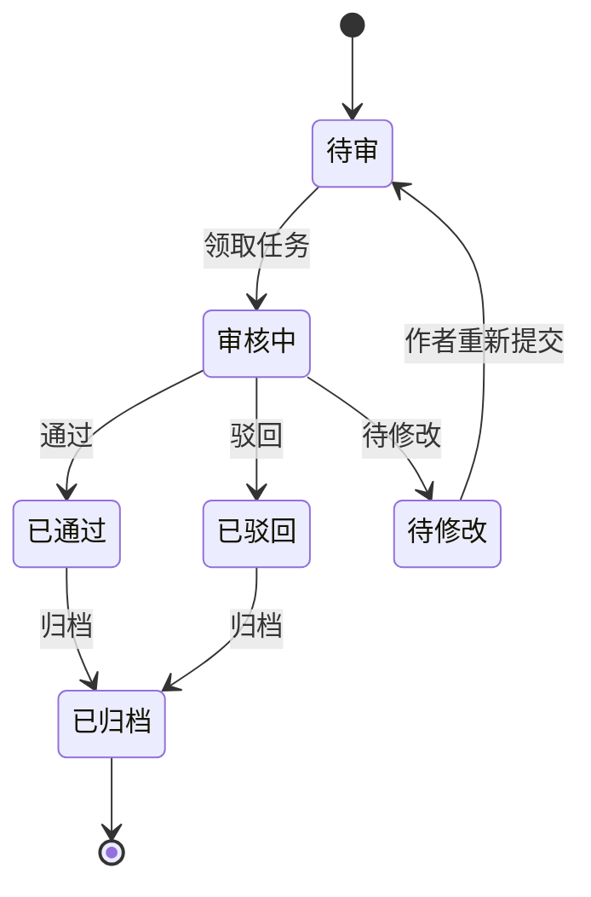

#### 批量审核

`mode='batch'` 时列表支持多选，底部出现批量操作条：

| 操作 | 适用状态 | 二次确认 |
|------|---------|---------|
| 批量通过 | 待审 / 审核中 | 否 |
| 批量驳回 | 待审 / 审核中 | 是（需选原因） |

#### Do / Don't

| Do | Don't |
|----|-------|
| 审核历史用 Timeline 展示 | 仅显示当前结果无历史 |
| 驳回必填原因与说明 | 驳回无原因 |
| 结果用对应功能色 Tag | 所有结果同色 |

[Expert judgment]

---

### 6.21 NovelDataModel

定义小说内容的核心数据结构和字段规范，用于 B 端表单与表格的数据约束。所有 B 端 Novel / Chapter 表单校验、表格列渲染均以本模型为准。

#### Novel 模型

| 字段 | 类型 | 必填 | 说明 |
|------|------|------|------|
| novelId | string | 是 | 主键，UUID |
| title | string | 是 | 书名，1-30 字 |
| authorId | string | 是 | 作者 ID，外键 → Author |
| categoryId | string | 是 | 分类 ID，外键 → Category |
| tags | string[] | 否 | 标签，最多 5 个 |
| status | enum | 是 | draft / serializing / completed / paused / shelved |
| wordCount | number | 是 | 总字数（自动统计，纯文字数） |
| chapterCount | number | 是 | 章节数（自动统计） |
| vipType | enum | 是 | free / vip / partial-vip |
| coverUrl | string | 否 | 封面图 URL |
| synopsis | string | 是 | 简介，10-500 字 |
| createdAt | timestamp | 是 | 创建时间 |
| updatedAt | timestamp | 是 | 更新时间 |
| publishedAt | timestamp | 否 | 上架发布时间 |

#### Chapter 模型

| 字段 | 类型 | 必填 | 说明 |
|------|------|------|------|
| chapterId | string | 是 | 主键，UUID |
| novelId | string | 是 | 外键 → Novel |
| title | string | 是 | 章节标题，1-50 字 |
| content | text | 是 | 章节正文 |
| wordCount | number | 是 | 字数（自动统计） |
| sort | number | 是 | 排序序号，从 1 递增 |
| status | enum | 是 | draft / pending / published / shelved |
| isVip | boolean | 是 | 是否 VIP 章节 |
| price | number | 否 | VIP 章节价格（单位：书币），isVip=true 时必填 |
| createdAt | timestamp | 是 | 创建时间 |
| publishedAt | timestamp | 否 | 发布时间 |

#### Novel 状态合法转换路径

| 当前状态 | 可流转至 | 触发 |
|---------|---------|------|
| draft | serializing | 首章发布 |
| serializing | completed | 标记完结 |
| serializing | paused | 停更 |
| paused | serializing | 恢复连载 |
| serializing / completed / paused | shelved | 下架 |
| shelved | serializing / completed | 恢复上架（回到下架前状态） |

#### Chapter 状态合法转换路径

| 当前状态 | 可流转至 | 可逆 |
|---------|---------|------|
| draft | pending | 是（撤回审核） |
| pending | published | 否（不可逆） |
| pending | draft | 是（驳回后修改） |
| published | shelved | 是（可恢复） |
| shelved | published | 是（恢复） |

#### 字数统计规则

| 口径 | 统计范围 | 用途 |
|------|---------|------|
| 纯文字数 | 汉字 + 字母 + 数字（不含标点、空格、换行） | 对外展示、榜单统计 |
| 含标点字数 | 全部字符（含中英文标点、空格，不含换行） | 稿费计费核对 |
| 统计时机 | 编辑器 input 实时统计；提交以服务端统计为准 | — |
| 显示 | 编辑器底部同时显示两值：`纯文字 3,021 / 含标点 3,180` | `--font-mono` |

#### VIP 章节定价约束

| 约束 | 规则 |
|------|------|
| 必填性 | isVip=true 时 price 必填；isVip=false 时 price 必须为 0 或 null |
| 取值范围 | 100-1000 书币，步长 100 |
| 调价限制 | VIP 章节定价一经设置不可上调，仅可下调 |
| 免费作品 | vipType=free 的作品下所有章节 isVip 必须为 false |
| 部分免费 | vipType=partial-vip 时，前 N 章（默认前 20 章）必须 isVip=false |

[Expert judgment]

---

### 6.22 AuthorManager

管理签约作者信息的组件，用于作者档案和合同管理。整合作者信息卡、作品列表、合同信息、收益统计四区。

#### 组件结构

```
AuthorManager
├── 作者信息卡（Avatar + 笔名 + 真名 + 状态 Tag）
├── 作品列表（Table：作品 / 分类 / 状态 / 字数 / 章节数）
├── 合同信息（Descriptions：合同编号 / 签约日期 / 分成比例 / 到期日期）
└── 收益统计（StatisticCard ×3：本月稿费 / 累计收益 / 提现状态）
```

#### 作者状态

| 状态 | Tag 颜色 | 令牌 |
|------|---------|------|
| 签约 | 绿 | `--color-feedback-success` |
| 未签约 | 灰 | `--color-text-tertiary` |
| 已解约 | 红 | `--color-feedback-error` |

#### 合同信息（Descriptions）

| 字段 | 说明 |
|------|------|
| 合同编号 | 系统生成，唯一 |
| 签约日期 | `YYYY-MM-DD` |
| 签约模式 | 买断 / 分成 / 保底+分成（见 §13.2） |
| 分成比例 | 百分比，分成模式必填 |
| 到期日期 | `YYYY-MM-DD`，到期前 30 天高亮 `--color-feedback-warning` |

#### 收益统计（StatisticCard）

| 指标 | 说明 | 令牌 |
|------|------|------|
| 本月稿费 | 当月已结算稿费 | `--color-text-primary` |
| 累计收益 | 历史累计 | `--color-text-primary` |
| 提现状态 | 待提现 / 已提现 | 待提现 `--color-feedback-warning`，已提现 `--color-feedback-success` |

#### Props 表

| 属性 | 类型 | 默认值 | 必填 | 说明 |
|------|------|--------|------|------|
| authorId | string | — | 是 | 作者 ID |
| author | AuthorInfo | — | 是 | 作者信息 |
| novels | Novel[] | — | 否 | 作品列表 |
| contract | Contract | — | 否 | 合同信息 |
| earnings | Earnings | — | 否 | 收益统计 |

#### Do / Don't

| Do | Don't |
|----|-------|
| 合同到期前预警高亮 | 到期无提示 |
| 收益数据右对齐千分位 | 收益随意对齐 |
| 解约作者作品列表置灰但仍可查 | 解约后直接隐藏作品 |

[Expert judgment]

---

## 7. B 端数据可视化

### 7.1 图表色板

B 端使用独立的数据可视化色板，与 UI 色板分离，确保图表中多系列色彩区分度：

| 序号 | 色值 | 用途 |
|------|------|------|
| 1 | #5B8FF9 | 主系列（蓝色） |
| 2 | #5AD8A6 | 次系列（绿色） |
| 3 | #5D7092 | 第三系列（灰蓝） |
| 4 | #F6BD16 | 第四系列（黄色） |
| 5 | #E8684A | 第五系列（橙红） |
| 6 | #6DC8EC | 第六系列（浅蓝） |

[Research-backed] 该色板来源于 AntV G2 官方默认色板，色相分布均匀、色盲友好，适用于多系列数据对比。

### 7.2 工作台常用图表

| 图表类型 | 用途 | 推荐库 |
|---------|------|--------|
| 折线趋势图 | 时间序列趋势（新增作品、活跃读者） | @ant-design/charts Line |
| 柱状对比图 | 分类对比（各分类作品数、各渠道流量） | @ant-design/charts Column |
| 环图占比 | 占比分析（作品分类分布、用户来源） | @ant-design/charts RingProgress / Pie |
| 指标卡 | 单一关键指标（KPI 卡片） | StatisticCard 组件 |

### 7.3 图表交互规范

| 交互 | 说明 |
|------|------|
| Tooltip 悬停 | 鼠标悬停显示数据点详情 |
| 图例筛选 | 点击图例切换系列显示/隐藏 |
| 数据缩放 | 折线图 X 轴支持拖拽缩放（大数据量时） |
| 点击钻取 | 点击数据点跳转详情页 |

### 7.4 图表尺寸规范

| 规范 | 值 |
|------|-----|
| 固定高度 | 320px |
| 宽度 | 自适应容器（100%） |
| 内边距 | 上下 16px，左右 24px |
| 坐标轴字号 | 12px |
| 图例字号 | 13px |

### 7.5 空数据图表占位

图表无数据时不渲染坐标轴，显示 Empty 占位组件：

```jsx
{hasData ? (
  <Line data={chartData} height={320} />
) : (
  <div style={{ height: 320, display: 'flex', alignItems: 'center', justifyContent: 'center' }}>
    <Empty description="暂无数据" />
  </div>
)}
```

### 7.6 图表示例

#### 折线趋势图

```jsx
import { Line } from '@ant-design/charts';

const config = {
  data: trendData,
  xField: 'date',
  yField: 'value',
  seriesField: 'category',
  color: ['#5B8FF9', '#5AD8A6', '#E8684A'],
  height: 320,
  smooth: true,
  tooltip: {
    showMarkers: true,
  },
  interactions: [{ type: 'brush' }],
};

<Line {...config} />
```

#### 柱状对比图

```jsx
import { Column } from '@ant-design/charts';

const config = {
  data: categoryData,
  xField: 'category',
  yField: 'count',
  color: ['#5B8FF9'],
  height: 320,
  columnWidthRatio: 0.6,
  label: {
    position: 'top',
  },
};

<Column {...config} />
```

#### 环图占比

```jsx
import { Pie } from '@ant-design/charts';

const config = {
  data: distributionData,
  angleField: 'value',
  colorField: 'type',
  color: ['#5B8FF9', '#5AD8A6', '#5D7092', '#F6BD16', '#E8684A', '#6DC8EC'],
  radius: 0.8,
  innerRadius: 0.6,
  height: 320,
  label: {
    text: 'percentage',
    content: '{percentage}',
  },
};

<Pie {...config} />
```

---

## 8. B 端布局规范

### 8.1 整体布局

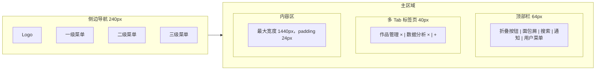

### 8.2 布局参数

| 区域 | 参数 | 值 |
|------|------|-----|
| 侧边导航 | 展开宽度 | 240px |
| 侧边导航 | 折叠宽度 | 80px |
| 顶部栏 | 高度 | 64px |
| Tab 标签页 | 高度 | 40px |
| 内容区 | 最大宽度 | 1440px |
| 内容区 | padding | 24px |
| 内容区 | 背景 | `--color-bg-page` (#F7F7F8) |
| 最小支持宽度 | — | 1280px |

### 8.3 侧边导航

| 规范 | 说明 |
|------|------|
| 菜单层级 | 最多 3 级（一级 > 二级 > 三级） |
| 折叠 | 支持折叠至 80px，仅显示图标 |
| 激活态 | 背景 `--brand-bg`，文字 `--brand`，左侧 3px `--brand` 指示条 |
| 菜单图标 | 20px，与文字间距 12px |
| 菜单项高度 | 一级 48px，二级 40px，三级 36px |
| 分组 | 支持分组标题（`--text-tertiary`，13px） |

### 8.4 顶部栏


| 区域 | 宽度 | 说明 |
|------|------|------|
| 折叠按钮 | 48px | 展开/折叠侧边栏 |
| 面包屑 | flex | 自适应，显示当前路径 |
| 全局搜索 | 240px | 搜索作品/用户/章节 |
| 通知图标 | 48px | 未读消息红点 |
| 用户菜单 | auto | 头像 + 下拉菜单 |

### 8.5 内容区栅格

| 规范 | 值 |
|------|-----|
| 栅格系统 | 12 列 |
| 断点 | xs/sm/md/lg/xl（5 级） |
| B 端基准 | xl (≥ 1440px) |
| 列间距 | 16px |
| 内容最大宽度 | 1440px |

### 8.6 多 Tab 标签页

| 规范 | 说明 |
|------|------|
| 标签高度 | 40px |
| 标签宽度 | 自适应，最小 120px，最大 200px |
| 关闭 | 每个标签含 × 关闭按钮（首页除外） |
| 右键菜单 | 关闭其他 / 关闭左侧 / 关闭右侧 / 关闭全部 |
| 持久化 | 刷新后保留已打开标签 |

### 8.7 最小宽度处理

低于 1280px 时，内容区触发横向滚动，不做响应式收缩：

```css
.b-end-layout {
  min-width: 1280px;
  overflow-x: auto;
}
```

---

## 9. B 端交互规范

### 9.1 表格行操作

| 规范 | 说明 |
|------|------|
| 操作位置 | 固定在表格最右侧列 `fixed: 'right'` |
| 显示方式 | 始终显示，或 hover 时显示 |
| 操作宽度 | 列宽 120-160px |
| 操作数量 | ≤ 3 个直接显示，> 3 个折叠到"更多" |
| 操作样式 | `type='link'`，字号 13px |

```jsx
{
  title: '操作',
  key: 'action',
  fixed: 'right',
  width: 140,
  render: (_, record) => (
    <Space size="small">
      <Button type="link" size="small">编辑</Button>
      <Button type="link" size="small">下架</Button>
      <Dropdown menu={{ items: moreActions }}>
        <Button type="link" size="small">更多</Button>
      </Dropdown>
    </Space>
  ),
}
```

### 9.2 批量操作

| 规范 | 说明 |
|------|------|
| 触发方式 | 表格勾选行后底部浮出 BatchActionBar |
| 浮出动画 | 从底部滑入，时长 200ms |
| 位置 | 固定在视口底部，距底部 24px |
| 已选计数 | 左侧显示"已选 N 项" |
| 操作后 | 操作完成后自动清除选择并刷新列表 |

### 9.3 筛选持久化

筛选状态同步到 URL 查询参数，刷新页面后保留筛选状态：

```jsx
// 筛选状态 ↔ URL 同步
useEffect(() => {
  const params = new URLSearchParams(location.search);
  setSearchKey(params.get('keyword') || '');
  setFilters({
    status: params.get('status'),
    category: params.get('category'),
  });
}, [location.search]);

// 筛选变化时更新 URL
const handleFilterChange = (values) => {
  const params = new URLSearchParams(values);
  navigate(`?${params.toString()}`);
};
```

### 9.4 表单校验

| 规范 | 说明 |
|------|------|
| 校验时机 | 失焦校验（onBlur）+ 提交校验 |
| 错误定位 | 提交失败时滚动到第一个错误字段 |
| 错误提示 | 字段下方红色文字 `--feedback-error` |
| 必填标识 | 字段标签前红色星号 |

```jsx
const onFinishFailed = (errorInfo) => {
  // 滚动到第一个错误字段
  const firstError = errorInfo.errorFields[0];
  if (firstError) {
    const errorElement = document.querySelector(
      `[id="${firstError.name.join('_')}"]`
    );
    errorElement?.scrollIntoView({ behavior: 'smooth', block: 'center' });
  }
};
```

### 9.5 删除确认

按操作风险等级分层确认：

| 风险等级 | 确认方式 | 示例 |
|---------|---------|------|
| 低 | 无需确认 | 编辑保存 |
| 中 | Modal 二次确认 | 批量下架 |
| 高 | Modal + 输入名称匹配 | 永久删除作品 |

```jsx
// 高危删除：输入名称匹配
<Modal
  title="危险操作"
  open={deleteModalOpen}
  onOk={handleConfirmDelete}
  okButtonProps={{ danger: true, disabled: confirmName !== novelTitle }}
  onCancel={() => setDeleteModalOpen(false)}
>
  <Alert
    type="error"
    message="此操作不可撤销"
    description="删除后作品及其所有章节将永久移除，无法恢复。"
    showIcon
    style={{ marginBottom: 16 }}
  />
  <p>请输入作品名称 <strong>{novelTitle}</strong> 以确认删除：</p>
  <Input
    value={confirmName}
    onChange={(e) => setConfirmName(e.target.value)}
    placeholder="请输入作品名称"
  />
</Modal>
```

### 9.6 键盘快捷键

| 快捷键 | 操作 | 适用场景 |
|--------|------|---------|
| Ctrl+S | 保存 | 表单页、编辑器 |
| Ctrl+Enter | 提交 | 表单页、评论框 |
| Esc | 关闭弹窗 | Modal / Drawer |
| Ctrl+Shift+N | 新建 | 列表页 |
| / | 聚焦搜索 | 全局 |

```jsx
useHotkeys('ctrl+s', (e) => {
  e.preventDefault();
  handleSave();
});
useHotkeys('ctrl+enter', (e) => {
  e.preventDefault();
  form.submit();
});
useHotkeys('esc', () => setModalOpen(false));
```

### 9.7 操作反馈

| 反馈类型 | 组件 | 时长 | 说明 |
|---------|------|------|------|
| 成功提示 | Message | 2s 自动关闭 | "保存成功"、"上架成功" |
| 错误提示 | Notification | 手动关闭 | "保存失败：网络错误" |
| 警告提示 | Message | 2s 自动关闭 | "请先填写必填项" |
| 加载中 | Message.loading | 自动消失 | "正在提交..." |
| 操作结果 | Result | 停留页面 | 流程结束结果页 |

```jsx
import { message, notification } from 'antd';

// 成功
const [messageApi, contextHolder] = message.useMessage();
messageApi.success('上架成功');

// 错误（需手动关闭）
notification.error({
  message: '保存失败',
  description: '网络连接超时，请检查网络后重试。',
  duration: 0,  // 不自动关闭
});
```

---

## 10. B 端权限设计

### 10.1 权限层级

B 端权限分 4 个层级，从粗到细：

| 层级 | 控制对象 | 示例 |
|------|---------|------|
| 菜单级 | 导航菜单可见性 | 无"系统设置"权限则不显示该菜单 |
| 页面级 | 页面访问 | 无"用户管理"权限则 403 |
| 操作级 | 按钮 / 操作可见性 | 无"novel:create"权限则隐藏新建按钮 |
| 数据级 | 数据可见范围 | 仅能查看自己负责的作品 |

### 10.2 权限标识命名

权限标识采用 `模块:操作` 格式：

| 权限标识 | 说明 |
|---------|------|
| `novel:create` | 新建作品 |
| `novel:edit` | 编辑作品 |
| `novel:delete` | 删除作品 |
| `novel:publish` | 上架/下架 |
| `novel:audit` | 审核作品 |
| `chapter:manage` | 章节管理 |
| `comment:audit` | 评论审核 |
| `user:manage` | 用户管理 |
| `system:config` | 系统配置 |

### 10.3 权限组件

提供 `<Authorized>` 组件用于操作级权限控制：

#### Props 表

| 属性 | 类型 | 默认值 | 必填 | 说明 |
|------|------|--------|------|------|
| permission | `string \| string[]` | — | 是 | 权限标识（数组为 OR 关系） |
| fallback | `ReactNode` | `null` | 否 | 无权限时展示 |
| children | `ReactNode` | — | 是 | 有权限时展示 |

#### JSX 示例

```jsx
import { Authorized } from '@/components/b-end';

// 操作级：隐藏无权限按钮
<Authorized permission="novel:create">
  <Button type="primary" onClick={handleCreate}>+ 新建作品</Button>
</Authorized>

// 操作级：无权限展示禁用按钮
<Authorized permission="novel:delete" fallback={
  <Button danger disabled>删除</Button>
}>
  <Button danger onClick={handleDelete}>删除</Button>
</Authorized>

// 多权限 OR 关系
<Authorized permission={['novel:audit', 'novel:publish']}>
  <Button onClick={handleAudit}>审核</Button>
</Authorized>
```

### 10.4 菜单级权限

侧边导航根据权限动态渲染：

```jsx
const menuItems = [
  {
    key: '/content',
    icon: <FileOutlined />,
    label: '内容管理',
    permission: 'novel:view',
    children: [
      { key: '/content/novels', label: '作品管理', permission: 'novel:view' },
      { key: '/content/chapters', label: '章节管理', permission: 'chapter:view' },
      { key: '/content/comments', label: '评论审核', permission: 'comment:view' },
    ],
  },
].filter((item) => hasPermission(item.permission));
```

### 10.5 页面级权限

路由守卫拦截无权限页面：

```jsx
const PrivateRoute = ({ permission, children }) => {
  const hasAccess = usePermission(permission);
  if (!hasAccess) {
    return <Result status="403" title="403" subTitle="抱歉，您没有权限访问此页面。" />;
  }
  return children;
};

<Route
  path="/content/novels"
  element={
    <PrivateRoute permission="novel:view">
      <NovelListPage />
    </PrivateRoute>
  }
/>
```

### 10.6 数据级权限

数据级权限通过后端接口控制，前端透传用户身份，后端返回该用户可见数据范围：

| 数据范围 | 说明 |
|---------|------|
| 全部 | 管理员可见所有数据 |
| 部门 | 仅可见本部门负责的作品 |
| 个人 | 仅可见自己创建/负责的作品 |

[Expert judgment] 数据级权限必须在后端严格校验，前端仅做展示控制，不可信任前端过滤。

---

## 11. B 端暗黑模式

### 11.1 令牌一致性

B 端暗黑模式与通用暗黑模式令牌体系一致，不额外定义 B 端专用暗色令牌。切换主题时所有语义令牌自动映射到暗色值。

### 11.2 暗黑模式令牌映射

| 语义令牌 | 亮色值 | 暗色值 | 说明 |
|---------|--------|--------|------|
| `--color-text-primary` | #0A0B12 | #F7F7F8 | 反转 |
| `--color-text-secondary` | #5E5E6A | #B8B8C1 | 提亮一档 |
| `--color-text-tertiary` | #9999A5 | #9999A5 | 居中灰保持 |
| `--color-bg-page` | #F7F7F8 | #0A0B12 | 页面背景变深 |
| `--color-bg-surface` | #FFFFFF | #15151B | 卡片背景 |
| `--color-bg-subtle` | #EDEDF0 | #1F1F25 | 分区背景 |
| `--color-border-default` | #D3D3DA | #2F2F37 | 边框 |
| `--color-border-subtle` | #E2E2E7 | #1F1F25 | 次级边框 |
| `--color-brand` | #1890FF | #40A9FF | 暗色提亮一档保对比 |
| `--color-brand-bg` | #E6F7FF | rgba(24,144,255,0.16) | 暗色用透明叠加 |

### 11.3 表格条纹色调整

暗黑模式下表格斑马纹需调整为更深的色值，确保行区分度：

| 模式 | 偶数行背景 | 奇数行背景 |
|------|-----------|-----------|
| 亮色 | `--color-bg-surface` (#FFFFFF) | `--color-bg-subtle` (#EDEDF0) |
| 暗色 | `--color-bg-surface` (#15151B) | #1F1F25 |

### 11.4 图表色板暗色适配

暗黑模式下图表色板调整，降低饱和度提升暗色背景下的可读性：

| 序号 | 亮色色值 | 暗色色值 |
|------|---------|---------|
| 1 | #5B8FF9 | #5B8FF9 |
| 2 | #5AD8A6 | #5AD8A6 |
| 3 | #5D7092 | #8AA2B8 |
| 4 | #F6BD16 | #F6BD16 |
| 5 | #E8684A | #E8684A |
| 6 | #6DC8EC | #6DC8EC |

```jsx
const chartColors = isDark
  ? ['#5B8FF9', '#5AD8A6', '#8AA2B8', '#F6BD16', '#E8684A', '#6DC8EC']
  : ['#5B8FF9', '#5AD8A6', '#5D7092', '#F6BD16', '#E8684A', '#6DC8EC'];

<Line data={data} color={chartColors} theme={isDark ? 'dark' : 'light'} />
```

### 11.5 侧边导航暗色样式

| 元素 | 亮色 | 暗色 |
|------|------|------|
| 导航背景 | `--color-bg-surface` (#FFFFFF) | #15151B |
| 菜单文字 | `--color-text-primary` | `--color-text-primary` |
| 激活项背景 | `--color-brand-bg` (#E6F7FF) | rgba(24,144,255,0.16) |
| 激活项文字 | `--color-brand` (#1890FF) | `--color-brand` (#40A9FF) |
| 激活项指示条 | `--color-brand` (#1890FF) | `--color-brand` (#40A9FF) |
| 分组标题 | `--color-text-tertiary` | `--color-text-tertiary` |
| hover 背景 | `--color-bg-subtle` (#EDEDF0) | #1F1F25 |

### 11.6 暗黑模式切换

主题切换通过 CSS 变量实现，不重新渲染组件树：

```css
/* 亮色（默认） */
:root {
  --color-text-primary: #0A0B12;
  --color-bg-page: #F7F7F8;
  --color-bg-surface: #FFFFFF;
  /* ... */
}

/* 暗色 */
:root[data-theme='dark'] {
  --color-text-primary: #F7F7F8;
  --color-bg-page: #0A0B12;
  --color-bg-surface: #15151B;
  /* ... */
}
```

```jsx
// 主题切换
const toggleTheme = (isDark) => {
  document.documentElement.setAttribute('data-theme', isDark ? 'dark' : 'light');
  localStorage.setItem('theme', isDark ? 'dark' : 'light');
};
```

[Research-backed] CSS 变量切换方案相比 React Context 方案性能更优，避免全组件树重新渲染，Ant Design 5.x 的 ConfigProvider 也推荐 CSS 变量方案。

---

## 12. 附录

### 12.1 令牌速查表

#### 间距（4px 基准，13 档）

| 令牌 | 值 | 用途 |
|------|-----|------|
| `--space-1` | 4px | 最小间距（图标与文字） |
| `--space-2` | 8px | 紧凑间距 |
| `--space-3` | 12px | 组件内间距 |
| `--space-4` | 16px | 标准间距（卡片 gap） |
| `--space-5` | 20px | 卡片内边距 |
| `--space-6` | 24px | 内容区内边距 |
| `--space-8` | 32px | 区块间距 |
| `--space-10` | 40px | 大区块间距 |
| `--space-12` | 48px | 页面区块间距 |
| `--space-16` | 64px | 大间距 |
| `--space-20` | 80px | 超大间距 |
| `--space-24` | 96px | 最大间距 |
| `--space-32` | 128px | 页面顶/底留白 |

#### 圆角（8 档）

| 令牌 | 值 | 用途 |
|------|-----|------|
| `--radius-none` | 0 | 表格行、分隔条 |
| `--radius-xs` | 2px | Tag、小徽标 |
| `--radius-sm` | 4px | 按钮（紧凑）、小卡片 |
| `--radius-md` | 8px | 默认按钮、输入框、卡片 |
| `--radius-lg` | 12px | 大卡片、面板 |
| `--radius-xl` | 16px | 大型容器 |
| `--radius-2xl` | 24px | 营销卡片 |
| `--radius-full` | 9999px | 胶囊、圆形头像 |

#### 阴影（5 级）

| 令牌 | 值 | 用途 |
|------|-----|------|
| `--sh-1` | `0 1px 2px 0 rgba(0,0,0,0.04)` | 极弱阴影，卡片浮起 hint |
| `--sh-2` | `0 2px 8px 0 rgba(0,0,0,0.08)` | 卡片默认阴影 |
| `--sh-3` | `0 4px 12px 0 rgba(0,0,0,0.10)` | 下拉菜单、悬浮菜单 |
| `--sh-4` | `0 8px 24px 0 rgba(0,0,0,0.12)` | Drawer、popover |
| `--sh-5` | `0 16px 48px 0 rgba(0,0,0,0.16)` | Modal、全屏弹层 |

#### 动效（5 档时长）

| 令牌 | 值 | 用途 |
|------|-----|------|
| `--dur-instant` | 90ms | 即时（hover、ripple） |
| `--dur-fast` | 150ms | 快速（toggle、tooltip） |
| `--dur-normal` | 240ms | 标准（展开/收起） |
| `--dur-slow` | 360ms | 慢速（drawer、弹窗） |
| `--dur-deliberate` | 540ms | 超慢（页面转场） |

#### z-index（6 级）

| 令牌 | 值 | 用途 |
|------|-----|------|
| `--z-index-base` | 0 | 基础层 |
| `--z-index-dropdown` | 1000 | 下拉菜单 |
| `--z-index-sticky` | 1100 | 吸顶元素 |
| `--z-index-drawer` | 1200 | 抽屉 |
| `--z-index-modal` | 1300 | 弹窗 |
| `--z-index-toast` | 1400 | 消息提示 |

### 12.2 栅格断点

| 断点 | 令牌 | 宽度 | B 端使用 |
|------|------|------|---------|
| xs | — | < 576px | 不适用 |
| sm | — | ≥ 576px | 不适用 |
| md | — | ≥ 768px | 不适用 |
| lg | — | ≥ 992px | 最小支持（1280px） |
| xl | — | ≥ 1200px | B 端基准（1440px） |
| xxl | — | ≥ 1600px | 大屏优化 |

> B 端 PC 优先，实际最小支持宽度为 1280px（lg 断点扩展），低于此宽度横向滚动。

### 12.3 组件清单速查

| 序号 | 组件 | 核心场景 | 页面模板 |
|------|------|---------|---------|
| 1 | Table | 数据列表 | 列表页、卡片页 |
| 2 | FilterBar | 筛选搜索 | 列表页 |
| 3 | StatisticCard | KPI 指标 | 工作台、卡片页 |
| 4 | PageHeader | 页面标题 | 全部页面 |
| 5 | BatchActionBar | 批量操作 | 列表页 |
| 6 | Form/FormItem | 表单输入 | 表单页 |
| 7 | Upload | 文件上传 | 表单页 |
| 8 | DatePicker/RangePicker | 日期选择 | 列表页、表单页 |
| 9 | Steps | 步骤引导 | 表单页 |
| 10 | Cascader | 级联选择 | 列表页、表单页 |
| 11 | Tree/TreeSelect | 树形选择 | 表单页、设置页 |
| 12 | Transfer | 数据迁移 | 权限配置 |
| 13 | Rate | 评分 | 卡片页 |
| 14 | Progress | 进度展示 | 工作台、卡片页 |
| 15 | Breadcrumb | 导航路径 | 全部页面 |
| 16 | Descriptions | 详情展示 | 卡片页 |
| 17 | Timeline | 审核记录 | 卡片页 |
| 18 | Result | 结果反馈 | 全部页面 |

### 12.4 文档版本记录

| 版本 | 日期 | 变更说明 |
|------|------|---------|
| V1.0.0 | 2026.07 | 初始版本，建立 B 端专项设计规范 |

---

## 13. 小说运营专项

### 13.1 敏感词过滤系统

支撑章节编辑（§6.19）与内容审核（§5.6、§6.20）的敏感词底层能力，按等级分级处置，兼顾合规与创作效率。

#### 敏感词等级与处理策略

| 等级 | 名称 | 命中类型 | 处理策略 | 令牌 |
|------|------|---------|---------|------|
| 一级 | 严禁 | 涉政 / 涉黄 | 直接拦截，不可发布 | `--color-feedback-error` |
| 二级 | 警告 | 暴力 / 广告 | 标记并转人工审核 | `--color-feedback-warning` |
| 三级 | 提示 | 俗语 / 敏感谐音 | 仅提示作者自查 | `--color-text-tertiary` |

#### 过滤策略

- 一级：编辑器提交时直接拦截，Toast 报错并定位首个命中词，不可保存为待审核
- 二级：可保存，但章节状态强制流转至「待审核」并打上「需人工审核」标记
- 三级：编辑器内仅高亮提示，不影响发布流程

#### UI 呈现

| 元素 | 一级 | 二级 | 三级 |
|------|------|------|------|
| 命中词背景 | `--color-feedback-error-bg` | `--color-feedback-warning-bg` | `--color-bg-subtle` |
| 命中词文字 | `--color-feedback-error` | `--color-feedback-warning` | `--color-text-tertiary` |
| hover 提示 | 等级 +「禁止发布」 | 等级 +「需人工审核」 | 等级 +「建议自查」 |

[Research-backed] 分级敏感词策略兼顾合规与创作效率，一级硬拦截、二三级软提示可显著降低误伤率。

---

### 13.2 版权与稿费管理

定义签约模式、稿费计算与结算流程，对应作者合同（§6.22）与收益统计。

#### 签约模式

| 模式 | 核心字段 | 稿费计算 |
|------|---------|---------|
| 买断 | 单价（书币/千字）、字数 | 字数 × 单价 |
| 分成 | 分成比例、订阅收入 | 订阅收入 × 分成比例 |
| 保底+分成 | 保底金额、分成比例、订阅收入 | max(保底金额, 订阅收入 × 分成比例) |

#### 稿费计算公式

- 买断：`稿费 = ceil(字数 / 1000) × 单价`
- 分成：`稿费 = 订阅收入 × 分成比例`
- 保底+分成：`稿费 = max(保底金额, 订阅收入 × 分成比例)`
- 字数口径：统一使用「含标点字数」（见 §6.21）

#### 结算状态

| 状态 | 令牌 |
|------|------|
| 待结算 | `--color-feedback-warning` |
| 已结算 | `--color-feedback-success` |
| 已提现 | `--color-feedback-success` |

#### 稿费明细表

| 月份 | 小说 | 章节数 | 字数 | 单价/分成 | 金额 | 状态 |
|------|------|--------|------|-----------|------|------|
| 2026-07 | 斗破苍穹 | 30 | 90,150 | 5 书币/千字 | 451 | 已结算 |
| 2026-07 | 凡人修仙 | 25 | 72,300 | 30% | 2,169 | 待结算 |

#### 结算流程图


[Expert judgment]

---

### 13.3 小说上架/下架流程

#### 上架流程

1. 作者提交上架申请（作品需 ≥ 1 章已发布）
2. 编辑初审（内容合规性）
3. 主编终审（作品质量）
4. 终审通过 → 自动上架，`publishedAt` 写入
5. 任一审核驳回 → 退回作者，附驳回原因

#### 下架流程

1. 运营发起下架（或作者申请下架）
2. 选择下架原因分类
3. 系统通知作者（站内信）
4. 执行下架，作品 status → shelved，C 端不可见

#### 下架原因分类

| 原因 | 说明 | 令牌 |
|------|------|------|
| 违规 | 内容违规 | `--color-feedback-error` |
| 版权问题 | 版权争议 | `--color-feedback-error` |
| 作者请求 | 作者主动申请 | `--color-feedback-warning` |
| 运营调整 | 运营策略调整 | `--color-feedback-warning` |

#### 流程图

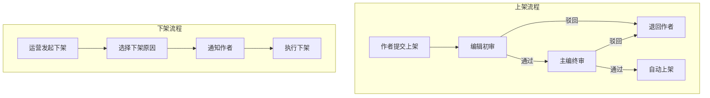

#### 流程节点状态色

| 流程节点 | 状态色 | 令牌 |
|---------|--------|------|
| 进行中 / 待审 | 橙 | `--color-feedback-warning` |
| 通过 / 上架成功 | 绿 | `--color-feedback-success` |
| 驳回 | 红 | `--color-feedback-error` |

[Expert judgment]

---

> **证据标注说明**
> - `[Research-backed]`：基于业界研究、官方文档或可用性研究数据
> - `[Expert judgment]`：基于设计经验与最佳实践的专家判断
