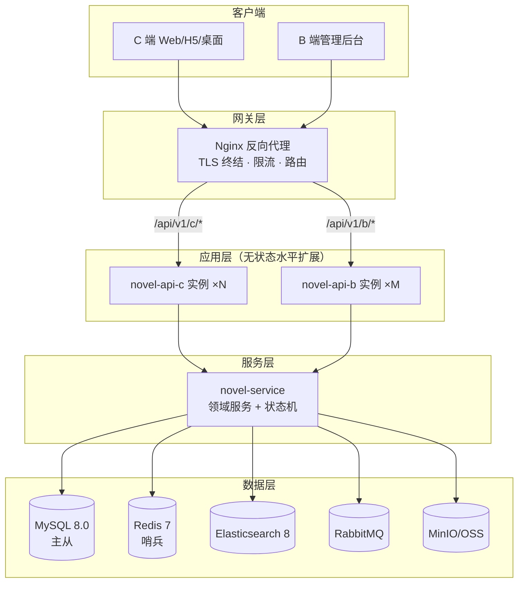
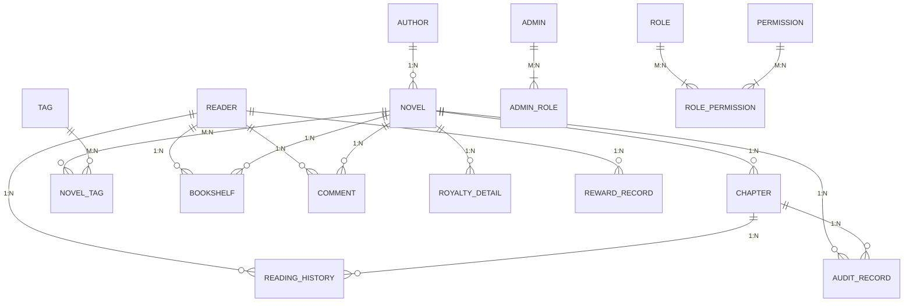
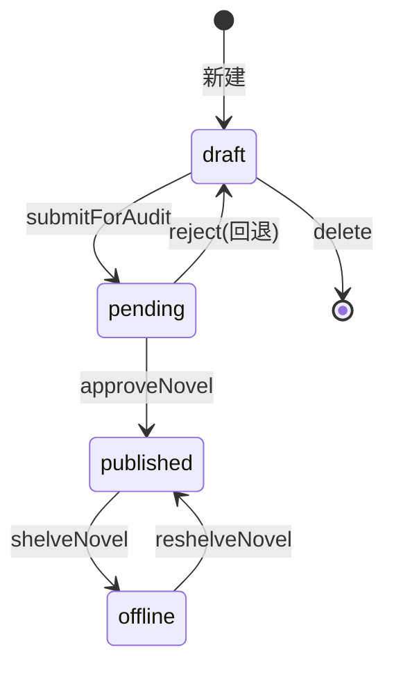
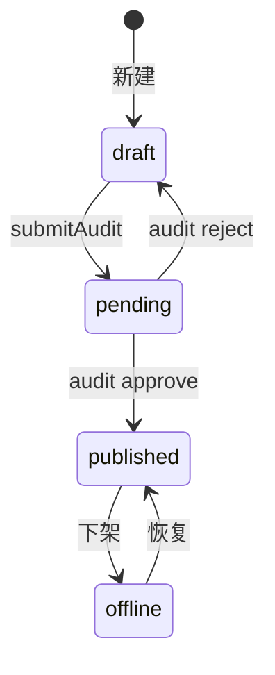
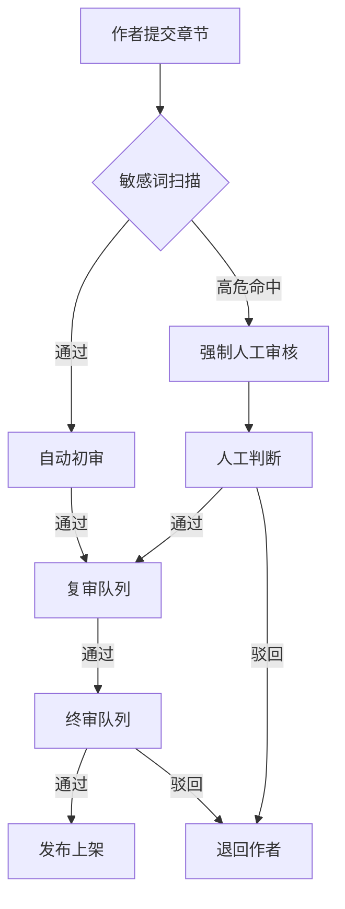
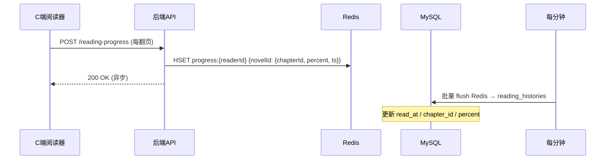

# 后端开发文档

> **文档版本**：V1.0.0 · 2026.07
> **适用产品**：小说阅读平台（C 端读者侧 + B 端运营管理）
> **依据**：《01-前端底层设计》《02-通用设计》《03-C端专项设计》《04-B端专项设计》及前端 Mock fetcher 契约
> **维护方**：后端工程组
> **对齐前端**：本文 API 路径、入参、出参与 `apps/web/src/api/fetcher.ts`、`apps/admin/src/api/*.ts` 一一对应，前端切换真实接口零改造成本

---

## 目录

1. [文档定位](#1-文档定位)
2. [技术栈选型](#2-技术栈选型)
3. [系统架构](#3-系统架构)
4. [数据库设计](#4-数据库设计)
5. [API 设计规范](#5-api-设计规范)
6. [鉴权与权限系统](#6-鉴权与权限系统)
7. [C 端 API 详细设计](#7-c-端-api-详细设计)
8. [B 端 API 详细设计](#8-b-端-api-详细设计)
9. [核心业务流程](#9-核心业务流程)
10. [缓存与性能设计](#10-缓存与性能设计)
11. [文件存储设计](#11-文件存储设计)
12. [安全设计](#12-安全设计)
13. [监控与运维](#13-监控与运维)
14. [开发计划与里程碑](#14-开发计划与里程碑)

---

## 1. 文档定位

### 1.1 文档目标

本文档是小说阅读平台后端从零到上线的工程蓝图，将前端已固化的 API 契约转化为可执行的后端实现规范，覆盖技术选型、架构、数据库、API、业务流程、安全、部署全链路。

### 1.2 对齐铁律

| 维度 | 约束 |
| --- | --- |
| 路径 | RESTful 风格，路径与前端 fetcher 方法名语义对应（见 §5.4 映射表） |
| 入参 | Query / Body 字段名与前端 TypeScript 接口逐字对齐 |
| 出参 | 响应体结构与前端 `types.ts` 定义一致，时间戳统一 ms |
| 枚举 | 全量复用 `@novel/types/enums.ts`，禁止后端自定义新枚举值 |
| 状态码 | 业务错误统一走业务码（见 §5.3），HTTP 状态码仅表征传输层 |

### 1.3 与前端的关系

```
前端 Mock fetcher（apps/web、apps/admin）
        │ 切换 baseURL 即可平替
        ▼
后端 RESTful API（本文档）
        │
        ▼
数据库 + 缓存 + 对象存储 + 搜索引擎
```

前端 Mock fetcher 已在 P0-P8 阶段沉淀全部接口契约，后端无需重新设计接口，仅需实现。本文档每个 API 节点均标注「对应前端方法」，便于联调时双向核对。

---

## 2. 技术栈选型

### 2.1 主技术栈

| 层 | 技术 | 版本 | 选型理由 |
| --- | --- | --- | --- |
| 语言 | Java | 17 LTS | 生态成熟，团队储备；与前端 TS 类型对齐 via TypeShare |
| 框架 | Spring Boot | 3.3.x | 主流 Web 框架，Jakarta EE 9+ |
| ORM | MyBatis-Plus | 3.5.x | 动态 SQL 灵活，分页插件成熟 |
| 数据库 | MySQL | 8.0 | 主库，事务强一致 |
| 缓存 | Redis | 7.x | 会话、热点榜单、阅读进度、限流 |
| 搜索 | Elasticsearch | 8.x | 小说/章节全文检索、搜索建议 |
| 消息队列 | RabbitMQ | 3.13 | 审核通知、稿费结算、阅读统计异步消费 |
| 对象存储 | MinIO / OSS | — | 封面、章节附件、导出报表 |
| 鉴权 | JWT + Spring Security | 6.x | 无状态会话，支持双 Token 刷新 |
| API 文档 | SpringDoc OpenAPI | 2.x | 自动生成 Swagger，对齐前端 Mock |

### 2.2 辅助组件

| 组件 | 用途 |
| --- | --- |
| Caffeine | 二级本地缓存（榜单、配置） |
| MapStruct | DTO ↔ Entity 转换 |
| Hutool | 工具类（敏感词扫描、字数统计） |
| Redisson | 分布式锁（库存扣减、批量操作幂等） |
| XXL-JOB | 定时任务（稿费月初生成、榜单刷新、统计聚合） |

### 2.3 工程模块划分

```
novel-backend/
├── novel-common          # 通用：响应体、错误码、枚举、工具
├── novel-auth            # 鉴权：JWT、Spring Security、权限注解
├── novel-domain          # 领域模型：Entity、枚举对齐 @novel/types
├── novel-repository      # 数据访问：MyBatis-Plus Mapper
├── novel-service         # 业务服务：领域服务、状态机、流程编排
├── novel-api-c           # C 端 REST Controller
├── novel-api-b           # B 端 REST Controller
├── novel-job             # 定时任务
└── novel-mq              # 消息消费者
```

> **模块边界铁律**：`novel-api-c` 与 `novel-api-b` 物理隔离，禁止互相 import；共享逻辑下沉到 `novel-service`。

---

## 3. 系统架构

### 3.1 部署架构



### 3.2 请求路径约定

| 端 | 路径前缀 | 网关路由 |
| --- | --- | --- |
| C 端 | `/api/v1/c/**` | 转发到 `novel-api-c` |
| B 端 | `/api/v1/b/**` | 转发到 `novel-api-b` |
| 公共 | `/api/v1/common/**`（验证码、上传） | 按需路由 |

### 3.3 环境分层

| 环境 | 用途 | 数据 |
| --- | --- | --- |
| dev | 本地开发 | 本地 MySQL + 嵌入式 Redis |
| test | 联调测试 | 独立实例 + Mock 种子数据 |
| staging | 预发布 | 脱敏生产快照 |
| prod | 生产 | 主从 + 读写分离 |

---

## 4. 数据库设计

### 4.1 ER 模型概览



### 4.2 表结构清单

> 命名规范：表名 `snake_case` 复数；主键统一 `id BIGINT`；时间字段统一 `BIGINT` 毫秒时间戳（对齐前端 `number` 类型）；软删除统一 `deleted TINYINT DEFAULT 0`。

#### 4.2.1 用户域

**`authors` 作者表**

| 字段 | 类型 | 说明 |
| --- | --- | --- |
| id | BIGINT PK | 主键 |
| pen_name | VARCHAR(64) | 笔名（对应前端 `author`） |
| real_name | VARCHAR(64) | 真实姓名 |
| avatar | VARCHAR(255) | 头像 URL |
| contract_type | VARCHAR(20) | 签约模式：buyout/share/guarantee-share |
| contract_rate | DECIMAL(10,4) | 买断单价/分成比例/保底金额 |
| status | TINYINT | 0 待签 1 已签 2 解约 |
| created_at | BIGINT | 创建时间 ms |
| updated_at | BIGINT | 更新时间 ms |
| deleted | TINYINT | 软删 |

**`readers` 读者表**

| 字段 | 类型 | 说明 |
| --- | --- | --- |
| id | BIGINT PK | |
| username | VARCHAR(64) | 登录名 |
| nickname | VARCHAR(64) | 昵称 |
| avatar | VARCHAR(255) | 头像 |
| password_hash | VARCHAR(128) | bcrypt |
| phone | VARCHAR(20) | 手机号（加密存储） |
| level | INT | 等级 |
| is_vip | TINYINT | 是否 VIP |
| vip_expire_at | BIGINT | VIP 过期 ms |
| total_reading_minutes | INT | 累计阅读分钟 |
| total_read_words | BIGINT | 累计阅读字数 |
| reading_days | INT | 阅读天数 |
| created_at / updated_at / deleted | — | 通用字段 |

**`admins` 管理员表**

| 字段 | 类型 | 说明 |
| --- | --- | --- |
| id | BIGINT PK | |
| username | VARCHAR(64) | |
| nickname | VARCHAR(64) | |
| avatar | VARCHAR(255) | |
| email | VARCHAR(128) | |
| password_hash | VARCHAR(128) | |
| enabled | TINYINT | 0 禁用 1 启用 |
| last_login_at | BIGINT | 最近登录 ms |
| created_at / updated_at | — | |

**`admin_roles` 管理员-角色绑定**

| 字段 | 类型 |
| --- | --- |
| admin_id | BIGINT |
| role_key | VARCHAR(32) |

> 复合主键 `(admin_id, role_key)`。`role_key` 取值对齐前端 `AdminRole`：`super-admin` / `content-admin` / `operation-admin` / `finance-admin` / `auditor`。

#### 4.2.2 内容域

**`novels` 小说表**

| 字段 | 类型 | 说明 |
| --- | --- | --- |
| id | BIGINT PK | |
| title | VARCHAR(128) | 书名 |
| author_id | BIGINT | FK authors.id |
| author_name | VARCHAR(64) | 冗余（对应前端 `author`） |
| cover | VARCHAR(255) | 封面 URL |
| category | VARCHAR(20) | 分类枚举（BookCategory） |
| intro | TEXT | 简介 |
| word_count | INT | 总字数 |
| status | VARCHAR(20) | B 端状态：draft/pending/published/offline |
| flags | VARCHAR(100) | 逗号分隔：vip,free-limited,editor-pick,hot |
| rating | DECIMAL(3,1) | 评分 |
| rating_count | INT | 评分人数 |
| follow_count | INT | 收藏数 |
| click_count | INT | 点击数 |
| price | DECIMAL(10,2) | 单价 |
| author_remark | VARCHAR(500) | 作者备注 |
| published_at | BIGINT | 上架 ms |
| shelved_at | BIGINT | 下架 ms |
| offline_reason | VARCHAR(32) | 下架原因枚举 |
| offline_remark | VARCHAR(500) | 下架备注 |
| created_at / updated_at / deleted | — | |

> **C 端状态派生**：B 端 `published` → C 端 `ongoing`/`completed` 由 `is_completed` 字段判定；其余 B 端状态对 C 端不可见。

**`novel_tags` 小说-标签关联**

| 字段 | 类型 |
| --- | --- |
| novel_id | BIGINT |
| tag_id | BIGINT |

**`tags` 标签表**

| 字段 | 类型 |
| --- | --- |
| id | BIGINT PK |
| name | VARCHAR(32) |
| ref_count | INT | 引用计数 |
| created_at | BIGINT |

**`categories` 分类表**

| 字段 | 类型 |
| --- | --- |
| id | BIGINT PK |
| code | VARCHAR(20) | BookCategory 枚举 |
| name | VARCHAR(32) | 中文名 |
| icon | VARCHAR(255) | 图标 |
| parent_id | BIGINT | 父分类（支持二级） |
| sort | INT | 排序 |
| novel_count | INT | 作品数（冗余） |

**`chapters` 章节表**

| 字段 | 类型 | 说明 |
| --- | --- | --- |
| id | BIGINT PK | |
| novel_id | BIGINT | FK |
| index | INT | 章节序号（支持拖拽重排） |
| title | VARCHAR(128) | 章节标题 |
| content | MEDIUMTEXT | HTML 正文 |
| content_text | MEDIUMTEXT | 纯文本（用于检索） |
| word_count | INT | 字数 |
| pure_word_count | INT | 纯文字字数（不含标点） |
| punctuation_word_count | INT | 含标点字数（稿费口径） |
| is_vip | TINYINT | 是否 VIP |
| status | VARCHAR(20) | draft/pending/published/offline |
| audit_level | VARCHAR(20) | first/second/final |
| published_at | BIGINT | 发布 ms |
| created_at / updated_at / deleted | — | |

> **索引建议**：`(novel_id, index)` 联合唯一；`(novel_id, status)`；`(status, audit_level)` 审核队列查询。

**`chapter_contents` 章节正文分表**

> 章节正文单表过大时按 `novel_id % 16` 分表到 `chapter_contents_00 ~ chapter_contents_15`，避免 MEDIUMTEXT 拖慢列表查询。

#### 4.2.3 阅读域

**`bookshelves` 书架**

| 字段 | 类型 |
| --- | --- |
| id | BIGINT PK |
| reader_id | BIGINT |
| novel_id | BIGINT |
| added_at | BIGINT |
| UNIQUE(reader_id, novel_id) | |

**`reading_histories` 阅读历史**

| 字段 | 类型 | 说明 |
| --- | --- | --- |
| id | BIGINT PK | |
| reader_id | BIGINT | |
| novel_id | BIGINT | |
| chapter_id | BIGINT | |
| chapter_index | INT | |
| percent | DECIMAL(5,2) | 阅读百分比 |
| read_at | BIGINT | 最后阅读 ms |
| UNIQUE(reader_id, novel_id) | | 一本书一条历史 |

**`reading_stats_daily` 每日阅读统计**

| 字段 | 类型 |
| --- | --- |
| id | BIGINT PK |
| reader_id | BIGINT |
| stat_date | DATE |
| duration_minutes | INT |
| words | INT |
| UNIQUE(reader_id, stat_date) | |

> 用于热力图（`getHeatmap`）、阅读偏好（`getPreferences`）、徽章解锁判定。

**`reading_progress` 实时进度（Redis）**

> 不落库，存 Redis Hash：`progress:{readerId}` → `{novelId: {chapterId, percent, ts}}`，TTL 90 天。

#### 4.2.4 互动域

**`comments` 评论 / 段评**

| 字段 | 类型 |
| --- | --- |
| id | BIGINT PK |
| novel_id | BIGINT |
| chapter_id | BIGINT NULL |
| paragraph_index | INT NULL（段评用） |
| reader_id | BIGINT |
| parent_id | BIGINT NULL |
| rating | TINYINT（1-5，仅书评有） |
| content | TEXT |
| likes | INT |
| status | TINYINT（0 待审 1 通过 2 驳回） |
| created_at | BIGINT |

**`reviews` 书评**

| 字段 | 类型 |
| --- | --- |
| id | BIGINT PK |
| reader_id | BIGINT |
| novel_id | BIGINT |
| rating | TINYINT |
| content | TEXT |
| images | VARCHAR(500) JSON |
| likes / replies | INT |
| created_at | BIGINT |

**`reward_records` 打赏记录**

| 字段 | 类型 |
| --- | --- |
| id | BIGINT PK |
| reader_id | BIGINT |
| novel_id | BIGINT |
| type | VARCHAR(20) | ticket/recommend/tip |
| amount | INT |
| created_at | BIGINT |

**`book_lists` 书单**

| 字段 | 类型 |
| --- | --- |
| id | BIGINT PK |
| title / desc / cover | — |
| book_count / follow_count | INT |
| created_at | BIGINT |

#### 4.2.5 审核域

**`audit_records` 审核记录**

| 字段 | 类型 |
| --- | --- |
| id | BIGINT PK |
| target_type | VARCHAR(20) | novel/chapter |
| target_id | BIGINT |
| level | VARCHAR(20) | first/second/final |
| status | VARCHAR(20) | pending/approved/revised/rejected |
| operator_id | BIGINT | admin |
| operator_name | VARCHAR(64) |
| comment | VARCHAR(500) |
| reject_reason | VARCHAR(32) | RejectReason 枚举 |
| sensitive_hits | TEXT JSON | 命中敏感词快照 |
| submitted_at | BIGINT |
| processed_at | BIGINT |

**`audit_histories` 审核历史**

| 字段 | 类型 |
| --- | --- |
| id | BIGINT PK |
| audit_record_id | BIGINT FK |
| operator_id | BIGINT |
| operator_name | VARCHAR(64) |
| result | VARCHAR(20) | approve/revise/reject |
| comment | VARCHAR(500) |
| reject_reason | VARCHAR(32) |
| created_at | BIGINT |

**`sensitive_words` 敏感词库**

| 字段 | 类型 |
| --- | --- |
| id | BIGINT PK |
| text | VARCHAR(64) |
| level | TINYINT | 1 高危 2 警告 3 提示 |
| suggestion | VARCHAR(255) |
| lib_version | VARCHAR(20) | 版本号 |
| created_at / updated_at | BIGINT |
| UNIQUE(text, level) | |

> 词库全量加载到 Redis（约 1-3 万词），Trie 树内存扫描，避免每次查库。

#### 4.2.6 稿费域

**`royalty_details` 稿费明细**

| 字段 | 类型 |
| --- | --- |
| id | BIGINT PK |
| month | VARCHAR(7) | YYYY-MM |
| novel_id | BIGINT |
| author_id | BIGINT |
| chapter_count | INT |
| word_count | INT | 含标点字数 |
| contract_type | VARCHAR(20) |
| rate | DECIMAL(10,4) |
| subscription_revenue | DECIMAL(12,2) |
| amount | DECIMAL(12,2) |
| status | VARCHAR(20) | pending/settled/withdrawn |
| settled_at / withdrawn_at | BIGINT |
| created_at | BIGINT |

#### 4.2.7 权限域

**`roles` 角色表**

| 字段 | 类型 |
| --- | --- |
| role_key | VARCHAR(32) PK | super-admin 等 |
| name | VARCHAR(32) |
| description | VARCHAR(255) |
| data_scope | VARCHAR(20) | all/department/self |
| builtin | TINYINT | 内置不可删 |
| user_count | INT | 冗余 |

**`permissions` 权限点表**

| 字段 | 类型 |
| --- | --- |
| perm_key | VARCHAR(32) PK | novel.list 等 |
| label | VARCHAR(32) |
| module | VARCHAR(20) |
| description | VARCHAR(255) |

**`role_permissions` 角色-权限**

| 字段 | 类型 |
| --- | --- |
| role_key | VARCHAR(32) |
| perm_key | VARCHAR(32) |
| PK(role_key, perm_key) | |

> 初始化数据对齐 `apps/admin/src/constants/permissions.ts` 与 `role-api.ts` 内置角色映射。

#### 4.2.8 运营域

**`banners` 轮播图** · `topics` 话题 · `vip_plans` VIP 套餐 · `payment_methods` 支付方式 · `system_configs` 系统配置

> 结构简单，参考前端 `types.ts` 一一映射。

### 4.3 索引策略

| 查询场景 | 索引 |
| --- | --- |
| 小说列表分页 | `(status, last_updated DESC)` |
| 章节列表 | `(novel_id, index)` |
| 审核队列 | `(status, level, submitted_at)` |
| 读者书架 | `(reader_id, novel_id)` UNIQUE |
| 阅读历史 | `(reader_id, read_at DESC)` |
| 稿费查询 | `(month, status, author_id)` |
| 评论列表 | `(novel_id, status, created_at)` |

### 4.4 分库分表策略

| 表 | 策略 | 时机 |
| --- | --- | --- |
| `chapters` | 按 `novel_id % 16` 分表 | 单表 > 5000 万行 |
| `reading_histories` | 按 `reader_id % 8` 分表 | 单表 > 1 亿行 |
| `comments` | 按 `novel_id % 8` 分表 | 单表 > 5000 万行 |
| `audit_records` | 按月分表 `audit_records_yyyymm` | 单表 > 1000 万行 |

---

## 5. API 设计规范

### 5.1 统一响应格式

```json
{
  "code": 0,
  "message": "ok",
  "data": { },
  "traceId": "a1b2c3d4"
}
```

| 字段 | 说明 |
| --- | --- |
| code | 0 成功；非 0 业务错误码（见 §5.3） |
| message | 用户可读消息（前端可直接展示） |
| data | 业务数据；列表用 `PagedResult<T>` 或数组 |
| traceId | 链路追踪 ID，写入日志与响应头 `X-Trace-Id` |

**分页响应**（对齐前端 `PagedResult<T>`）：

```json
{
  "code": 0,
  "data": {
    "items": [],
    "total": 1280,
    "page": 1,
    "pageSize": 20,
    "hasMore": false
  }
}
```

### 5.2 HTTP 状态码

| 状态码 | 场景 |
| --- | --- |
| 200 | 业务成功（含 code=0） |
| 400 | 入参校验失败 |
| 401 | 未登录 / Token 过期 |
| 403 | 已登录但无权限 |
| 404 | 资源不存在 |
| 429 | 限流 |
| 500 | 服务端异常 |

> **铁律**：业务错误（如「作品不存在」「状态不可转换」）HTTP 状态码仍为 200，通过 `code` 区分。仅传输层与鉴权层用 4xx/5xx。

### 5.3 业务错误码

| 区间 | 模块 | 示例 |
| --- | --- | --- |
| 1xxxx | 鉴权 | 10001 用户名或密码错误；10002 Token 过期 |
| 2xxxx | 作品 | 20001 作品不存在；20002 状态不可转换 |
| 3xxxx | 章节 | 30001 章节不存在；30002 已发布需标题匹配 |
| 4xxxx | 审核 | 40001 审核项不存在；40002 非法审核结果 |
| 5xxxx | 权限 | 50001 无权限；50002 角色不可修改 |
| 6xxxx | 稿费 | 60001 已结算不可重复；60002 提现金额不足 |
| 7xxxx | 系统 | 70001 文件上传失败；70002 敏感词库版本冲突 |
| 9xxxx | 通用 | 90001 参数校验失败；90002 资源不存在 |

### 5.4 前端方法 → 后端路径映射

#### C 端（对齐 `apps/web/src/api/fetcher.ts`）

| 前端方法 | HTTP | 路径 |
| --- | --- | --- |
| getBanners | GET | `/api/v1/c/banners` |
| getHotBooks | GET | `/api/v1/c/books/hot` |
| getFreeLimitedBooks | GET | `/api/v1/c/books/free-limited` |
| getEditorPicks | GET | `/api/v1/c/books/editor-picks` |
| getRanking(type) | GET | `/api/v1/c/rankings/{type}` |
| getCategories | GET | `/api/v1/c/categories` |
| getBook(bookId) | GET | `/api/v1/c/books/{bookId}` |
| getChapters(bookId) | GET | `/api/v1/c/books/{bookId}/chapters` |
| getChapter(bookId, chapterId) | GET | `/api/v1/c/books/{bookId}/chapters/{chapterId}` |
| getRelatedBooks(bookId) | GET | `/api/v1/c/books/{bookId}/related` |
| getComments(bookId) | GET | `/api/v1/c/books/{bookId}/comments` |
| getRatingDistribution(bookId) | GET | `/api/v1/c/books/{bookId}/rating-distribution` |
| getTags | GET | `/api/v1/c/tags` |
| getCategoryBooks | GET | `/api/v1/c/books` |
| searchSuggestions(keyword) | GET | `/api/v1/c/search/suggestions?keyword=` |
| searchBooks | GET | `/api/v1/c/search/books` |
| getHotSearches | GET | `/api/v1/c/search/hot` |
| getCurrentUser | GET | `/api/v1/c/me` |
| getBookshelf(tab) | GET | `/api/v1/c/me/bookshelf?tab=` |
| getReadingHistory | GET | `/api/v1/c/me/reading-history` |
| getBookLists | GET | `/api/v1/c/book-lists` |
| getRewardRecords | GET | `/api/v1/c/me/rewards` |
| getRankings(type) | GET | `/api/v1/c/rankings/{type}` |
| getRecommendations | GET | `/api/v1/c/recommendations` |
| getTopics | GET | `/api/v1/c/topics` |
| getReviews | GET | `/api/v1/c/reviews` |
| getReadingStatOverview | GET | `/api/v1/c/me/stats/overview` |
| getHeatmap | GET | `/api/v1/c/me/stats/heatmap` |
| getPreferences | GET | `/api/v1/c/me/stats/preferences` |
| getBadges | GET | `/api/v1/c/me/badges` |
| getVipPlans | GET | `/api/v1/c/vip/plans` |
| getPaymentMethods | GET | `/api/v1/c/payment/methods` |
| getFollowList | GET | `/api/v1/c/me/follows` |

#### B 端（对齐 `apps/admin/src/api/*.ts`）

| 前端方法 | HTTP | 路径 |
| --- | --- | --- |
| auth.login | POST | `/api/v1/b/auth/login` |
| auth.refresh | POST | `/api/v1/b/auth/refresh` |
| auth.logout | POST | `/api/v1/b/auth/logout` |
| auth.getCurrentUser | GET | `/api/v1/b/auth/me` |
| workbench.getKpiCards | GET | `/api/v1/b/workbench/kpi` |
| workbench.getWordCountTrend | GET | `/api/v1/b/workbench/word-trend` |
| fetchNovelList | GET | `/api/v1/b/novels` |
| fetchNovelDetail | GET | `/api/v1/b/novels/{id}` |
| submitNovel | POST | `/api/v1/b/novels` |
| submitNovel(编辑) | PUT | `/api/v1/b/novels/{id}` |
| batchOperate | POST | `/api/v1/b/novels/batch-operate` |
| submitForAudit | POST | `/api/v1/b/novels/submit-audit` |
| approveNovel | POST | `/api/v1/b/novels/approve` |
| shelveNovel | POST | `/api/v1/b/novels/shelve` |
| reshelveNovel | POST | `/api/v1/b/novels/reshelve` |
| fetchChapterList | GET | `/api/v1/b/novels/{novelId}/chapters` |
| fetchChapterDetail | GET | `/api/v1/b/chapters/{id}` |
| createChapter | POST | `/api/v1/b/chapters` |
| updateChapter | PATCH | `/api/v1/b/chapters/{id}` |
| reorderChapters | POST | `/api/v1/b/novels/{novelId}/chapters/reorder` |
| transitionChapterStatus | POST | `/api/v1/b/chapters/{id}/transition` |
| batchOperateChapters | POST | `/api/v1/b/chapters/batch-operate` |
| deleteChapter | DELETE | `/api/v1/b/chapters/{id}` |
| fetchAuditQueue | GET | `/api/v1/b/audits/queue` |
| fetchAuditHistory | GET | `/api/v1/b/audits/{itemId}/history` |
| submitAudit | POST | `/api/v1/b/audits/submit` |
| fetchRoleList | GET | `/api/v1/b/roles` |
| fetchRoleDetail | GET | `/api/v1/b/roles/{key}` |
| updateRolePermissions | PUT | `/api/v1/b/roles/{key}/permissions` |
| updateRoleMeta | PATCH | `/api/v1/b/roles/{key}` |
| fetchAllPermissions | GET | `/api/v1/b/permissions` |
| fetchRoyaltyList | GET | `/api/v1/b/royalties` |
| batchSettle | POST | `/api/v1/b/royalties/batch-settle` |
| markWithdrawn | POST | `/api/v1/b/royalties/mark-withdrawn` |
| fetchSensitiveWordLib | GET | `/api/v1/b/sensitive-words` |
| addSensitiveWord | POST | `/api/v1/b/sensitive-words` |
| removeSensitiveWord | DELETE | `/api/v1/b/sensitive-words` |
| fetchWorkbenchTrend | GET | `/api/v1/b/charts/workbench-trend` |
| fetchWordCountGrowth | GET | `/api/v1/b/charts/word-count-growth` |
| fetchReadingHeatmap | GET | `/api/v1/b/charts/reading-heatmap` |
| fetchReadingFunnel | GET | `/api/v1/b/charts/reading-funnel` |
| fetchRankingTrend | GET | `/api/v1/b/charts/ranking-trend` |
| fetchCategoryDistribution | GET | `/api/v1/b/charts/category-distribution` |
| fetchBasicChartData | GET | `/api/v1/b/charts/basic` |
| system.getConfig | GET | `/api/v1/b/system/config` |
| user.getList | GET | `/api/v1/b/users` |

### 5.5 接口版本化

- 路径版本：`/api/v1/` 全局版本号
- 字段版本：响应体新增字段向后兼容；删除/重命名字段需升 `v2`
- 弃用策略：旧版本保留 6 个月，响应头 `Deprecation: true` + `Sunset` 告知下线时间

---

## 6. 鉴权与权限系统

### 6.1 双 Token 机制

对齐前端 `LoginResponse`：

```json
{
  "token": "access-token",
  "refreshToken": "refresh-token",
  "expiresAt": 1722384000000,
  "user": { }
}
```

| Token | TTL | 存储 | 用途 |
| --- | --- | --- | --- |
| access token | 8 小时（对齐前端 `expiresAt`） | Redis `auth:access:{token}` | API 鉴权 |
| refresh token | 30 天 | Redis `auth:refresh:{token}` | 刷新 access |

**刷新流程**：
1. 前端检测 `expiresAt` 临近过期，调 `/auth/refresh` 携带 `refreshToken`
2. 后端校验 refresh 有效且未轮换 → 颁发新 access + 新 refresh（轮换，旧 refresh 失效）
3. 返回新 `LoginResponse`

### 6.2 请求头约定

```http
Authorization: Bearer {access-token}
X-User-Id: 12345          # 网关注入，后端校验
X-Data-Scope: department   # 对齐前端 data-scope.ts
X-Roles: content-admin,auditor
X-Trace-Id: a1b2c3d4
```

> **安全铁律**：`X-User-Id` / `X-Roles` 仅由网关注入，业务服务不得信任客户端直接传入的这些头；网关层强制覆盖。

### 6.3 权限四层模型

对齐《04-B端专项设计》§10：

| 层级 | 实现方式 | 示例 |
| --- | --- | --- |
| 菜单级 | 后端返回 `permissions` 数组，前端控制显隐 | 无 `novel.list` 则不显示作品菜单 |
| 页面级 | `@RequirePermission('novel.list')` 注解 | 访问列表页 API 校验 |
| 操作级 | `@RequirePermission('novel.shelve')` | 上下架接口校验 |
| 数据级 | `DataScopeInterceptor` 拦截 SQL | auditor 仅看自己处理的审核 |

### 6.4 数据级权限实现

```java
// MyBatis-Plus 拦截器
@Component
public class DataScopeInterceptor implements InnerInterceptor {
    @Override
    public void beforeQuery(...) {
        DataScope scope = SecurityUtils.getCurrentDataScope();
        Long userId = SecurityUtils.getCurrentUserId();
        if (scope == DataScope.ALL) return;       // 不过滤
        if (scope == DataScope.SELF) {
            sql.append(" AND operator_id = ").append(userId);
        } else if (scope == DataScope.DEPARTMENT) {
            sql.append(" AND dept_id IN (SELECT id FROM depts WHERE ...)");
        }
    }
}
```

### 6.5 权限点清单

后端初始化数据必须与 `apps/admin/src/constants/permissions.ts` 的 `PERMISSION_LIST` 逐项对齐（共 19 个权限点，8 个模块分组），详见前端常量文件。

---

## 7. C 端 API 详细设计

### 7.1 发现页

#### `GET /api/v1/c/banners` · 对应 `getBanners`

**响应**：`Banner[]`

```json
[{
  "id": "b1",
  "bookId": "n1",
  "title": "本周精选",
  "subtitle": "《斗破苍穹》火热连载",
  "cover": "https://...",
  "accent": "#245BFF"
}]
```

**实现要点**：
- 缓存 Redis `c:banners`，TTL 5 分钟，运营后台修改时主动失效
- `accent` 字段支持运营自定义主色

#### `GET /api/v1/c/rankings/{type}` · 对应 `getRanking` / `getRankings`

**路径参数**：`type` ∈ `hot | follow | ticket | new`

**响应**：`RankItem[]`（含 `rank` / `prevRank` 排名变化）

```json
[{
  "book": { "id": "n1", "title": "...", ... },
  "rank": 1,
  "prevRank": 2
}]
```

**实现要点**：
- 四类榜单独立 ZSet：`rank:hot` / `rank:follow` / `rank:ticket` / `rank:new`
- `hot` 按近 7 天点击数；`follow` 按收藏数；`ticket` 按月票数；`new` 按发布时间
- XXL-JOB 每 10 分钟刷新 ZSet，并快照 `prevRank` 到 `rank:snapshot:{type}:{date}`
- 取 Top 100，前端取 Top 10

### 7.2 详情页

#### `GET /api/v1/c/books/{bookId}` · 对应 `getBook`

**响应**：`BookSummary | null`

> 包含 `rating` / `ratingCount` / `followCount` / `clickCount` / `flags` / `intro` / `tags`。

**实现要点**：
- 命中缓存 `c:book:{id}` TTL 10 分钟；未命中查库并回填
- 点击数异步累加（Redis INCR `book:click:{id}`，每分钟刷库）
- 已下架作品对 C 端返回 404，不暴露存在性

#### `GET /api/v1/c/books/{bookId}/chapters/{chapterId}` · 对应 `getChapter`

**响应**：`ChapterContent`

```json
{
  "id": "ch-1",
  "bookId": "n1",
  "index": 1,
  "title": "第一章 初入江湖",
  "wordCount": 3200,
  "isVip": false,
  "publishedAt": 1722300000000,
  "paragraphs": ["第一段...", "第二段..."],
  "prevId": null,
  "nextId": "ch-2"
}
```

**实现要点**：
- 正文按段落拆分到 `paragraphs[]`，段落以 `\n\n` 切分
- VIP 章节校验读者 VIP 状态：未开通返回 `code=70003` + 锁定提示
- 上下章 ID 由 `(novel_id, index ± 1)` 查询，缓存到 `chapter:nav:{chapterId}`
- 阅读进度上报 `POST /api/v1/c/me/reading-progress`，前端 ReaderPage 翻页时调用

#### `GET /api/v1/c/books/{bookId}/rating-distribution` · 对应 `getRatingDistribution`

**响应**：

```json
{
  "total": 1280,
  "average": 4.3,
  "buckets": [
    { "star": 5, "count": 800, "percent": 62.5 },
    { "star": 4, "count": 300, "percent": 23.4 },
    ...
  ]
}
```

**实现要点**：
- 评分桶缓存 `c:book:{id}:rating`，读者提交评分时增量更新
- 异步重算 `average` 与 `percent`，避免实时聚合

### 7.3 分类页

#### `GET /api/v1/c/books` · 对应 `getCategoryBooks`

**Query**：

| 参数 | 类型 | 默认 |
| --- | --- | --- |
| category | string | all |
| tags | string[] | — |
| sort | hot/follow/latest/completed | hot |
| status | ongoing/completed | — |
| page | int | 1 |
| pageSize | int | 12 |

**响应**：`PagedResult<BookSummary>`

**实现要点**：
- `sort=completed` 时强制 `status=completed` 过滤
- ES 检索 + MySQL 回查：ES 命中 ID 列表后批量查库补全评分/字数
- 列表缓存键 `c:books:{category}:{tagsHash}:{sort}:{status}:{page}`，TTL 1 分钟

### 7.4 搜索页

#### `GET /api/v1/c/search/suggestions` · 对应 `searchSuggestions`

**Query**：`keyword`

**响应**：`SearchSuggestion[]`（最多 8 条）

```json
[
  { "type": "book", "text": "斗破苍穹", "bookId": "n1" },
  { "type": "author", "text": "天蚕土豆" },
  { "type": "tag", "text": "玄幻" }
]
```

**实现要点**：
- ES `completion` suggester，分别建 `book-suggest` / `author-suggest` / `tag-suggest` 三个字段
- 拼音分词器支持中文拼音搜索（如 `dpcq` 匹配「斗破苍穹」）
- Redis 缓存 `c:search:sug:{keywordHash}` TTL 1 分钟

#### `GET /api/v1/c/search/hot` · 对应 `getHotSearches`

**响应**：`string[]` 热搜词列表

> 基于近 24 小时搜索词频 ZSet `search:hot`，Top 10。

### 7.5 个人中心

#### `GET /api/v1/c/me/stats/heatmap` · 对应 `getHeatmap`

**响应**：`HeatmapCell[]`

```json
[{ "date": "2026-07-01", "duration": 45 }]
```

**实现要点**：
- 聚合 `reading_stats_daily` 近 365 天
- 按月分桶返回，避免一次性返回 365 条
- Redis 缓存 `c:me:heatmap:{readerId}` TTL 1 小时

#### `GET /api/v1/c/me/follows` · 对应 `getFollowList`

**响应**：`FollowItem[]`

> `status` 字段 `updated` / `none` / `done` 由「关注后是否有新章节」判定，比较 `reader.last_read_chapter_index` 与 `novel.latest_chapter_index`。

### 7.6 写操作 API（前端 Mock 未覆盖，后端需补全）

| 操作 | HTTP | 路径 |
| --- | --- | --- |
| 加入/移出书架 | POST/DELETE | `/api/v1/c/me/bookshelf/{novelId}` |
| 上报阅读进度 | POST | `/api/v1/c/me/reading-progress` |
| 提交评论 | POST | `/api/v1/c/books/{bookId}/comments` |
| 点赞评论 | POST | `/api/v1/c/comments/{id}/like` |
| 打赏 | POST | `/api/v1/c/books/{bookId}/rewards` |
| 评分 | POST | `/api/v1/c/books/{bookId}/rating` |
| VIP 订阅 | POST | `/api/v1/c/vip/orders` |
| 支付回调 | POST | `/api/v1/c/payment/callback` |

> **打赏事务**：扣减读者书币 → 增加作者余额 → 写 `reward_records` → 触发月票计数，Redisson 分布式锁防重复提交。

---

## 8. B 端 API 详细设计

### 8.1 鉴权

#### `POST /api/v1/b/auth/login` · 对应 `auth.login`

**Body**：`LoginCredentials`

```json
{ "username": "admin", "password": "admin123", "remember": true }
```

**响应**：`LoginResponse`

**实现要点**：
- bcrypt 校验密码；连续失败 5 次锁定 15 分钟（Redis `login:fail:{username}`）
- `remember=true` 时 refresh TTL 延长至 90 天
- 登录成功写 `admin_login_logs` 审计表

### 8.2 工作台

#### `GET /api/v1/b/workbench/kpi` · 对应 `workbench.getKpiCards`

**响应**：

```json
{
  "totalNovels": 1280,
  "publishedNovels": 1100,
  "pendingAudit": 23,
  "totalAuthors": 450,
  "totalReaders": 128500,
  "todayRevenue": 8650.50
}
```

**实现要点**：
- 全部走 Redis 计数器（`stat:novel:total` 等），避免实时 COUNT
- XXL-JOB 每 5 分钟刷新，统计接口直读缓存
- `todayRevenue` 按自然日重置

### 8.3 作品管理

#### `GET /api/v1/b/novels` · 对应 `fetchNovelList`

**Query**：`NovelListParams`

| 参数 | 类型 |
| --- | --- |
| page / pageSize | int |
| searchKey | string |
| status | BNovelStatus \| all |
| category | string \| all |
| dateRange | [start, end] ms |

**响应**：`NovelListResponse`

```json
{
  "list": [BNovelDetail],
  "total": 1280,
  "page": 1,
  "pageSize": 20
}
```

**实现要点**：
- 数据级权限：`auditor` 仅看自己审核过的作品；`operation-admin` 看部门
- `dateRange` 按 `last_updated` 过滤
- 列表查询走 MyBatis-Plus 分页插件，禁止全表扫描

#### `POST /api/v1/b/novels/submit-audit` · 对应 `submitForAudit`

**Body**：`{ ids: [] }`

**响应**：`{ success, failed?: [{id, reason}] }`

**业务校验**：调用 `NovelStateMachine.canTransition(status, 'pending')`，仅 `draft` 可提交。

#### `POST /api/v1/b/novels/shelve` · 对应 `shelveNovel`

**Body**：

```json
{ "ids": [], "reason": "violation", "comment": "违规内容..." }
```

**响应**：`{ success, failed? }`

**业务校验**：
- `reason` 必填，取值 `OfflineReason` 枚举
- 仅 `published` 状态可下架
- 写 `audit_records` 记录下架原因与操作人

### 8.4 章节管理

#### `POST /api/v1/b/novels/{novelId}/chapters/reorder` · 对应 `reorderChapters`

**Body**：`{ orderedIds: ["ch-1", "ch-3", "ch-2"] }`

**实现要点**：
- 事务内批量 UPDATE `index` 字段
- Redisson 分布式锁 `novel:reorder:{novelId}` 防并发
- 重排后失效 `chapter:nav:*` 缓存

#### `DELETE /api/v1/b/chapters/{id}?titleMatch=...` · 对应 `deleteChapter`

**业务校验**：已发布章节删除需 `titleMatch` 与章节标题完全一致，对齐前端 `deleteChapter` mock 逻辑。

### 8.5 内容审核

#### `GET /api/v1/b/audits/queue` · 对应 `fetchAuditQueue`

**Query**：`level` ∈ `all | first | second | final`

**响应**：

```json
{
  "list": [AuditItem],
  "stats": {
    "pendingCount": 12,
    "todayProcessed": 38,
    "byLevel": { "first": 5, "second": 4, "final": 3 }
  }
}
```

**实现要点**：
- 待审项从 `audit_records` WHERE `status='pending'` 查询
- `sensitiveHits` 字段提交时由敏感词扫描服务预生成并存储
- `todayProcessed` 按 `processed_at` 当日范围统计

#### `POST /api/v1/b/audits/submit` · 对应 `submitAudit`

**Body**：`AuditSubmitParams`

```json
{
  "ids": ["audit-0001"],
  "result": "approve",
  "comment": "初审通过",
  "rejectReason": "pornographic"
}
```

**实现要点**：
- 事务内：更新 `audit_records.status` → 写 `audit_histories` → 触发章节状态流转
- `result=approve` 时章节 `pending → published`；`reject` 时章节 `pending → draft`
- 发 MQ 通知作者（站内信 + 邮件）
- 返回 `nextId` 供前端连续审核下一条

### 8.6 稿费管理

#### `GET /api/v1/b/royalties` · 对应 `fetchRoyaltyList`

**Query**：`RoyaltyListParams`（month / status / author / page / pageSize）

**响应**：`RoyaltyListResponse`（含 `list` + `stats` 汇总）

**实现要点**：
- `stats.monthlyTotal` 等汇总基于查询结果集实时聚合（数据量可控）
- `contractType=buyout` 时 `amount = ceil(wordCount/1000) * rate`
- `share` 时 `amount = round(subscriptionRevenue * rate)`
- `guarantee-share` 时 `amount = max(guarantee, subscriptionRevenue * rate)`

**月初生成账单**（XXL-JOB cron `0 0 1 1 * ?` 每月 1 日 0 点）：
1. 扫描上月所有 `published` 章节
2. 按 `novel_id` 聚合字数与章节数
3. 查作者签约模式与单价
4. 计算应发金额写入 `royalty_details`

### 8.7 敏感词管理

#### `GET /api/v1/b/sensitive-words` · 对应 `fetchSensitiveWordLib`

**响应**：

```json
{
  "words": [SensitiveWord],
  "meta": {
    "version": "2026.07.31",
    "updatedAt": 1722300000000,
    "totalCount": 1280,
    "byLevel": { "1": 120, "2": 380, "3": 780 }
  }
}
```

**实现要点**：
- 全量缓存 Redis `sensitive:lib:{version}`，TTL 永久
- 修改时（新增/删除）触发版本号自增 `2026.07.31 → 2026.08.01`
- 版本号同步到 `system_configs.sensitiveWordLibVersion`，对齐前端 `system.getConfig`

**敏感词扫描服务**：
- 启动时加载词库到 Trie 树（DFA 算法）
- 章节提交审核时调用 `scan(content)` 返回 `SensitiveHit[]`
- 高危（level=1）命中自动标记需人工审核

### 8.8 图表数据

| 接口 | 实现要点 |
| --- | --- |
| `workbench-trend?range=7\|30\|90` | 聚合 `novels` 与 `readers` 按日新增，缓存 10 分钟 |
| `word-count-growth` | 按章节 `published_at` 聚合 30 天日更字数，累计值累加 |
| `reading-heatmap` | 聚合 `reading_stats_daily` 7×24 网格 |
| `reading-funnel` | 5 层漏斗按事件埋点统计：曝光/详情/加架/开读/7日回访 |
| `ranking-trend` | 查 `rank:snapshot` 14 天快照，对比当前作品与 Top10 均值 |
| `category-distribution` | `GROUP BY category` 聚合作品数 |

---

## 9. 核心业务流程

### 9.1 作品状态机

对齐 `@novel/b-end` 的 `canTransitionNovel`：



**非法转换拦截**：状态机服务统一校验，前端批量操作返回 `failed: [{id, reason}]`。

### 9.2 章节状态机



### 9.3 审核流程



### 9.4 稿费结算流程

对齐前端 `SETTLEMENT_FLOW`：


- 每月初 XXL-JOB 触发账单生成
- 财务 `batchSettle` 批量结算
- 作者 C 端发起提现 → 后台 `markWithdrawn` 确认到账

### 9.5 阅读进度同步



- 高频写 Redis，低频刷库，避免 DB 压力
- 跨端同步：读者打开书时优先读 Redis 实时进度

---

## 10. 缓存与性能设计

### 10.1 缓存分层

| 层 | 技术 | 用途 | TTL |
| --- | --- | --- | --- |
| L1 本地 | Caffeine | 配置、分类树、权限点 | 5 分钟 |
| L2 分布式 | Redis | 榜单、详情、会话 | 1-30 分钟 |
| L3 数据库 | MySQL | 持久化 | — |

### 10.2 缓存键规范

```
c:book:{id}              # C 端作品详情
c:book:{id}:chapters     # 章节列表
c:chapters:{id}          # 章节正文
c:books:list:{hash}      # 列表查询
c:rank:{type}            # 榜单 ZSet
c:search:sug:{kw}        # 搜索建议
c:me:heatmap:{readerId}  # 阅读热力图

b:workbench:kpi          # B 端工作台 KPI
b:novel:{id}             # B 端作品详情
sensitive:lib:{version}  # 敏感词库
auth:access:{token}      # 会话
```

### 10.3 缓存策略

| 模式 | 场景 |
| --- | --- |
| Cache-Aside | 详情、列表读多写少 |
| Write-Through | 阅读进度、点击数 |
| Write-Behind | 统计计数（Redis INCR → 定时刷库） |
| 主动失效 | 后台编辑/上下架后 `DEL` 相关键 + 发广播失效 L1 |

### 10.4 性能指标

对齐《03-C端专项设计》§2.5：

| 接口 | P99 目标 |
| --- | --- |
| 首页 Banner / 热门 | < 100ms |
| 作品详情 | < 150ms |
| 章节正文 | < 200ms |
| 搜索 | < 300ms |
| 阅读器翻页 | < 300ms（含预加载） |
| B 端列表 | < 500ms |

**优化手段**：
- 章节正文预加载：阅读器请求当前章时后端返回 `prevId`/`nextId`，前端提前请求 ±2 章
- 列表虚拟滚动：后端支持 `cursor` 分页，避免深分页 `OFFSET`
- 搜索 ES 聚合：分类筛选走 ES `terms` 聚合，不回查 MySQL

---

## 11. 文件存储设计

### 11.1 存储桶划分

| 桶 | 用途 | 访问控制 |
| --- | --- | --- |
| `novel-covers` | 作品封面 | 公共读 |
| `novel-chapter-assets` | 章节内嵌图片 | 私有 + 签名 URL |
| `novel-avatars` | 用户/作者头像 | 公共读 |
| `novel-exports` | 稿费导出、数据报表 | 私有 + 临时签名（15 分钟） |
| `novel-uploads-temp` | 编辑器草稿附件 | 私有，定期清理 |

### 11.2 上传流程

```
前端 → POST /api/v1/common/upload/presign
     ← { uploadUrl, objectKey, expireAt }
前端 → PUT uploadUrl（直传 OSS，不经过后端）
前端 → POST /api/v1/common/upload/confirm { objectKey }
后端 → 校验文件类型/大小 → 返回可访问 URL
```

### 11.3 图片处理

- 封面：上传后异步生成 1x/2x/3x 多源（对齐前端 `srcset`）
- 格式：优先 WebP/AVIF，降级 JPEG
- 尺寸：封面固定 3:4，压缩至 < 100KB

---

## 12. 安全设计

### 12.1 认证与授权

| 风险 | 措施 |
| --- | --- |
| 暴力破解 | 登录失败 5 次锁定 15 分钟 |
| Token 泄露 | HTTPS 强制 + HSTS；refresh 轮换 |
| 越权访问 | 网关注入 `X-User-Id`，业务层二次校验资源归属 |
| SQL 注入 | MyBatis 参数化查询，禁止字符串拼接 |
| XSS | 章节正文存储前 sanitize，富文本白名单标签 |
| CSRF | JWT 无 Cookie，自然免疫；状态变更接口校验 `Origin` |

### 12.2 敏感数据保护

| 数据 | 措施 |
| --- | --- |
| 密码 | bcrypt cost=12 |
| 手机号 | AES-256 加密存储，展示时脱敏 `138****1234` |
| 身份证 | 不收集（小说平台非必需） |
| 稿费金额 | 日志脱敏，仅财务角色可见明细 |
| 管理员操作 | 全量审计日志 `audit_logs`（操作人/时间/IP/参数/结果） |

### 12.3 限流

| 接口 | 限流策略 |
| --- | --- |
| 登录 | IP + 用户名 双维度，5 次/分钟 |
| 搜索 | 用户 10 次/秒 |
| 阅读进度上报 | 用户 1 次/秒 |
| 打赏 | 用户 1 次/3 秒（防重复提交） |
| 评论 | 用户 1 次/30 秒（防刷屏） |

实现：Redis + Lua 脚本滑动窗口；超限返回 429。

### 12.4 内容安全

- 章节正文提交前敏感词扫描（§8.7）
- 评论 / 书评实时扫描
- 图片上传 NSFW 检测（调用第三方 API）
- 外链 URL 黑名单校验（防广告引流，对齐敏感词库 `加微信`/`QQ群`）

---

## 13. 监控与运维

### 13.1 日志规范

| 类型 | 内容 | 存储 |
| --- | --- | --- |
| 访问日志 | 请求方法/路径/状态码/耗时/IP/UA | ELK 30 天 |
| 业务日志 | 关键操作（登录/上下架/结算） | ELK 90 天 |
| 审计日志 | 管理员全部写操作 | MySQL 永久 |
| 错误日志 | 异常堆栈 + traceId | ELK + 告警 |

日志格式：JSON 结构化，含 `traceId` / `userId` / `module` / `action`。

### 13.2 链路追踪

- Spring Cloud Sleuth 注入 `X-Trace-Id`，全链路透传
- 响应头返回 `X-Trace-Id`，前端报错时附带便于排查

### 13.3 监控指标

| 维度 | 指标 | 告警阈值 |
| --- | --- | --- |
| 接口 | P99 延迟 | > 1s |
| 接口 | 错误率 | > 1% |
| 资源 | CPU | > 80% 持续 5 分钟 |
| 资源 | 内存 | > 85% |
| 数据库 | 慢查询 | > 1s |
| Redis | 命中率 | < 90% |
| MQ | 积压 | > 1000 条 |
| 业务 | 待审积压 | > 100 条 |
| 业务 | 支付失败率 | > 0.5% |

工具：Prometheus + Grafana 仪表盘 + AlertManager → 飞书/钉钉告警。

### 13.4 部署

- 容器化：Docker + Kubernetes
- CI/CD：GitHub Actions → 构建镜像 → 推送仓库 → k8s 滚动更新
- 灰度：按用户 ID 哈希分流，10% → 50% → 100%
- 回滚：保留最近 3 个版本镜像，一键回滚

---

## 14. 开发计划与里程碑

### 14.1 阶段划分

| 阶段 | 名称 | 核心交付 | 目标 |
| --- | --- | --- | --- |
| B0 | 工程脚手架 | 模块划分 + 数据库 + CI | 团队可并行开发 |
| B1 | 鉴权与权限 | 登录/双 Token/4 层权限 | B 端登录可用 |
| B2 | C 端只读 API | 发现/详情/搜索/分类 | C 端可联调 |
| B3 | B 端内容管理 | 作品/章节 CRUD + 状态机 | B 端核心可用 |
| B4 | 审核与稿费 | 审核流程 + 敏感词 + 稿费结算 | 业务闭环 |
| B5 | 写操作与支付 | 书架/评论/打赏/VIP | C 端互动可用 |
| B6 | 性能与上线 | 缓存/限流/监控/灰度 | 生产可用 |

### 14.2 与前端阶段对齐

| 后端阶段 | 支撑前端阶段 | 联调里程碑 |
| --- | --- | --- |
| B0 + B1 | C/B 端 P0（脚手架+鉴权） | M1 登录联调 |
| B2 | C 端 P3-P5（组件+阅读器+核心页面） | M2 C 端只读联调 |
| B3 | B 端 P4-P5（作品+章节+审核） | M3 B 端管理联调 |
| B4 | B 端 P8（敏感词+稿费+上下架） | M4 业务闭环联调 |
| B5 | C 端 P6（统计+VIP+追更） | M5 互动联调 |
| B6 | C/B 端 P9（上线） | M6 生产上线 |

### 14.3 联调约定

1. 后端先输出 OpenAPI YAML，前端根据 YAML 生成 TS 类型（与现有 `types.ts` 比对差异）
2. 联调环境部署独立 `test` 实例，前端 `VITE_API_BASE_URL` 切换即可
3. 前端 Mock fetcher 保留至全量联调通过后下线，期间通过环境变量 `USE_MOCK` 切换
4. 接口变更走 PR 评审，更新本文档与前端 `types.ts`，CI 强制类型对齐

---

## 附录 A：枚举值对齐清单

后端枚举必须与 `packages/types/src/enums.ts` 一致：

| 枚举 | 取值 | 来源 |
| --- | --- | --- |
| BookFlag | vip, free-limited, editor-pick, hot | enums.ts |
| BookCategory | xuanhuan, xianxia, urban, history, scifi, wuxia, game, suspense, romance, other | enums.ts |
| ContractType | buyout, share, guarantee-share | enums.ts |
| SettlementStatus | pending, settled, withdrawn | enums.ts |
| AuditLevel | first, second, final | enums.ts |
| AuditResult | approve, revise, reject | enums.ts |
| RejectReason | political, pornographic, violence, plagiarism, advertisement, other | enums.ts |
| OfflineReason | violation, copyright, author-request, operation-adjust | enums.ts |
| BNovelStatus | draft, pending, published, offline | novel.ts |
| BChapterStatus | draft, pending, published, offline | novel.ts |
| AdminRole | super-admin, content-admin, operation-admin, finance-admin, auditor | user.ts |
| Permission | 19 项（novel.list 等） | user.ts + permissions.ts |

---

## 附录 B：初始化数据清单

后端首次部署需初始化：

1. **5 个内置角色**：对齐 `role-api.ts` MOCK_ROLES
2. **19 个权限点**：对齐 `permissions.ts` PERMISSION_LIST
3. **角色-权限映射**：对齐 `BUILTIN_ROLE_PERMISSIONS`
4. **10 个分类**：对齐 `enums.ts` BookCategory + 中文名
5. **系统配置**：siteName / icp / sensitiveWordLibVersion（对齐 `fetcher.system.getConfig`）
6. **默认敏感词库**：对齐 `sensitive-api.ts` DEFAULT_LIB
7. **VIP 套餐**：对齐 `mockData.ts` VIP_PLANS
8. **支付方式**：对齐 `mockData.ts` PAYMENT_METHODS

---

> **文档版本**：V1.0.0 · 2026.07
> **维护方**：后端工程组
> **对齐前端**：本文 API 契约与 `apps/web/src/api/fetcher.ts`、`apps/admin/src/api/*.ts` 逐方法对齐，联调时以前端 Mock 为基准核对差异
> **下一步**：后端团队基于本文档拆分 JIRA 任务，按 §14 阶段推进，每个里程碑与前端同步联调
