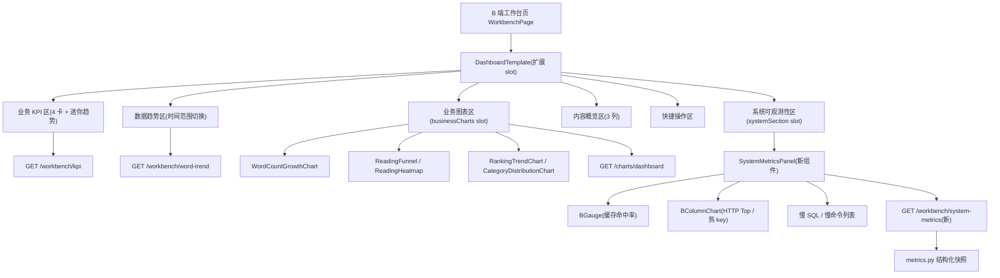

# 后台统一控制面板（Admin Unified Dashboard）

Feature Name: admin-unified-dashboard
Updated: 2026-08-09

## Description

将 B 端默认首页工作台（WorkbenchPage）升级为「统一控制面板」，聚合全部后台数据：
业务运营数据（KPI、字数增长、阅读行为、排行、分类）与系统可观测性数据
（HTTP 请求量、Redis 缓存命中率、热 key 模式、慢 SQL、Redis 慢命令）。
业务与系统指标同页可视化，无需跳转 Charts 页或访问 Prometheus `/metrics`。

## Architecture



后端仅新增一个聚合端点 `GET /api/v1/b/workbench/system-metrics`，复用
`app/core/metrics.py` 已有 getter 组装结构化 JSON；前端通过 DashboardTemplate
两个新 slot 与新增 `SystemMetricsPanel` 组件完成同页展示。

## Components and Interfaces

### 后端

**`GET /api/v1/b/workbench/system-metrics`**（新增，`WorkbenchService`）

- 鉴权：`get_current_admin`（非 DEBUG 环境强制，与 B 端其余接口一致）
- 响应：统一 `{code, message, data}`，`data` 为 `SystemMetricsSnapshot`
- 实现：`WorkbenchService.get_system_metrics()` 组合 metrics getter：

```text
http:    get_metrics() → 总请求/错误数、平均耗时、路径 Top 10（按 count 降序）
redis:   get_redis_stats() + get_cache_pattern_stats() + get_redis_command_stats()
         → hits/misses/hit_rate、模式 hits/misses、命令调用次数、慢命令明细
db:      get_slow_query_stats() + get_slow_query_details()
         → 慢查询总数、平均耗时、Top 50 归一化语句
```

**`SystemMetricsSnapshot` schema**（`app/schemas/b_end.py`，基于 `CamelModel`）：

```python
class HttpPathMetric(CamelModel):
    path: str
    count: int
    error_count: int = 0

class RedisPatternMetric(CamelModel):
    pattern: str
    hits: int
    misses: int

class SlowItem(CamelModel):
    text: str          # 归一化 SQL 或命令名
    duration_ms: float

class RedisCommandMetric(CamelModel):
    command: str
    calls: int

class SystemMetricsSnapshot(CamelModel):
    http_total: int
    http_error_total: int
    http_avg_duration_ms: float
    http_top_paths: list[HttpPathMetric]
    redis_hits: int
    redis_misses: int
    redis_hit_rate: float
    redis_patterns: list[RedisPatternMetric]
    redis_command_calls: list[RedisCommandMetric]
    redis_slow_commands: list[SlowItem]
    slow_query_count: int
    slow_query_avg_ms: float
    slow_query_top: list[SlowItem]
```

### 前端

**`DashboardTemplate` 扩展**（`apps/admin/src/templates/DashboardTemplate.tsx`）

新增两个可选 slot，保持现有 props 与结构不变：

- `businessCharts?: React.ReactNode` — 渲染于「数据趋势」Card 之后、「内容概览」之前
- `systemSection?: React.ReactNode` — 渲染于「快捷操作」Card 之后（页面底部）

**`SystemMetricsPanel` 新组件**（`apps/admin/src/components/SystemMetricsPanel.tsx` + CSS）

四卡指标行 + 两个图表卡 + 两个列表卡：

| 区块 | 图表/组件 | 数据源 |
|------|-----------|--------|
| 指标行（4 卡） | HTTP 请求量 / 缓存命中率(BGauge) / 慢 SQL 数 / 慢命令数 | snapshot 顶层字段 |
| HTTP Top 10 | BColumnChart（path × count） | `httpTopPaths` |
| 热 key 模式 | BColumnChart（pattern × hits/misses 分组柱） | `redisPatterns` |
| 慢 SQL Top | antd List（归一化语句 + 耗时 Tag） | `slowQueryTop` |
| 慢命令 Top | antd List（命令名 + 耗时 Tag） | `redisSlowCommands` |

空态：各区块数据为空时展示 `Empty` 占位；加载失败由页面级错误态覆盖。

**`WorkbenchPage` 重构**（`apps/admin/src/pages/WorkbenchPage.tsx`）

- 保留现有 KPI / 趋势 / 概览 / 快捷操作逻辑与数据加载
- 新增 `loadSystemMetrics()`（独立请求，失败不影响其余分区）
- 新增 `loadBusinessCharts()`（复用 `fetchDashboardCharts` 聚合接口）
- 将 `businessCharts` 与 `systemSection` 传入 DashboardTemplate

**fetcher 扩展**（`apps/admin/src/api/fetcher.ts`）：

```ts
workbench: {
  // ...现有 getKpiCards / getOverviews / getWordCountTrend
  async getSystemMetrics(): Promise<SystemMetricsSnapshot> {
    return cachedGet<SystemMetricsSnapshot>("/workbench/system-metrics");
  },
}
```

**i18n**（`apps/admin/src/i18n/locales/zh-CN.ts`）：新增 `workbench.system.*` 文案
（系统可观测性、HTTP 请求量、缓存命中率、慢 SQL、慢命令、热 key 等）。

## Data Models

- 新增 `SystemMetricsSnapshot` 及嵌套子模型（见上），全部基于 `CamelModel`
  （snake_case 字段自动 camelCase 序列化）
- 无数据库表变更；指标全部来自进程内 `_MetricStore`
- 契约测试（`test_api_contract.py`）遍历 OpenAPI，新端点自动纳入 115+ 用例

## Correctness Properties

- 指标存储为空（进程刚启动）时快照字段全为零/空列表，不抛错
- HTTP Top 取 count 降序前 10；慢查询明细取耗时降序前 50（沿用 `_MAX_SLOW_DETAILS`）
- `redis_hit_rate` = hits / (hits + misses)，分母为 0 时为 0.0（沿用 `/metrics` 逻辑）
- 新增端点响应体恒满足 `{code, message, data, traceId}` 统一契约（沿用 `ok()`）
- 前端系统指标加载失败不阻断业务分区渲染（分区级容错）

## Error Handling

| 场景 | 处理 |
|------|------|
| 未登录/无权限访问 system-metrics | 401/403，沿用 `get_current_admin` 机制 |
| metrics getter 抛异常 | 冒泡至统一异常处理器，返回 `code != 0` 响应 |
| 前端系统指标请求失败 | `SystemMetricsPanel` 显示 Result 错误态 + 重试按钮，业务分区不受影响 |
| 前端业务图表请求失败 | 沿用现有 `chart-error` 状态与重试 |

## Test Strategy

**后端**（新增 `tests/test_system_metrics.py`）：

1. `test_empty_snapshot` — 空指标存储返回全零快照，字段齐全且类型正确
2. `test_snapshot_after_metrics` — 注入 `inc_metric`/`inc_redis`/`inc_cache_access`/
   `record_slow_query`/`record_redis_call` 后，快照反映对应数值与 Top 排序
3. `test_http_top_paths_limited` — 注入超过 10 个路径时仅返回 Top 10
4. `test_contract_endpoint` — 通过 API 客户端请求新端点，校验统一响应体与 camelCase 字段
5. 全量契约测试（`test_api_contract.py`）自动覆盖新端点

**前端**：

- `pnpm typecheck` 全量类型检查
- `pnpm run lint`（8 包，--max-warnings=0）
- `pnpm run test`（admin vitest，现有测试不受影响）
- 构建验证：`pnpm build`

**全量验证**：后端全量测试（626+）+ ruff 零错误 + `pnpm run validate`

## References

[^1]: (Filename#Lnnn) - [backend/app/core/metrics.py](../backend/app/core/metrics.py) — 指标存储与 getter
[^2]: (Filename#Lnnn) - [backend/app/api/b_end/workbench.py](../backend/app/api/b_end/workbench.py) — 工作台路由
[^3]: (Filename#Lnnn) - [backend/app/services/workbench_service.py](../backend/app/services/workbench_service.py) — 工作台服务
[^4]: (Filename#Lnnn) - [apps/admin/src/pages/WorkbenchPage.tsx](../apps/admin/src/pages/WorkbenchPage.tsx) — 工作台页
[^5]: (Filename#Lnnn) - [apps/admin/src/templates/DashboardTemplate.tsx](../apps/admin/src/templates/DashboardTemplate.tsx) — 工作台模板
[^6]: (Filename#Lnnn) - [apps/admin/src/api/fetcher.ts](../apps/admin/src/api/fetcher.ts) — API 客户端
[^7]: (Filename#Lnnn) - [.monkeycode/specs/admin-unified-dashboard/requirements.md](requirements.md) — 需求文档
