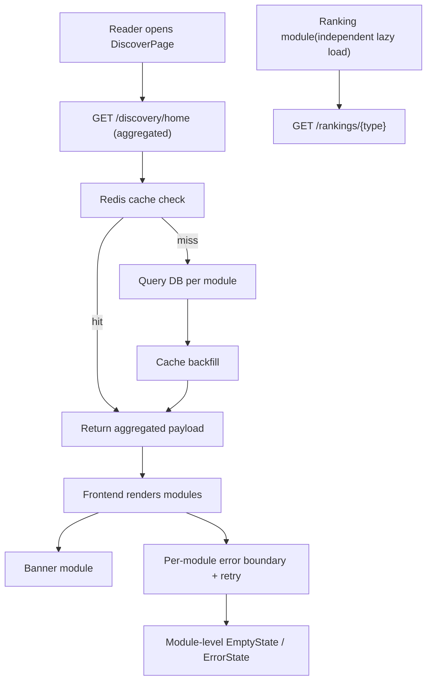

# 发现页功能完善

Feature Name: discover-page-enhancement
Updated: 2026-08-03

## Description

完善 C 端发现页（首页）现有内容模块的交互与数据呈现，并同步补齐搜索页、分类页的直接相关功能。核心目标：减少首屏请求、增强模块级容错、完善空态/错误态/重试、补齐搜索分页与分类页后端过滤一致性。本期不做个性化推荐。

## Architecture

### 现状

- 前端 `DiscoverPage` 一次发起 **5 个并行请求**（banners / books/hot / books/free-limited / books/editor-picks / categories），排行榜独立通过 `useAsyncState` 按 Tab 切换加载
- 后端 `discovery_service.py` 已为各模块实现 Cache-Aside 缓存（`_TTL_*`）
- 后端 `/books` 已支持 `tags` 参数后端过滤（`novel_repo.list_published`），搜索接口已支持分页

### 目标架构



## Components and Interfaces

### 后端

#### 1. 聚合接口 `GET /api/v1/c/discovery/home`

- **位置**: `backend/app/api/c_end/discovery.py` 新增路由
- **服务**: `backend/app/services/discovery_service.py` 新增 `get_home_payload()` 方法
- **返回结构**:

```json
{
  "banners": [...],
  "hotBooks": [...],
  "freeBooks": [...],
  "editorPicks": [...],
  "categories": [...],
  "rankings": { "hot": [...], "follow": [...], "ticket": [...], "new": [...] }
}
```

- 各模块复用现有 `get_banners()` / `get_hot_books()` / `get_free_limited_books()` / `get_editor_picks()` / `get_categories()` / `get_ranking()`，缓存策略不变
- 排行榜数据随聚合返回（默认 4 榜单各 Top 8），前端 Tab 切换直接使用，不再额外发请求；保留独立 `/rankings/{type}` 供完整榜单页使用
- 单模块查询失败 SHALL NOT 拖垮整个聚合（try/except 单模块降级为空数组 + 日志）

#### 2. 限免截止时间字段

- **现状**: `BookSummary` 无限免截止字段，前端 `Countdown` 使用写死的「今天 23:59」
- **方案**: `Banner`/`Novel` 模型当前无 free_deadline 字段，本期在前端对 `BookSummary` 扩展可选 `freeDeadline?: number`（后端若存在则透传），前端兜底降级文案「限免中」

#### 3. 聚合缓存键

- 在 `backend/app/core/redis.py` `CacheKeys` 增加 `HOME = "discovery:home"`，TTL 取各模块最小 TTL（300s），保证数据新鲜度不劣于最频繁更新模块

### 前端

#### 4. `apps/web/src/api/fetcher.ts`

- 新增 `getDiscoverHome(): Promise<DiscoverHome>`（`GET /discovery/home`）
- 新增类型 `DiscoverHome` 至 `apps/web/src/api/types.ts`
- `getRankings` 保持用于完整榜单页

#### 5. `apps/web/src/pages/DiscoverPage.tsx` 重构

- 主数据源切换为 `getDiscoverHome()` 单次请求
- 页面级加载态：骨架屏
- 页面级失败态：整页 `ErrorState` + 重试（复用 `EmptyState` action 或新增轻量 `ErrorState` 组件）
- 模块级容错：`DiscoverModule` 包装组件，props 传入 `loading/error/onRetry/children`，单模块失败仅展示该模块错误态
- 排行榜改为使用聚合数据（4 榜单预取），Tab 切换本地切换无网络请求

#### 6. `apps/web/src/pages/SearchPage.tsx`

- 搜索结果改为分页累积：新增「加载更多」按钮，追加下一页（`useAsyncState` + 手动 `page` 状态）
- 加载完毕展示「已加载全部」
- 加载更多失败展示可重试错误提示
- 历史/热门搜索保持现状

#### 7. `apps/web/src/pages/CategoryPage.tsx`

- 分类树支持二级分类展示（`CategoryNode.children`）
- 后端 tag 过滤已实现，前端继续传 `tags` 参数，移除/确认无客户端二次过滤
- 列表加载失败增加错误态与重试按钮

#### 8. 通用组件

- 新增 `ErrorState` 组件（`apps/web/src/components/ErrorState.tsx`）或复用 `EmptyState` + action
- 图片懒加载沿用 `LazyImage` / `loading="lazy"`

## Data Models

- `DiscoverHome`（前端类型，`apps/web/src/api/types.ts`）：

```typescript
interface DiscoverHome {
  banners: Banner[];
  hotBooks: BookSummary[];
  freeBooks: BookSummary[];
  editorPicks: BookSummary[];
  categories: Category[];
  rankings: Record<RankType, BookSummary[]>;
}
```

- `BookSummary.freeDeadline?: number`（可选扩展，用于限免倒计时）
- 后端无新增数据表；`CacheKeys.HOME` 缓存键为纯运行时新增

## Correctness Properties

1. 聚合接口返回的六类模块字段非空键 SHALL 全部存在，失败模块 SHALL 为 `[]` 而非缺失键
2. 排行榜 4 个 Tab 数据 SHALL 随聚合一次返回，前端切换 Tab SHALL 不发起额外网络请求
3. 单模块失败 SHALL 不触发整页失败态，模块错误态 SHALL 与整页错误态可区分
4. 搜索「加载更多」SHALL 追加到已有列表尾部，SHALL NOT 替换或重复
5. 所有列表「已加载全部」判定 SHALL 基于后端 `total` 与已加载数量比较
6. 分类页选中标签 SHALL 由后端 `tags` 参数过滤，前端结果与后端一致

## Error Handling

| 场景 | 处理 |
|------|------|
| 聚合接口整体失败 | 整页错误态 + 重试按钮 |
| 聚合接口部分模块失败 | 单模块错误态 + 模块级重试 |
| 榜单 Tab 切换失败 | 榜单模块错误态 + 重试（不影响其他模块） |
| 限免截止时间缺失 | 前端降级文案「限免中」，不渲染倒计时 |
| 搜索加载更多失败 | 列表尾部错误提示 + 重试按钮 |
| 分类列表加载失败 | 网格区域错误态 + 重试按钮 |

## Test Strategy

### 后端

- `backend/tests/test_api_c_end.py`: 新增 `/discovery/home` 接口测试（返回 6 模块、缺数据模块为空数组、缓存命中）
- `backend/tests/test_discovery_service.py`（新增或并入现有）: 聚合服务单模块失败降级测试
- 运行: `python -m pytest tests/ -v --tb=short`

### 前端

- 无既有前端测试框架（apps/web 无 `*.test.*`），以 `pnpm typecheck` + 巡检验证为主
- `monitoring/checks/pages.c-end.ts` / `business-flow.ts`: 新增/更新发现页巡检断言（模块渲染、错误重试、搜索加载更多、分类二级分类）
- 运行: `bash monitoring/run.sh`（或对应 `monitor:page` / `monitor:flow`）

### 全量验证

- `pnpm typecheck`
- `pnpm run ci`
- `bash monitoring/run.sh`

## References

- 需求文档: `.monkeycode/specs/discover-page-enhancement/requirements.md`
- 发现页现状: `apps/web/src/pages/DiscoverPage.tsx`
- 搜索页现状: `apps/web/src/pages/SearchPage.tsx`
- 分类页现状: `apps/web/src/pages/CategoryPage.tsx`
- 后端发现服务: `backend/app/services/discovery_service.py`
- 后端发现路由: `backend/app/api/c_end/discovery.py`
- 前端 API: `apps/web/src/api/fetcher.ts`
- 历史规划: `.monkeycode/docs/完善规划.md`（P2-10 分类页 tag 过滤）、`.monkeycode/docs/下一阶段规划.md`
