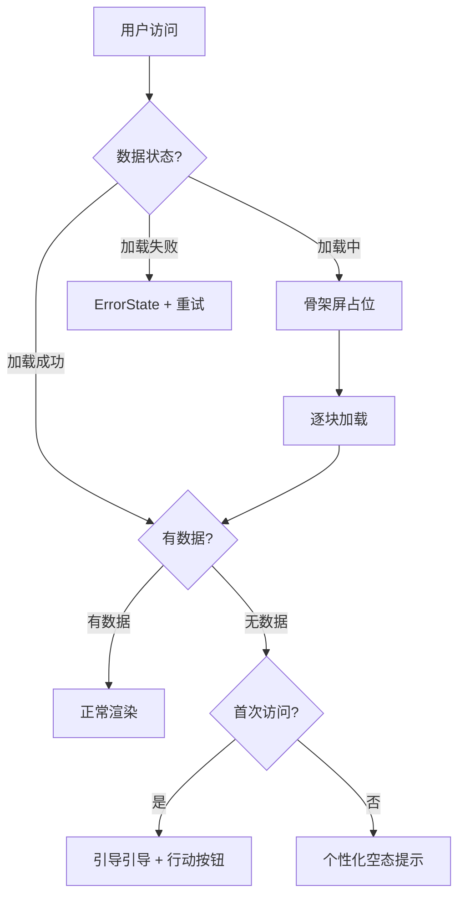

# 体验优化（Experience Optimization）

Feature Name: experience-optimization
Updated: 2026-08-16

## Description

针对 C 端读者站和 B 端管理后台的关键体验痛点进行优化，重点解决空数据状态、加载感知和引导反馈问题。通过智能化的空态处理、骨架屏优化和错误降级策略，提升用户在使用平台时的流畅度和满意度。

## Architecture

## Components and Interfaces

### C 端优化

**`DiscoverPage`** (`apps/web/src/pages/DiscoverPage.tsx`)

新增组件：
- `DefaultBanner`: 默认推荐横幅组件
- `EmptyHomeState`: 首页空态引导组件

变更：
- 当 `banners` 为空时展示 `DefaultBanner`
- 当 `hotBooks` 为空时展示分类探索引导
- 当 `categories` 为空时隐藏分类导航区域

**`SearchPage`** (`apps/web/src/pages/SearchPage.tsx`)

变更：
- 搜索联想为空时展示"无相关建议"提示
- 搜索结果为空时展示包含搜索建议的空态卡片
- 搜索结果加载中展示骨架屏

**`ReadingStatsPage`** (`apps/web/src/pages/ReadingStatsPage.tsx`)

变更：
- 阅读时长为 0 时展示引导文案
- 热力图为空时展示"暂无阅读记录"提示
- 徽章为空时展示解锁进度提示

### B 端优化

**`WorkbenchPage`** (`apps/admin/src/pages/WorkbenchPage.tsx`)

变更：
- KPI 数据为 0 时展示"暂无数据"提示
- 图表数据为空时展示统一的空态引导
- 系统指标加载失败时展示降级提示

**`DashboardTemplate`** (`apps/admin/src/templates/DashboardTemplate.tsx`)

新增 prop：
- `emptyState?: React.ReactNode` - 自定义空态内容

### 通用组件

**`EmptyState`** (`packages/components/src`)

增强：
- 新增 `description` prop - 空态描述文案
- 新增 `action` prop - 行动按钮
- 新增 `icon` prop - 自定义图标

## Data Models

无数据库表结构变更。所有优化基于现有数据结构的状态判断。

## Correctness Properties

- 空态组件不得阻塞页面其他区域渲染
- 骨架屏动画时长控制在 200-500ms 内
- 错误状态必须提供重试机制
- 所有空态文案需通过 i18n 国际化

## Error Handling

| 场景 | 处理 |
|------|------|
| API 返回空数组 | 展示空态引导 |
| API 返回错误 | 展示 ErrorState + 重试 |
| 网络超时 | 展示 LoadingState + 超时提示 |
| 组件加载失败 | 局部降级，不影响整体 |

## Test Strategy

**单元测试**：
- `EmptyState` 组件渲染测试（不同状态）
- `DiscoverPage` 空态逻辑测试
- `SearchPage` 搜索结果空态测试
- `ReadingStatsPage` 统计数据空态测试

**集成测试**：
- 端到端空态流程测试（Playwright）
- 错误降级恢复测试

**全量验证**：
- 前端测试：`pnpm run test`
- 类型检查：`pnpm typecheck`
- Lint：`pnpm run lint`
- 构建验证：`pnpm build`

## References

[^1]: (Filename#Lnnn) - [apps/web/src/pages/DiscoverPage.tsx](../apps/web/src/pages/DiscoverPage.tsx) — C 端首页
[^2]: (Filename#Lnnn) - [apps/web/src/pages/SearchPage.tsx](../apps/web/src/pages/SearchPage.tsx) — 搜索页
[^3]: (Filename#Lnnn) - [apps/web/src/pages/ReadingStatsPage.tsx](../apps/web/src/pages/ReadingStatsPage.tsx) — 阅读统计
[^4]: (Filename#Lnnn) - [apps/admin/src/pages/WorkbenchPage.tsx](../apps/admin/src/pages/WorkbenchPage.tsx) — B 端工作台
[^5]: (Filename#Lnnn) - [packages/components/src](../packages/components/src) — 共享组件库
