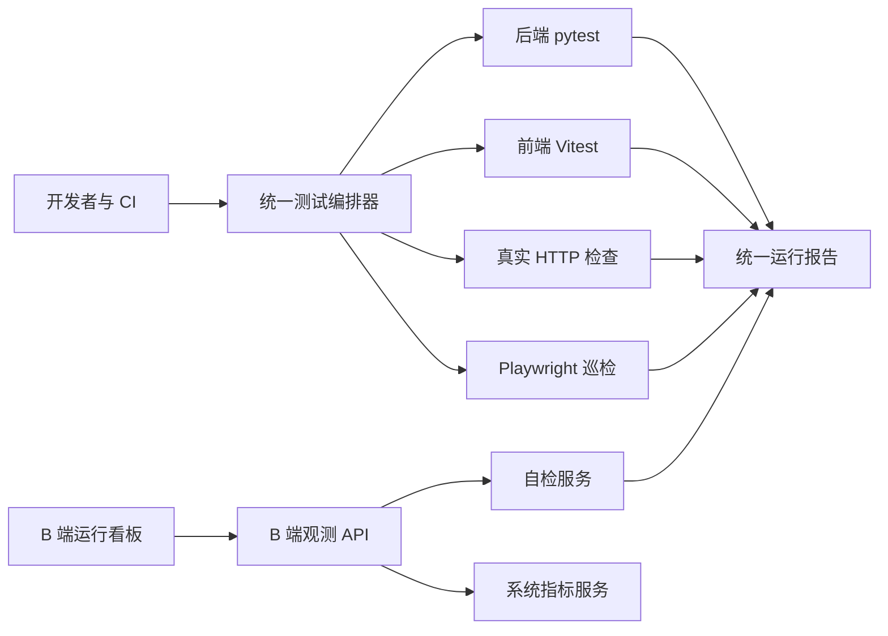

# 测试与运行观测系统设计

Feature Name: test-observability-system
Updated: 2026-08-16

## 描述

本设计将当前分散的 pytest、Vitest、Playwright、全局真实请求检查和自检服务收敛为统一的测试编排与报告体系。B 端新增独立运行看板，通过已鉴权的后端 API 访问自检服务。

## 架构



## 组件与接口

### 测试清单与编排器

- 在根目录新增结构化测试清单，集中定义模块名称、标签、执行器、命令和归属范围。
- 新增统一编排入口，支持 `quick`、`full`、单模块与批量目标，向调用方返回可靠退出码。
- `scripts/validate.sh`、`monitoring/run.sh`、根 `package.json` 和 CI 工作流复用统一入口，移除吞掉失败状态的执行模式。
- 后端 pytest 测试通过 marker 形成单一分层口径，runner 负责参数转换、报告归档和资源控制。

### 统一运行报告

统一报告顶层结构：

```json
{
  "timestamp": "2026-08-16T12:00:00+0000",
  "target": "quick",
  "status": "passed",
  "summary": {
    "total": 24,
    "passed": 24,
    "failed": 0,
    "warned": 0,
    "skipped": 0,
    "passRate": 100,
    "elapsedMs": 1200
  },
  "results": []
}
```

每个结果包含 `name`、`status`、`tags`、`durationMs`、`detail` 和 `reportPath`。报告归档到受版本控制排除的运行目录；自检服务从归档中恢复最近完成的报告。

### 自检服务

- `SelfCheckRunner` 在服务启动时同步执行 `health` 检查并归档结果。
- 检查模块扩展为 `health`、`api`、`pages`、`flow`、`performance` 和 `all`。
- `all` 为批量检查目标，依序协调真实 HTTP 检查与 Playwright 巡检。
- 自检任务保留内存中的执行状态，并将完成报告写入归档目录；重启后从归档恢复最近报告。
- `timeout_ms` 贯穿请求模型、任务提交和检查执行。

### B 端观测 API

- 在 `workbench` API 下新增受 `system.config` 保护的观测路由。
- 后端通过配置的本机自检服务地址调用 `/readyz`、`/selfcheck/summary`、`/selfcheck/latest`、`/selfcheck/run` 和任务状态接口。
- API 统一转换为项目既有响应格式，向前端返回看板快照、任务状态和失败项。
- 后端连接自检服务的请求具有固定超时，错误对前端返回通用诊断状态，详细原因仅写服务日志。

### B 端运行看板

- 新增 `/operations` 路由和菜单项，使用 `RequirePermission` 守卫。
- 页面包含服务状态、最近运行摘要、功能可用性矩阵、失败项列表和检查操作区。
- 单模块操作提供健康、API、页面、业务流和性能检查；批量操作提供完整检查。
- 任务运行期间禁用重复提交并显示状态；页面每 3 秒轮询任务，在结束后刷新快照。
- 小屏布局将摘要卡片和操作区堆叠为单列，失败项以可扫描列表呈现。

### CI 周期检查

- 现有 CI 工作流继续处理 push 和 pull request。
- 新增定时触发器，以 CI 容器启动后端和前端后执行关键健康、API 和页面检查。
- 运行报告以 GitHub Actions artifact 保存；失败状态由编排器退出码直接传递。

## 数据模型

运行报告为文件归档数据，不写入业务数据库。看板读取最近报告和当前任务状态；系统指标继续复用现有进程内指标快照。

## 正确性属性

1. 任意包含失败结果的报告状态为 `failed`。
2. 任意返回成功的编排命令包含零个失败检查结果。
3. 看板可见的任务标识仅由已通过 `system.config` 授权的 B 端 API 创建。
4. 自检服务重启后，最近完成报告可从归档恢复。
5. 浏览器请求始终指向 `/api/v1/b`，自检服务地址不暴露给浏览器配置。

## 错误处理

- 自检服务不可达：返回 `unavailable` 状态和重试建议。
- 自检任务不存在：映射为 B 端标准业务错误。
- 模块执行失败：归档失败详情，任务状态为 `failed`，编排进程返回非零状态。
- 报告解析失败：保留原始文件，向看板返回报告不可用状态并记录结构化日志。

## 测试策略

- 单元测试覆盖测试清单解析、报告聚合、归档恢复和自检服务适配。
- API 测试覆盖权限、参数校验、任务状态与服务不可达场景。
- 前端测试覆盖看板加载、状态展示、模块触发、轮询完成与失败提示。
- Playwright 覆盖管理员进入运行看板和手动触发健康检查的主流程。
- CI 运行核心质量门禁与定时真实请求检查，并保存统一报告。

## 参考

- `backend/scripts/test-platform/run.py`
- `scripts/global-check/global_check.py`
- `selfcheck/runner.py`
- `selfcheck/service.py`
- `apps/admin/src/pages/WorkbenchPage.tsx`
- `apps/admin/src/components/SystemMetricsPanel.tsx`
