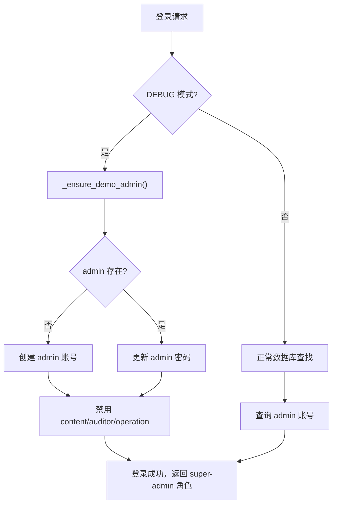

# 统一管理员账号（Unified Admin Account）

Feature Name: unified-admin-account
Updated: 2026-08-16

## Description

将 B 端控制台的四个演示账号（admin、content、auditor、operation）合并为一个统一的超级管理员账号。该账号拥有控制台的所有管理权限和页面访问权，简化演示环境和运维流程。

## Architecture



## Components and Interfaces

### 后端变更

**`app/services/auth_service.py`**

修改 `_DEMO_ADMINS` 常量，仅保留 `admin` 账号：

```python
_DEMO_ADMINS = [
    ("admin", "admin123", "演示管理员", "super-admin"),
]
```

修改 `_ensure_demo_admin()` 方法：
- 确保 `admin` 账号存在并启用
- 将其他三个演示账号（`content`、`auditor`、`operation`）设为禁用

**`scripts/seed.py`**

修改 `DEMO_ADMINS` 常量：

```python
DEMO_ADMINS: list[tuple[str, str, str, str]] = [
    ("admin", "admin123", "演示管理员", "super-admin"),
]
```

修改种子逻辑：创建 `admin` 账号，其他三个账号保持禁用状态。

**`tests/test_auth_service.py`**

更新 `TestEnsureDemoAdmin` 类：
- `test_creates_demo_admin_when_missing`：验证只创建 `admin`
- `test_keeps_existing_demo_admin`：验证 `admin` 存在，其他三个账号被禁用

### 前端变更

**`apps/admin/src/pages/LoginPage.tsx`**

简化 `DEMO_ACCOUNTS` 常量：

```typescript
const DEMO_ACCOUNTS = [
  { label: "管理员", username: "admin", password: "admin123" },
];
```

**`apps/admin/src/i18n/locales/zh-CN.ts`**

更新登录页文案：

```typescript
demoAccount: "演示账号：",
demoAdmin: "admin / admin123（超级管理员）",
// 移除 demoContent、demoAuditor、demoOperation
```

### 文档变更

**`README.md`**

更新演示账号表格：

| 端 | 账号 | 密码 | 说明 |
|----|------|------|------|
| B 端后台 | `admin` | `admin123` | 超级管理员（全部权限） |

## Data Models

无数据库表结构变更。现有 `admins` 表的 `enabled` 字段用于禁用其他三个账号。

## Correctness Properties

- `admin` 账号始终存在且启用，role_key 为 `super-admin`
- `content`、`auditor`、`operation` 账号被禁用，无法登录
- 登录页仅展示 `admin` 演示账号
- 向后兼容：已有数据库会自动禁用其他三个账号

## Error Handling

| 场景 | 处理 |
|------|------|
| 其他三个账号不存在 | 创建并设为禁用状态 |
| `admin` 账号不存在 | 创建并启用 |
| 登录失败 | 沿用现有错误处理机制 |

## Test Strategy

**后端测试**：
1. `test_creates_demo_admin_when_missing`：验证只创建 `admin`
2. `test_keeps_existing_demo_admin`：验证其他三个账号被禁用
3. `test_login_with_disabled_account`：验证 `content` 等账号无法登录

**前端测试**：
- 登录页渲染测试：验证只显示一个演示账号
- i18n 键验证：验证 `demoContent` 等键已移除

**全量验证**：
- 后端测试：`python3 scripts/test-platform/run.py --quick`
- 前端测试：`pnpm run test`
- 类型检查：`pnpm typecheck`
- Lint：`pnpm run lint`

## References

[^1]: (Filename#Lnnn) - [backend/app/services/auth_service.py](../backend/app/services/auth_service.py) — 鉴权服务
[^2]: (Filename#Lnnn) - [backend/scripts/seed.py](../backend/scripts/seed.py) — 种子数据脚本
[^3]: (Filename#Lnnn) - [apps/admin/src/pages/LoginPage.tsx](../apps/admin/src/pages/LoginPage.tsx) — 登录页
[^4]: (Filename#Lnnn) - [apps/admin/src/i18n/locales/zh-CN.ts](../apps/admin/src/i18n/locales/zh-CN.ts) — 国际化文案
